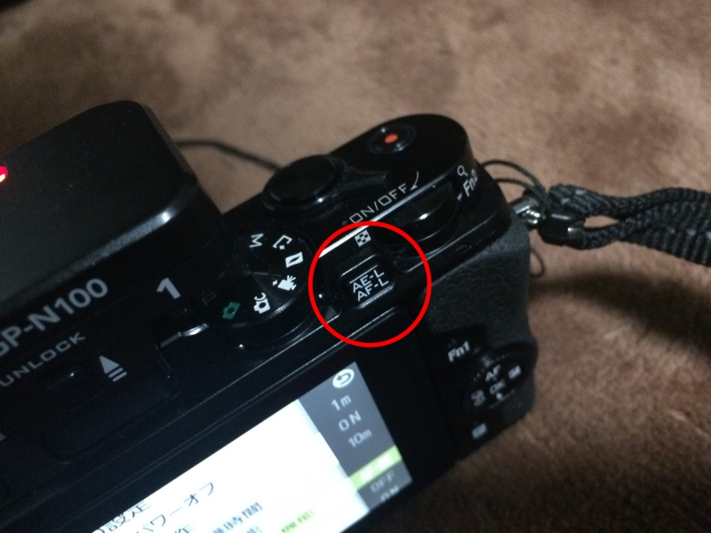
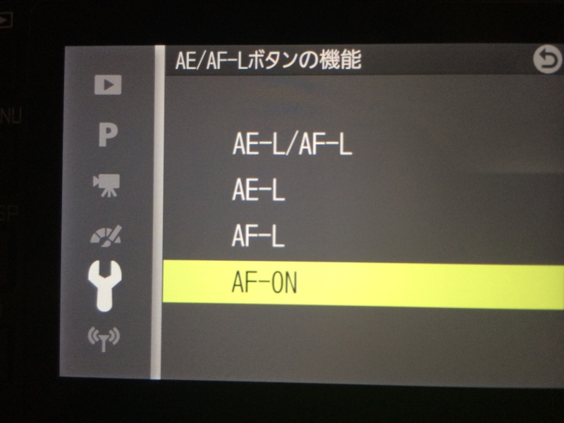
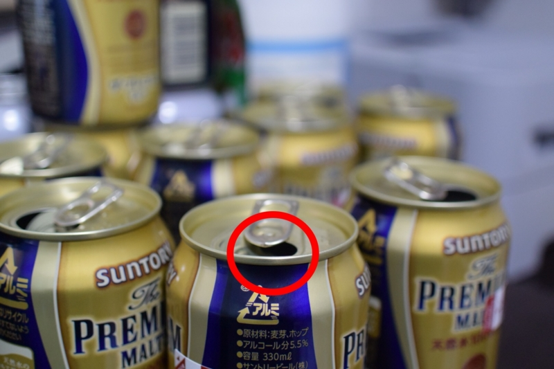
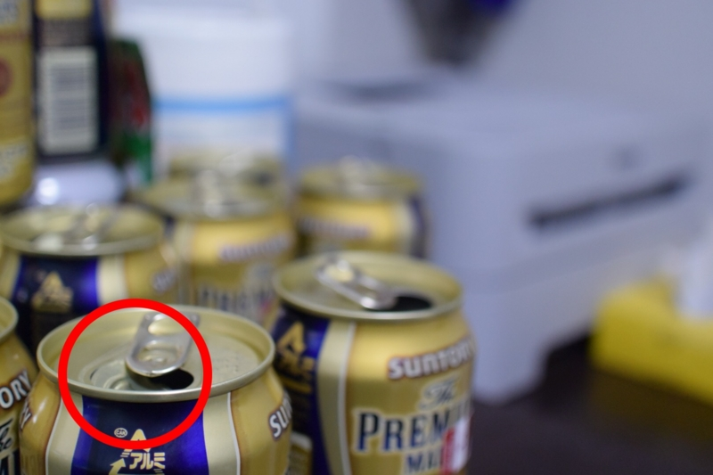

カメラ撮影のうまい人は、親指 AF という技を駆使しているらしい。

一般のコンパクトカメラだと、シャッターボタンを半押しして AF（オートフォーカス）して、ピントが決まればさらにシャッターボタンを押し下げて撮影する。フォーカスの当たる場所は、基本的にカメラ任せ（最近だと顔認識とかで、人の顔に勝手にフォーカスが当たる）。たまに十字キーでイジるって感じじゃないかな。

一方、親指 AF では AF を専用のボタンで行い、シャッターボタンは撮影にのみ使う。一眼カメラの場合は［AF-ON］というボタンを使うが、Nokon 1 V3 の場合は［AE-L/AF-L］ボタンを利用する。これがちょうど、右手の親指のところにあることから、親指 AF と呼ぶらしい。

利用するには、まずメニュー画面で［AE-L/AF-L］ボタンの挙動を変更する。このボタンは、デフォルトでは「AF を一時的にロックする」機能に割り当てられているので、これを［AF-ON］に設定。 

あとは、たとえば真ん中で AF するように設定しておいて、一度［AE-L/AF-L］ボタンでピントを合わせ……

そのままカメラをずらしてシャッターを切る。

すると、端っこにピントがあった状態で写真が撮れたりする。これはいい感じかもしれない。すくなくとも、十字キーでフォーカスポイントを指定するより楽ちんだなー。

ちなみに、正月中に机に積まれていたビールの空き缶は、禁酒開始とともにすべて駆除した。

<ul>
<li><a href="https://blog.daruyanagi.jp/entry/2014/03/15/232343">&#x307A;&#x3093;&#x3066;&#x308B;&#x306E;&#x7F36;&#x3064;&#x3076;&#x3057;&#x304C;&#x304A;&#x5024;&#x6BB5;&#x4EE5;&#x4E0A;&#x30CB;&#x30C8;&#x30EA;&#x3060;&#x3063;&#x305F;&#x3002; - &#x3060;&#x308B;&#x308D;&#x3050;</a></li>
</ul>
禁酒すると缶つぶしができなくなって悲しい。

