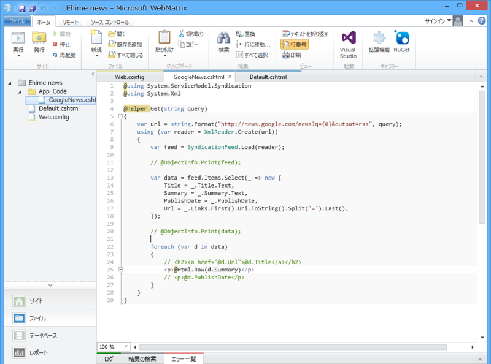
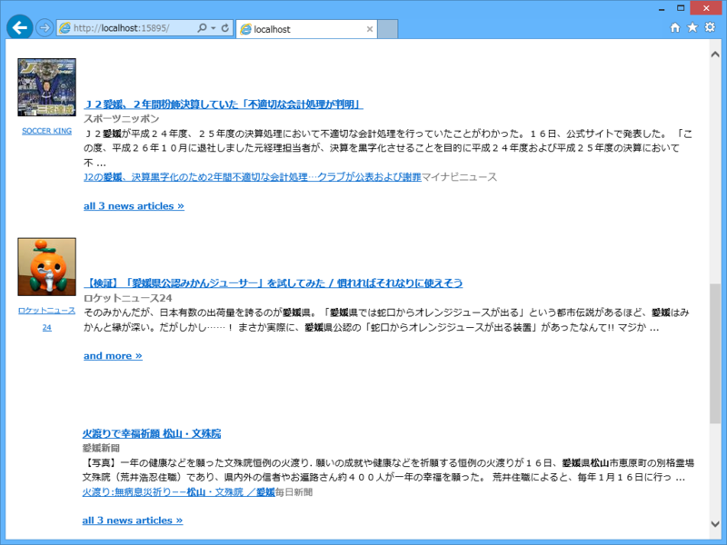

地元のニュースだけ読みたいので、それを Google ニュース引っ張ってくる BOT でも作ろうかと思って少し調べてみた。

<pre class="code lang-cs" data-lang="cs" data-unlink># ~/App_Code/GoogleNews.cshtml

@using System.ServiceModel.Syndication
@using System.Xml

@helper Get(string query)
{
var url = string.Format(
&quot;http://news.google.com/news?q={0}&amp;output=rss&quot;,
query
);

using (var reader = XmlReader.Create(url))
{
var feed = SyndicationFeed.Load(reader);

// @ObjectInfo.Print(feed);

var data = feed.Items.Select(_ =&gt; new {
Title = _.Title.Text,
Summary = _.Summary.Text,
PublishDate = _.PublishDate,
Url = _.Links.First().Uri.ToString().Split('=').Last(),
});

// @ObjectInfo.Print(data);

foreach (var d in data)
{
// &lt;h2&gt;&lt;a href=&quot;@d.Url&quot;&gt;@d.Title&lt;/a&gt;&lt;/h2&gt;
&lt;p&gt;@Html.Raw(d.Summary)&lt;/p&gt;
// &lt;p&gt;@d.PublishDate&lt;/p&gt;
}
}
}
</pre>
パラメーターに output=rss をくっつけると RSS 形式でデータを取得できるので XmlReader と SyndicationFeed で読み込み・整形してやるとよさげ。

残念なのでは地域ごとに絞れないこと<a href="#f-68c7e51c" name="fn-68c7e51c" title="本当はパラメーターに ned=jp を付けるとその国のニュースのみにデータを絞れるはずなのだけど、日本語版の Google ニュースでは利用できないようだ。">*1</a>。そのため「松山」で検索すると台湾の松山のニュースも引っかかるが……まぁ、これは仕方ないかな。JavaScript の API を利用すれば、ちゃんと制御できるようなので、JavaScript ができる人はそちらで書けばいいと思う。

<h3>結果</h3>

 

<pre class="code lang-cs" data-lang="cs" data-unlink># ~/Default.cshtml

&lt;!DOCTYPE html&gt;

&lt;html lang=&quot;en&quot;&gt;
&lt;head&gt;
&lt;meta charset=&quot;utf-8&quot; /&gt;
&lt;title&gt;&lt;/title&gt;
&lt;style&gt;
* {
font-family: Meiryo, sans-serif;
}
&lt;/style&gt;
&lt;/head&gt;
&lt;body&gt;
@GoogleNews.Get(&quot;愛媛 OR 松山 -秀樹 -ゴルフ&quot;)
&lt;/body&gt;
&lt;/html&gt;
</pre>
天気予報機能も付けて（「☀時々☁、最高10度最低0度、西風後南西風海上後南西風稍強、波0.5米後1米」）、Twitter BOT にでもしようかな。

<a href="#fn-68c7e51c" name="f-68c7e51c" class="footnote-number">*1</a>:本当はパラメーターに ned=jp を付けるとその国のニュースのみにデータを絞れるはずなのだけど、日本語版の Google ニュースでは利用できないようだ。

