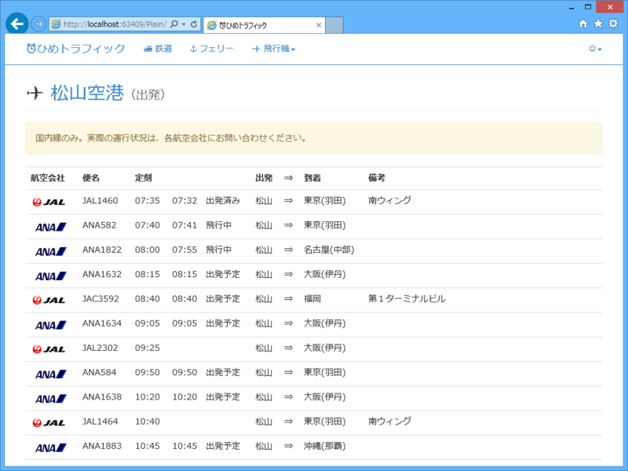
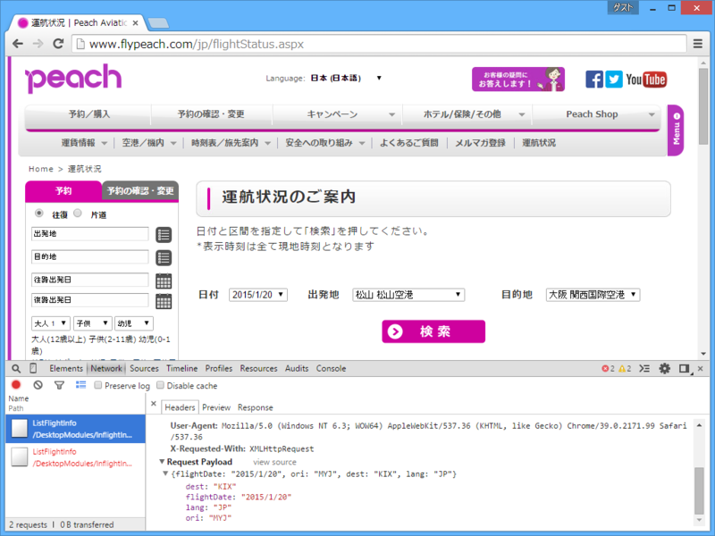

 

<ul>
<li><a href="http://ehime-traffic.azurewebsites.net/">http://ehime-traffic.azurewebsites.net/</a></li>
</ul>
WebMatrix + Azure Web サイト（<a href="http://www.microsoft.com/ja-jp/mic/bizspark/">&#x30DE;&#x30A4;&#x30AF;&#x30ED;&#x30BD;&#x30D5;&#x30C8;&#x306E;&#x30AF;&#x30E9;&#x30A6;&#x30C9;&#x74B0;&#x5883;&#x3084;&#x958B;&#x767A;&#x30C4;&#x30FC;&#x30EB;&#x3092;&#x7121;&#x511F;&#x63D0;&#x4F9B; | Microsoft BizSpark</a>、ありがとう！）で愛媛・松山の鉄道・船・飛行機の運行状況を集約したサイトを作ってみました（飛行機の英語の綴りミスなんかがボロボロ見つかる程度の成熟度です）。誰の役に立つというものでもないですが、自分的には満足です。そのうちわざわざサイトに行くのも面倒になると思うので、ゆくゆくは Twitter の BOT か何か作って、情報をプッシュできるようにしたいですね。

このサイトの情報は、大きく分けて二つの方法で取得しています。

<ul>
<li>サイトをスクレイピングして情報取得（鉄道、船、JAL）</li>
<li>（非公開）API を叩いて JSON から情報取得（ANA、ピーチ）</li>
<li>（ジェットスターだけはうまくいかなかった！　今度誰か教えて！<a href="#f-787436cb" name="fn-787436cb" title="幸い JAL とのコードシェアなので、そっちから情報を取得">*1</a>）</li>
</ul>
スクレイピングで面倒だったのは、情報の形式が一定していないこと、文字コードがバラバラなこと（ローカルでテストしているときは文字化けしないのに、クラウドで動かすと文字化けすることもあった）でしょうか。とくに情報の形式が一定していないのはしんどいですね。イレギュラーなケースを見つけるたびにデータ標準化のための処理が膨れ上がっていくので、最後は妥協、妥協、妥協。ペライチのページにコードをべた書きして、それをまとめていくという開発手法は WebMatrix が得意とする分野だと思うけれど、最後のほうはちょっと力不足かなって感じもしました。まぁ、そんなときはサクッと Visual Studio に切り替えちゃうんですけど。

<h3>開発の流れ</h3>

運行情報のページをブラウザーでみる。ブラウザーの開発者ツールで DOM をみたり、リクエスト・レスポンスをみたりしながら、静的ページであればスクレイピング、ページを動的に組み立てているなら API を探してそれを叩いてみるという感じ。

スクレイピングであれば、<a href="https://www.nuget.org/packages/HtmlAgilityPack">NuGet Gallery | HtmlAgilityPack 1.4.9</a> が超簡単。XPath でノードを指定してサクッと中身を取ってこれる。

<pre class="code lang-cs" data-lang="cs" data-unlink>using (var client = new WebClient())
{
var response = client.DownloadString(url);
var json = Json.Decode(response);

var doc = new HtmlAgilityPack.HtmlDocument();
doc.LoadHtml(doc)

// &lt;div class=&quot;ss_comment&quot;&gt;ここがほしいやで&lt;/div&gt;
var message = doc.DocumentNode
.SelectSingleNode(@&quot;//div[@class=&quot;&quot;ss_coment&quot;&quot;]&quot;)
.InnerText;

@ObjectInfo.Print(json)
}
</pre>
これが使えないならば、正規表現で頑張ることになるのかな。今回はそこまでしなければならないケースはなかった。

非公開 API があるのならば、JSON Helper が便利。Chrome の場合、開発者ツールの［Network］タブでリクエスト・レスポンスをみると、内部 API らしきものが見るかる。今回見つけたなかでは、ANA が出発・到着空港の天気までとれる重量級。一方、ピーチは割と扱いやすい感じ（ASP.NET っぽかった）。

<pre class="code lang-cs" data-lang="cs" data-unlink>using (var client = new WebClient())
{
var response = client.UploadString(url, postData);
var json = Json.Decode(response);

@ObjectInfo.Print(json)
}
</pre>
ObjectInfo.Print で Json オプジェクトの中身をみながら、自分が使いやすいようにデータを取捨・加工する。

コーディング自体はとても簡単で、開発時間のほとんどは API のパラメーター解析に費やされた。

<h3>これから</h3>

閲覧時に情報を取りに行く設計になっているので、キャッシュが効いていない場合にロードがとても遅い。相手にも負荷がかかって迷惑<a href="#f-bb29751c" name="fn-bb29751c" title="本当に迷惑になりそうな、体力がなさげなサイトにはすでに対策を入れてある">*2</a>なので、バックグラウンドで情報を取得するようにしたい。Twitter BOT にするにも必要な処理だし。

<a href="#fn-787436cb" name="f-787436cb" class="footnote-number">*1</a>:幸い JAL とのコードシェアなので、そっちから情報を取得

<a href="#fn-bb29751c" name="f-bb29751c" class="footnote-number">*2</a>:本当に迷惑になりそうな、体力がなさげなサイトにはすでに対策を入れてある

