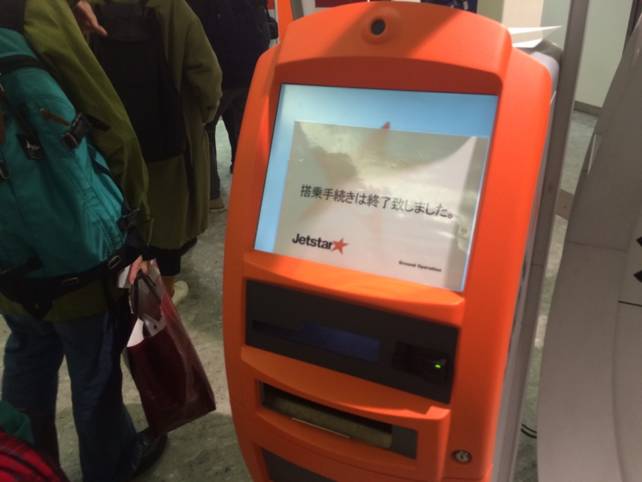
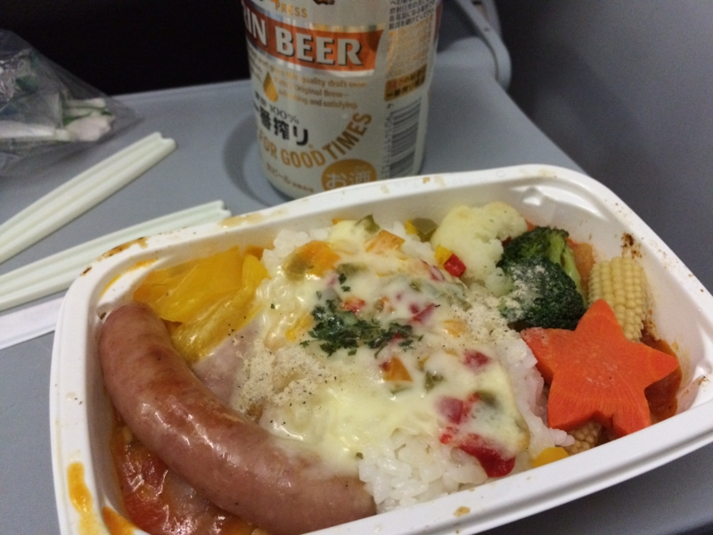

その日はとても風の強い日で、たしか瀬戸大橋も通行規制がかかり、電車が立ち往生して大変だった。松山空港のほうもタイムテーブルが若干荒れ気味で、機材の到着遅延で伊丹行きが空港の運用時間オーバーで関空行きになっちゃったり。自分が乗るつもりだったジェットスターの成田行きも、30分ほど出発が遅れるという連絡があった。定刻通り着くなら、小岩によって一杯ひっかけて帰れたのにな、今晩は寝床直行か。

それからしばし、本など読みながら時間をつぶしているとアナウンスが。

――機材が強風で高松空港に降りたので、欠航になるとの由。

オーマイガッ。スケジュールには余裕をもたせていたので、明日の晩までに東京に着ければ問題はなかったのだけど、東京でだるだる過ごす時間は失われてしまった。ANA の羽田便が若干遅れながらもフツーに出発していたのは、機材が大きく、風の影響を受けにくいからだろうか。やはり大手のほうは安心なのだな、と感じる。

実は飛行機の欠航は生まれて初めてだったので、何をどうすればいいのかよくわかっていなかったのだけど、一目散にカウンターへ走っていく人がいたので、自分は早歩き程度に抑えて、その人についていった。

カウンターには振替便を取ろうとする客でごった返していた。幸い、自分は待合室の椅子に座らず、壁際に立っていたので、歩いてカウンターへ向かったにもかかわらず、列の前のほうを占めることができた。迎えに来たらしき老人の二人組がカウンターに「説明しろ！」といちゃもんをつけているのを尻目に、無事、次の日の夜便をとることができた。

さてさて、ジェットスターには欠航見舞金制度というのがあるそうだ。

<blockquote cite="http://www.jetstar.com/jp/ja/planning-and-booking/booking-with-jetstar/plus_max_protect">

ジェットスター・ジャパン(GK)が運航する国内線において「Starter Plus」運賃もしくは「Starter Max」運 賃にて航空券をご購入いただいたお客様を対象に、欠航や遅延が発生した際に、見舞金をお支払いします。 本サービスは、ジェットスター・ジャパンの都合による欠航や遅延だけではなく、天候や火山灰 降灰(鹿児島桜島のみ)が理由でも見舞金のお支払い対象になります。

<cite><a href="http://www.jetstar.com/jp/ja/planning-and-booking/booking-with-jetstar/plus_max_protect">&#x3042;&#x3093;&#x3057;&#x3093;Plus/Max | &#x30D5;&#x30E9;&#x30A4;&#x30C8;&#x306E;&#x4E88;&#x7D04; | &#x30B8;&#x30A7;&#x30C3;&#x30C8;&#x30B9;&#x30BF;&#x30FC;</a></cite>
</blockquote>

自分の場合、夜便のときは「Starter Plus」にしている。500円のバウチャーをもらって、機内でビールを飲むためだ。前のほうの席を予約して、サクッと降機できるのもいい<a href="#f-6ea80247" name="fn-6ea80247" title="成田着では空港内の移動がバスなので、早く降機できるとバスで座れる！">*1</a>。というわけで、今回はこのお見舞金の条件にたまたま合致していた。

<blockquote cite="http://www.asahi.com/articles/ASG7G4SMYG7GULFA00Y.html">

過去２年間の実績では、見舞金の対象となる欠航や遅延は全体の約１・５％になるという。

<cite><a href="http://www.asahi.com/articles/ASG7G4SMYG7GULFA00Y.html">&#x30B8;&#x30A7;&#x30C3;&#x30C8;&#x30B9;&#x30BF;&#x30FC;&#x3001;&#x6B20;&#x822A;&#x30FB;&#x5927;&#x5E45;&#x9045;&#x5EF6;&#x306A;&#x3089;&#xFF12;&#x4E07;&#x5186;&#x300C;&#x898B;&#x821E;&#x91D1;&#x300D;&#xFF1A;&#x671D;&#x65E5;&#x65B0;&#x805E;&#x30C7;&#x30B8;&#x30BF;&#x30EB;</a></cite>
</blockquote>

とのことなので、あんまり該当することはないと思うけれど。夜便は昼便よりも機材都合の欠航がありそうだし（知らんけど）、見舞金のことも考えて「Starter Plus」にしておくのもありかなと思う。

というわけで、申請を――<i>するのを忘れていた／(＾o＾)＼</i>というわけで、今回はたぶんもらえませんね。

同社の「航空便欠航・遅延見舞金制度規程」によると、

<ul>
<li>30日以内に見舞金が受けとれるケースじゃないか？　と問い合わせる</li>
<li>その後、30日以内に請求書を送る</li>
</ul>
という手順が必要らしいのだけど、欠航がたしか12月初めで、申請を忘れているのに気が付いたのが1月初め。ギリギリ30日を超えていた。

てっきりあっちから知らせが来るのではないかと期待していたのですが、そこは LCC クオリティ、全部自分でやらなければいけなかった。ちょっと残念だ……

<blockquote cite="http://www.nikkei.com/article/DGXNASDZ14H65_U4A710C1TI0000/">

見舞金を受け取るには欠航や運休などの発生から60日以内にジェットスターが定める請求書類をファクスか郵送、電子メールで提出する。

<cite><a href="http://www.nikkei.com/article/DGXNASDZ14H65_U4A710C1TI0000/">&#x6B20;&#x822A;&#x30FB;&#x904B;&#x4F11;&#x306B;&#x300C;&#x898B;&#x821E;&#x91D1;&#x300D; &#xFF2C;&#xFF23;&#xFF23;&#x306E;&#x30B8;&#x30A7;&#x30C3;&#x30C8;&#x30B9;&#x30BF;&#x30FC; &#xFF1A;&#x65E5;&#x672C;&#x7D4C;&#x6E08;&#x65B0;&#x805E;</a></cite>
</blockquote>

関係ないけど、日経新聞のこの記述はざっくりしすぎているかな。まぁ、2つの条件を足せば最長60日以内にはなるんだろうけど。

それはともかく、振替便は無事に出発＆到着。ついでにオプションを奮発して、機内食も食べてみたり。これで1000円は高いけれど、まぁ、こんなもんかと。ビールのいいアテになった。

ただ、松山 ⇔ 成田 だと食べる時間が実質30分ないので、割と早食いしなければならない。これはちょっとツラいかも。

<a href="#fn-6ea80247" name="f-6ea80247" class="footnote-number">*1</a>:成田着では空港内の移動がバスなので、早く降機できるとバスで座れる！

