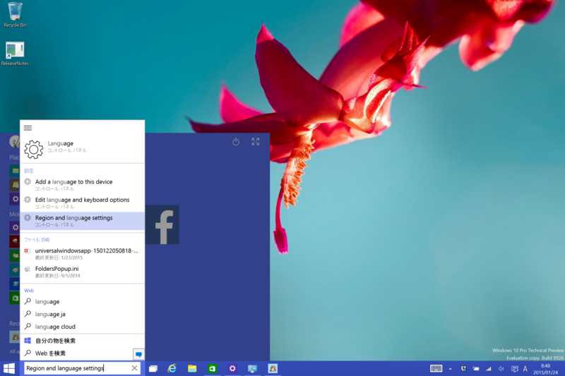
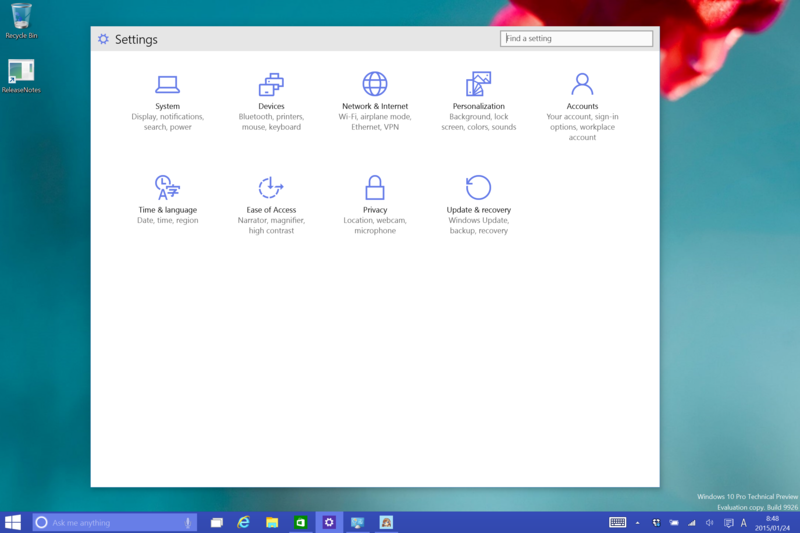
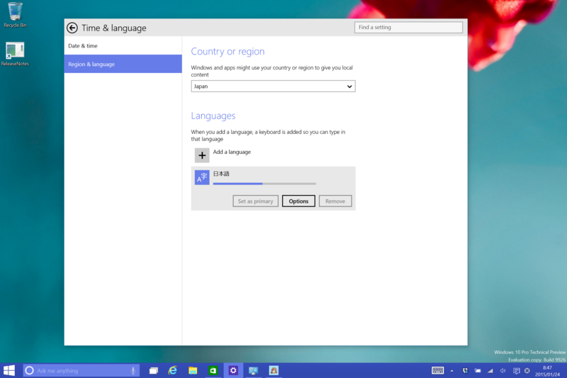
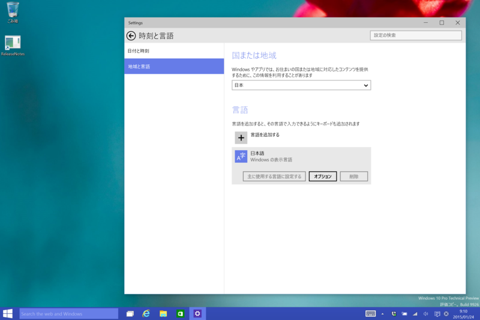
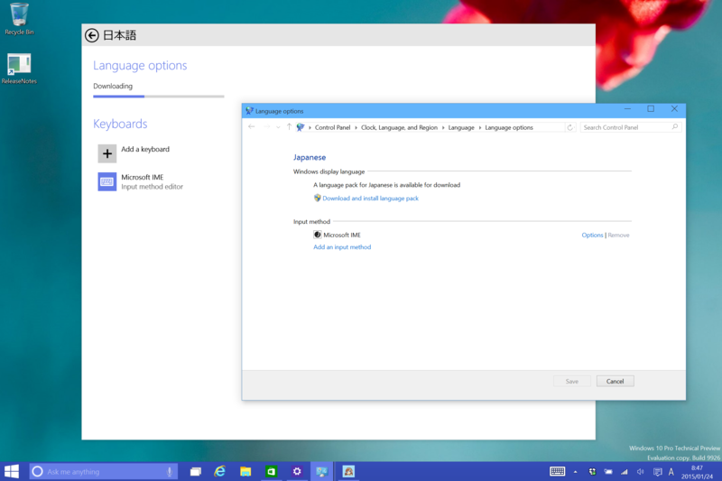

［Regeion and language settings］へアクセス。日本リージョンでは使えない Cortana さん(ノД`)・゜・。

［Settings］画面が表示される。だいぶデザインが変わったなー。ここで［Time & language］を選択。

［Regeion and language］タブへ移動。［日本語］の［Options］を開くと、言語パックの検索が始まる。見つかったらそれをダウンロード。

ダウンロード完了。Windows Update ついでに再起動すると、UI が日本語化される。一度サインアウトしてサインインするだけでもいいかも。

うちの環境では、レガシーなコントロールパネルからは日本語化できなかったかも。

