
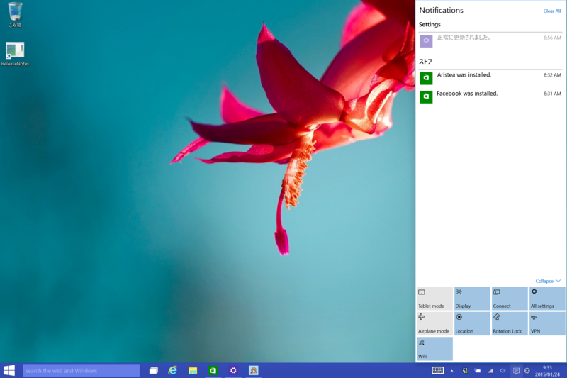

スクリーンを右から左方向へスワイプする（Windows 8 ではチャームに割り当てられていた操作）と、“アクションセンター”（Windows 10 で新設）があらわれる。この下、左端に［Tablet mode］ボタンがあり、デスクトップモード（？）とタブレットモードの切り替えができるようになっている<a href="#f-399937da" name="fn-399937da" title="この切り替えは［Settings］画面でも可能">*1</a>。

Surface Pro 3 でキーボードを取り外したら自動でタブレットモードへ切り替わる、なんていう挙動を期待してしまったのだけど、今のところ、少なくとも自分の環境では動作しない。

<h3>Tablet mode OFF</h3>

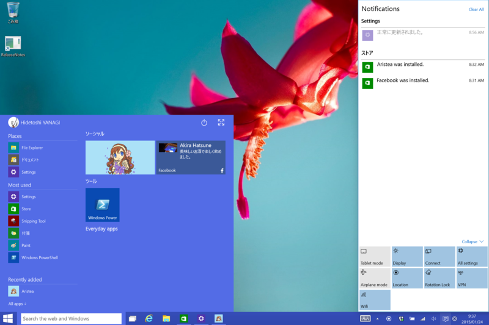 

<ul>
<li>デスクトップが明るく</li>
<li>検索ボタンがテキストボックススタイルに</li>
<li>スタートメニュー（全画面表示にすることも可能）</li>
</ul>
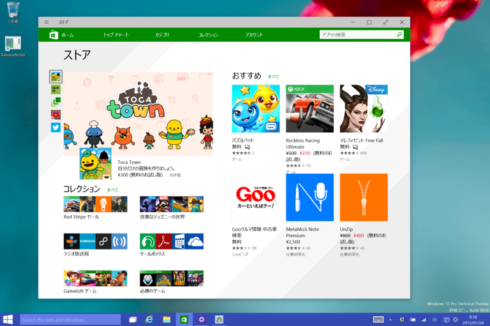 

<ul>
<li>ストア アプリは Windowed モードに</li>
<li>ソフトウェアキーボードは手動表示</li>
</ul>

<h3>Tablet mode ON</h3>

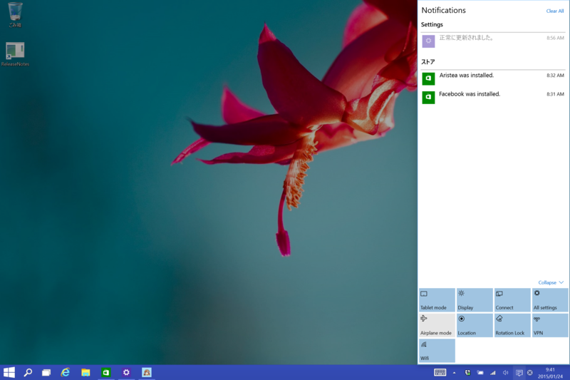 

<ul>
<li>（デスクトップを表示した状態で ON にすると）デスクトップが暗転</li>
<li>検索テキストボックスが消え、ボタンスタイルに</li>
</ul>
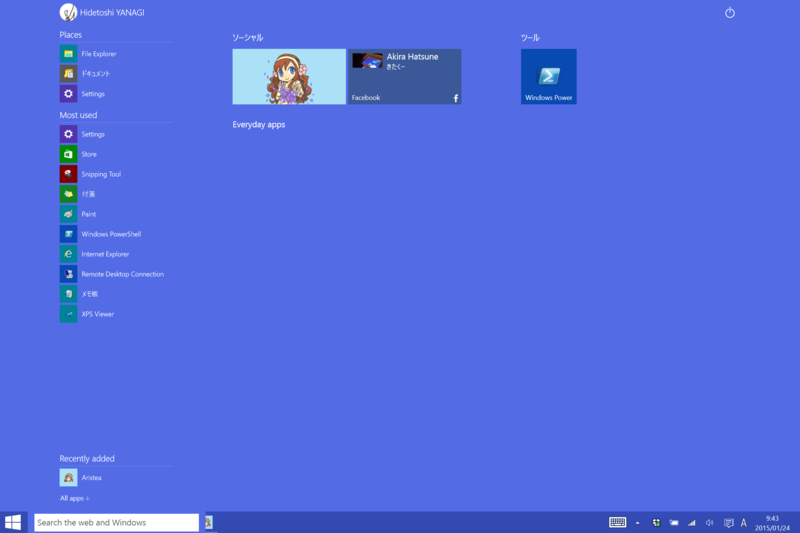 

<ul>
<li>スタート画面
<ul>
<li>検索ボタンは再びテキストボックススタイルに</li>
</ul></li>
</ul>
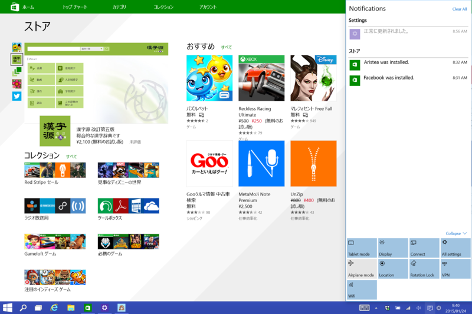 

<ul>
<li>ストア アプリは Full screen モードに
<ul>
<li>切り替えを繰り返してると Windowed モードに戻った際にタイトルバーが消えて困る</li>
<li>タスクバーは消えない（しかも不透明）</li>
<li>共有チャームはタッチ操作でどうやって出すんだ？（［Windows］＋［H］キーで出せる）</li>
<li>設定チャームは［Windows］＋［C］キーでコマンドメニューを出してアクセス？（［Windows］＋［I］キーは［Settings］画面に割り当て）</li>
</ul></li>
</ul>
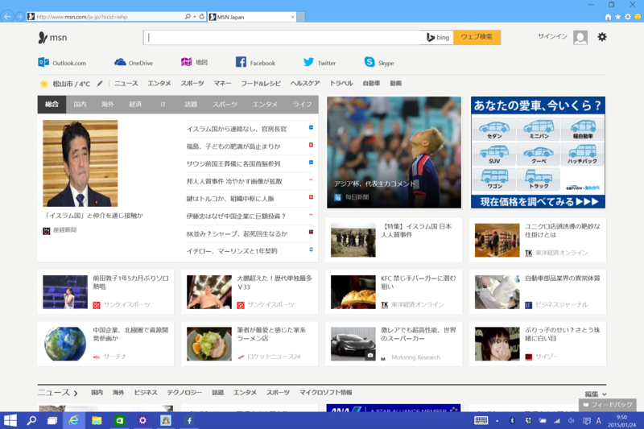 

<ul>
<li>デスクトップ アプリも Full screen に！
<ul>
<li>画面分割してアプリと並べたりできる</li>
</ul></li>
</ul>
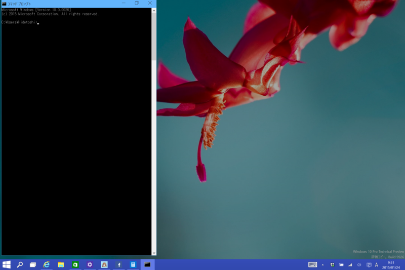 

<ul>
<li>ただし、コマンドプロンプトなどは除く（笑</li>
</ul>
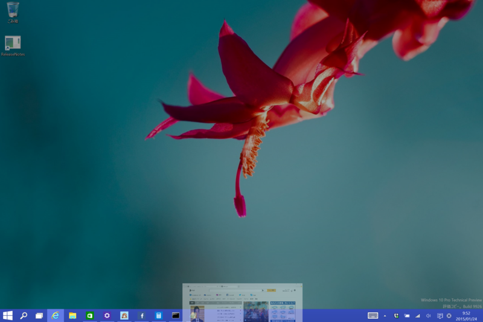 

<ul>
<li>ストア アプリと同じ操作で閉じられる。操作に一貫性が
<ul>
<li>Windows 8 みたいにくるっと回転するまで待たなくてもよくなったのかな？</li>
</ul></li>
<li>ソフトウェアキーボードはテキストボックスにフォーカスが当たると自動表示</li>
</ul>

<h3>再び Tablet mode off</h3>

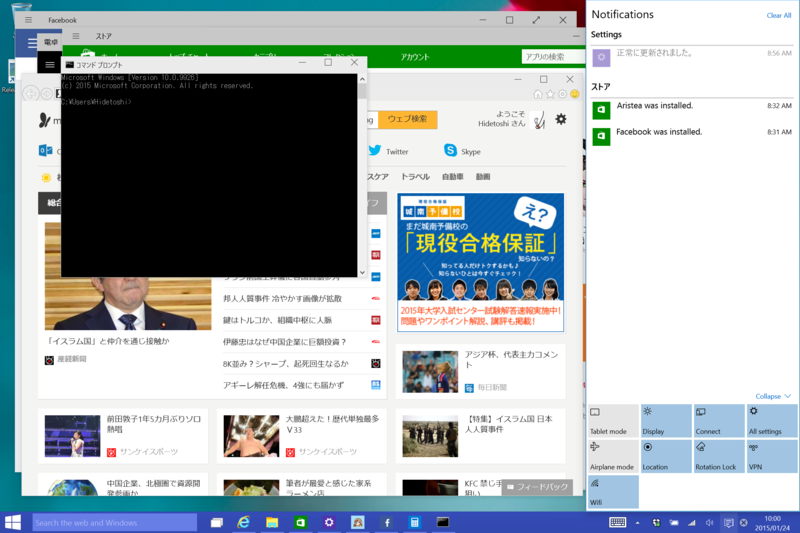

“Windows！”って感じの世界に戻る。

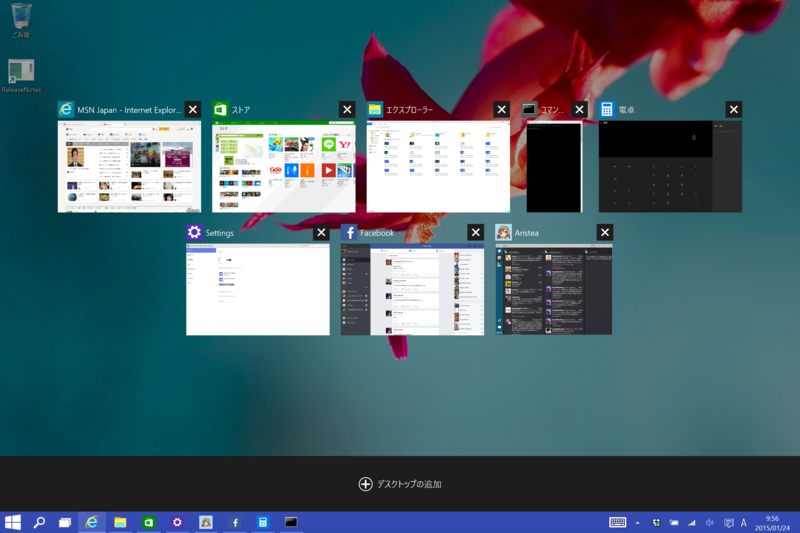

タスクの切り替えでも、ストア アプリとデスクトップ アプリは同等に扱われる。これは前のビルドから一緒だったかも。よく覚えてない。

手持ちの Surface Pro 3 で動作確認。もしかしたらデスクトップとタブレットで動作が違うとか、あるかもしれない。ドキュメントが見つかったら、また更新するかも。

<a href="#fn-399937da" name="f-399937da" class="footnote-number">*1</a>:この切り替えは［Settings］画面でも可能

