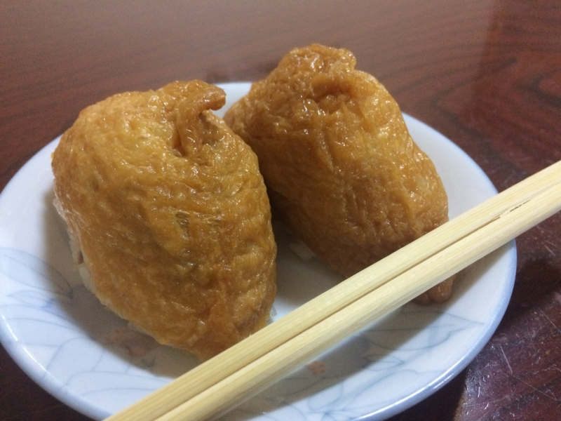
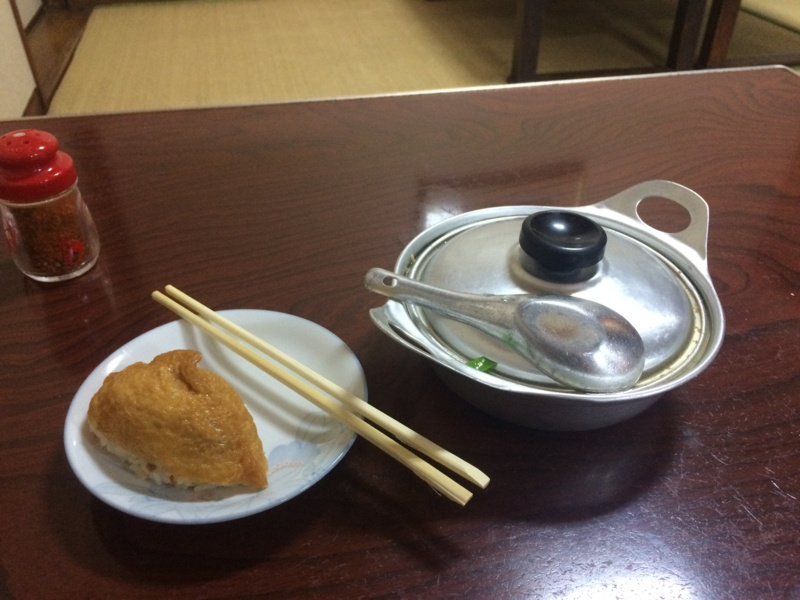
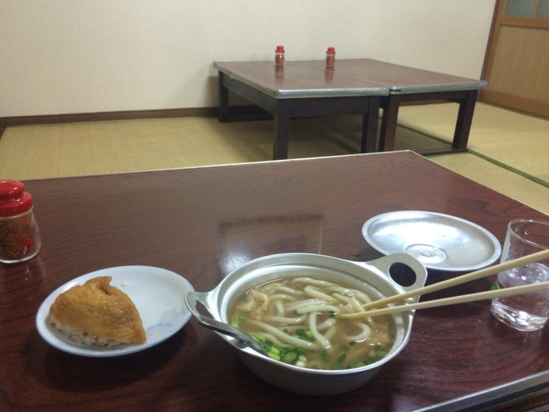

松山に引っ越してそろそろ1年になるけど、まだ鍋焼きうどんを食べてなかった！　というのを、『おへんろ』の松山編を見て思い出した。

<ul>
<li><a href="http://www.nicovideo.jp/watch/1420512625">&#x304A;&#x3078;&#x3093;&#x308D;&#x3002;&#xFF5E;&#x516B;&#x5341;&#x516B;&#x6B69;&#x8A18;&#xFF5E; &#x7B2C;28&#x8A71;&#x300C;&#x7A81;&#x6483;&#xFF01; &#x9B45;&#x60D1;&#x306E;&#x30EF;&#x30F3;&#x30C0;&#x30FC;&#x30E9;&#x30F3;&#x30C9;&#xFF01;&#x30A8;&#x30EA;&#x30A2;51&#x300D; &#x2010; &#x30CB;&#x30B3;&#x30CB;&#x30B3;&#x52D5;&#x753B;:GINZA</a>（残念ながら無償視聴期間は過ぎたので有料）</li>
</ul>
そういえば、『永遠のゼロ』の漫画版でも主人公が食べてたね。

<a href="http://www.amazon.co.jp/exec/obidos/ASIN/B009DBYYCC/bestylesnet-22/">永遠の０ : 1 (アクションコミックス)</a>
<ul><li>作者: 百田尚樹,須本壮一</li><li>出版社/メーカー: 双葉社</li><li>発売日: 2012/09/07</li><li>メディア: Kindle版</li><li><a href="http://d.hatena.ne.jp/asin/B009DBYYCC/bestylesnet-22" target="_blank">この商品を含むブログを見る</a></li></ul>

ここにでてきたのは「ことり」という店だけど、今回は「アサヒ」に行ってきた。どちらも銀天街（松山市駅から大街道（松山城への入り口）に伸びる商店街）のちょっと入ったところにある。松山市駅から歩いて、大街道に向かって左へ曲がるあたりにある小道を覗いてみれば、たぶんどちらかはすぐに見つかると思う。

ちなみに、松山では長年「ことり」派と「アサヒ」派で血で血を洗う抗争が続いているのだそうだ。たいへん恐ろしいことである。

一人で訪れると、畳敷きの座敷へ案内された。メニューも何もないので、とりあえず「鍋焼きうどんください」と注文。店内を見回すと、棚においしそうな稲荷寿司がならべてあったので、それも頼んだ。一つか二つか聞かれたので、一つだけ注文することもできるのだろう。自分は二つ頼んだ。文庫本を開き、稲荷寿司を一つ、二口に分けて食べる。フツーに美味しい。

すると、アルミ（？）製の鍋にはいった鍋焼きうどんが到着。

ちょっとびっくりしたのは、この時点でお勘定を要求されたこと。慌てて財布をお尻のポケットから抜く。お会計は、鍋焼きうどんとお稲荷さん2個で720円。鍋焼きうどんだけなら500円ぐらいなんじゃないかな。“たまご”と注文を通す声が聞こえたので、生卵入りとかもできるのかもしれないが未確認。

ふたを開けた見た。ゆげゆげー

しっかり火が通ったやわらかいおうどんが、甘い出汁の中に。香川県人なら怒髪が成層圏に達するであろう、ふにゃふにゃなおうどんだけど、出汁の甘さも相まって、なんだか優しい感じがする。っていうか、昔、母ちゃんが夜食で作ってくれたうどんと似たような味がするわ。具のとりあわせも、そんな感じだしな。母ちゃん、このレシピ知ってたんだろうか。

出汁まで全部飲んで完食。割とお腹いっぱいになってしまった。

たぶんB級グルメグランプリに出しても優勝は望めない気がするけど（インパクトないし！）、のんびり、まったり、温かい、松山らしい食べ物かもしれないなと思った。とくに、この季節にはよく合う。

