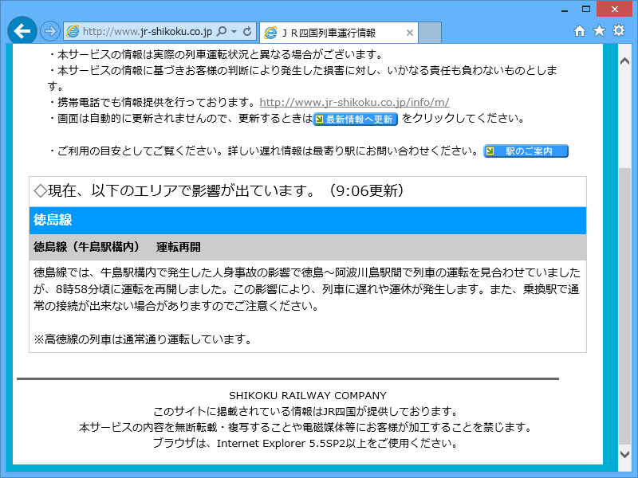
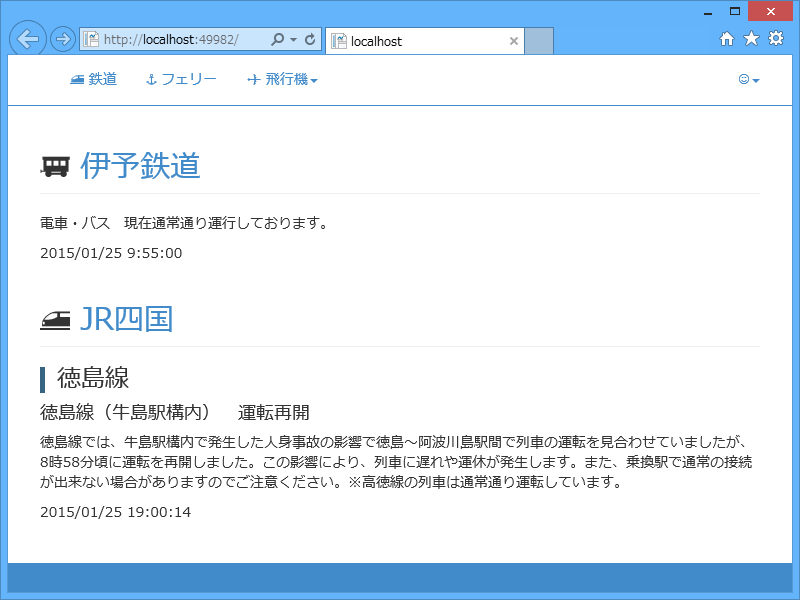

密かに待ってました。人身事故ってのがちょっと胸痛むけれど。すみません。でも、これで運行に遅延が発生した時にどんなコードが吐かれるのかわかったやで。

<ul>
<li><a href="http://www.jr-shikoku.co.jp/info/">&#xFF2A;&#xFF32;&#x56DB;&#x56FD;&#x5217;&#x8ECA;&#x904B;&#x884C;&#x60C5;&#x5831;</a></li>
</ul>
遅れがないとき。

<pre class="code lang-html" data-lang="html" data-unlink>&lt;div ID=&quot;delay_info&quot;&gt;
&lt;div class=&quot;no_delay&quot;&gt;◇現在、遅れ等の情報はありません。&lt;/div&gt;
&lt;/div&gt;
</pre>
遅れがあるとき。

<pre class="code lang-html" data-lang="html" data-unlink>&lt;div ID=&quot;delay_info&quot;&gt;
&lt;p&gt;◇現在、以下のエリアで影響が出ています（*:**更新）。&lt;/p&gt;

&lt;h4&gt;徳島線&lt;/h4&gt;
&lt;h5&gt;徳島線（牛島駅構内）　運転再開&lt;/h5&gt;
&lt;p&gt;徳島線では……&lt;br&gt;※高徳線の列車は……&lt;/p&gt;
&lt;/div&gt;
</pre>
同じ路線で複数の遅延情報があるケースも考えられるだろうので、タグはこんな感じになるんだろう（と思う）。

<pre class="code" data-lang="" data-unlink>p

h4
h5
p

h5
p
:
h4
h5
p

h5
p
:</pre>
というわけで、これをいい感じにデータオブジェクトに変換していくわけれだけれど、どうしよう。

とりあえず HtmlAgilityPack でやってみた。

<pre class="code lang-cs" data-lang="cs" data-unlink>public class DelayInfo
{
public string Line { get; set; }
public string Status { get; set; }
public string Message { get; set; }
}

public static List&lt;DelayInfo&gt; GetJRShikoku()
{
const string key = &quot;jrshikoku&quot;;
const string url = &quot;http://www.jr-shikoku.co.jp/info/&quot;;

// キャッシュを探す
var result = WebCache.Get(key) as List&lt;DelayInfo&gt;;

// キャッシュがヒットしなければ、情報の取得
if (result == null)
{
using (var client = new WebClient())
{
// !!
client.Encoding = Encoding.GetEncoding(&quot;Shift_JIS&quot;);

var doc = new HtmlAgilityPack.HtmlDocument();
var src = client.DownloadString(url);

doc.LoadHtml(src);

var nodes = doc.DocumentNode
// div#delay_info タグを探す
.SelectSingleNode(@&quot;//div[@id=&quot;&quot;delay_info&quot;&quot;]&quot;)
// 直下のノードを列挙
.ChildNodes
// 改行・コメントなどのノードは読み飛ばす
.Where(_ =&gt; _.NodeType == HtmlNodeType.Element)
// 最初の div#no_delay や p は読み飛ばす
.Skip(1);

var line = string.Empty;
var status = string.Empty;

result = new List&lt;DelayInfo&gt;();

foreach (var node in nodes)
{
switch (node.Name)
{
case &quot;h4&quot;: // 線名を記憶
line = node.InnerText;
continue;
case &quot;h5&quot;: // &quot;徳島線（牛島駅構内）　運転再開&quot;を記憶
status = node.InnerText;
continue;
case &quot;p&quot;:  // p タグを見つけたらデータをプッシュ
result.Add(new DelayInfo()
{
Line = line,
Status = status,
Message = node.InnerText,
});
break;
default:
// Do Nothing
break;
}
}

// 遅延情報が見つからなかった場合、全線正常のデータをプッシュ
if (result.Count == 0)
{
result.Add(new DelayInfo()
{
Line = &quot;全線&quot;,
Status = &quot;正常運行&quot;,
Message = &quot;現在通常通り運行しております。&quot;,
});
}
}
}

return result;
}
</pre>

ビューでこのデータを適当にレンダリング。まぁ、まぁ、いい感じかもしれない。もっといろんなケースを見てみたかったけれど、とりあえずこれが正しいとして、Twitter BOT でも実装してみるかな。

