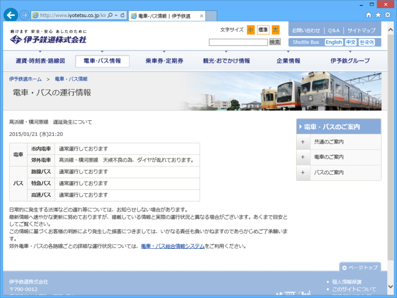
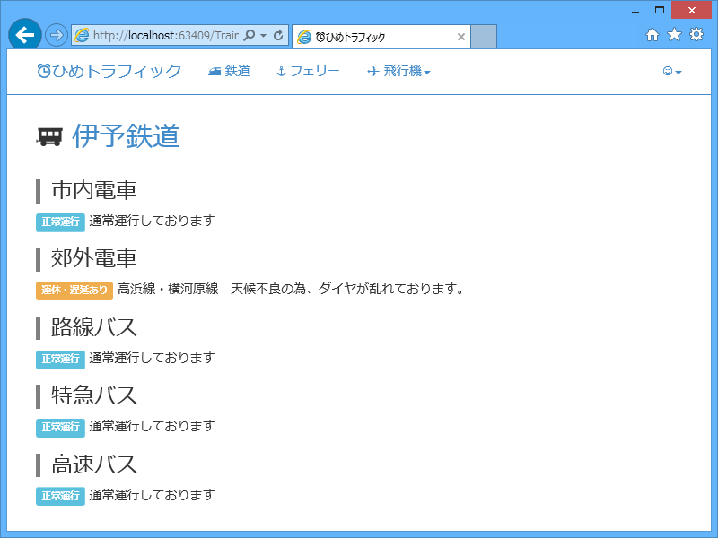

<a href="https://blog.daruyanagi.jp/entry/2015/01/25/143744">WebMatrix&#xFF1A; JR&#x56DB;&#x56FD;&#x304C;&#x6B62;&#x307E;&#x3063;&#x305F;&#x306E;&#x3067;&#x3001;&#x904B;&#x884C;&#x60C5;&#x5831;&#x306E;&#x53D6;&#x5F97;&#x30D7;&#x30ED;&#x30B0;&#x30E9;&#x30E0;&#x4F5C;&#x308B;&#x306E;&#x304C;&#x6357;&#x3063;&#x305F;&#x3002; - &#x3060;&#x308B;&#x308D;&#x3050;</a> で喜んでたら、今朝は伊予鉄にも遅れが出た。これで、伊予鉄の運行情報もとれるぞ！

<ul>
<li><a href="http://www.iyotetsu.co.jp/kinkyu/">&#x96FB;&#x8ECA;&#x30FB;&#x30D0;&#x30B9;&#x60C5;&#x5831; | &#x4F0A;&#x4E88;&#x9244;</a></li>
</ul>
伊予鉄の運行情報ページの構造は、

<pre class="code lang-html" data-lang="html" data-unlink>&lt;p class=&quot;about&quot;&gt;電車・バス　現在通常通り運行しております。&lt;/p&gt;
&lt;p class=&quot;date&quot;&gt;2015/01/26(月) 10:26&lt;/p&gt;

&lt;!-- 遅延がある場合だけ↓　--&gt;
&lt;table class=default&gt;
:
:
&lt;/table&gt;
</pre>
こんな感じになってるみたい。ということは、このテーブルがある前提で遅延情報を解析・出力、途中で例外が発生すれば正常運行とみなすという方針でよさそうだ。

<pre class="code lang-cs" data-lang="cs" data-unlink>public static List&lt;DelayInfo&gt; GetIyotestu()
{
const string name = &quot;伊予鉄&quot;;
const string url = &quot;http://www.iyotetsu.co.jp/kinkyu/&quot;;

return GetDelayInfo(name, url, Encoding.UTF8, _ =&gt;
{
var doc = new HtmlAgilityPack.HtmlDocument();

doc.LoadHtml(_);

try
{
// 遅延情報のテーブルを取得。発見できなければ例外 → 正常運行
var rows = doc
.DocumentNode
// table.default のなかにある tr タグを取得
.SelectNodes(@&quot;//table[@class=&quot;&quot;default&quot;&quot;]//tr&quot;)
// テキストノードなどは読み飛ばす
.Where(n =&gt; n.NodeType == HtmlNodeType.Element);

var result = new List&lt;DelayInfo&gt;();

foreach (var row in rows)
{
var td = row.ChildNodes
// テキストノードなどは読み飛ばす
.Where(n =&gt; n.NodeType == HtmlNodeType.Element)
// セルの結合があるので、ほしい情報のインデックスが列によって違う！
// → 後ろから読む
.Reverse()
.ToList();

result.Add(
new DelayInfo()
{
Line = td[1].InnerHtml,
Status = td[0].InnerHtml.IndexOf(&quot;通常運行&quot;) &lt; 0
? &quot;運休・遅延あり&quot;
: &quot;正常運行&quot;,
Message = td[0].InnerHtml,
}
);
}

return result;
}
catch
{
// p.about の内容を解析して、正常運行というデータを返す    
var text = doc.DocumentNode
.SelectSingleNode(@&quot;//p[@class=&quot;&quot;about&quot;&quot;]&quot;)
.InnerText;
var line = text.Split('　')[0];
var message = text.Split('　')[1];
return new List&lt;DelayInfo&gt;()
{
new DelayInfo()
{
Line = line,
Status = &quot;正常運行&quot;,
Message = message,
},
};
}
});
}
</pre>
GetDelayInfo(name, url, encodsing, processor) は、指定した URL からソースコードの取得を取得するもので、キャッシュを Get/Set も行う（定型処理なので分離した）。HTML の解釈を string processor(string src) に委譲しているので、今回はその中身だけを書けばよい。

とくに難しいことはないのだけど、ただ一点、テーブルのセルがところどころ結合されている関係で、列によって取得したい情報のセルのインデックスがずれる。しかし、後ろから数えた場合のインデックスは変わらないので、Reverse() してから読んでやればいい。

これで数日様子を見てみる。

