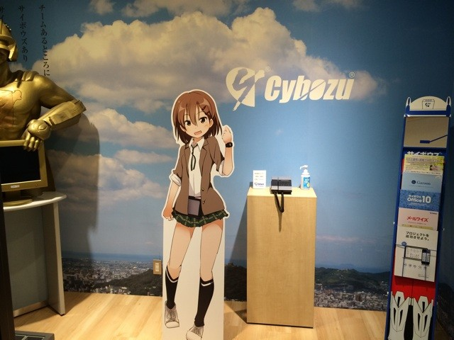
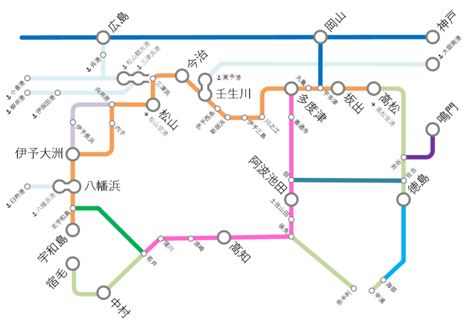

いろいろ決まったら、もう少しちゃんと告知があるだろうと思いますが、県外からの参加者の皆様は早めに予定を知りたいでしょうから、先にお漏らししてしまいます。<i>今年も愛媛・松山でプログラミング生放送が開催される予定です！</i>開催日は<b>6月6日（土）</b>を予定しています。皆様の参加をお待ちしております。

<blockquote cite="http://pronama.azurewebsites.net/study/">

プロ生では不定期にIT・開発系の勉強会を開催しています。テーマは、IT・開発系であればノンジャンルです。まれにテーマを決めて開催もしています。勉強会とは、特定の分野に興味のある人たちの交流の場として活動しています。

勉強会の特徴は、オンラインストリーミング（ニコニコ生放送や Ustream ）を前提としていて、スライドに視聴者のコメントや Twitter を重ねて表示しています（ニコニコメソッド）。

楽しい勉強会なので、興味のある方は、ぜひご参加ください！

<cite><a href="http://pronama.azurewebsites.net/study/">&#x52C9;&#x5F37;&#x4F1A; | &#x30D7;&#x30ED;&#x30B0;&#x30E9;&#x30DF;&#x30F3;&#x30B0;&#x751F;&#x653E;&#x9001;</a></cite>
</blockquote>

不詳・だるやなぎもそれまでに何かネタをひねり出す予定です。

<blockquote class="twitter-tweet" lang="ja">
RT <a href="https://twitter.com/daruyanagi">@daruyanagi</a>: WebMatrix を使った Wiki の作り方の Wiki、プロ生愛媛までに完成させたい
&mdash; ウェブマトリクスマン(緑のタイツマン (@WebMatrixMan) <a href="https://twitter.com/WebMatrixMan/status/560735567777120256">2015, 1月 29</a></blockquote>

緑色の人にも捕捉されちゃったので、ぜひ形にしたいですね。

去年の様子は、酢酸先生のブログに詳しいのでご紹介しておきます（ほかにもいろんな人がブログに書いてくれているのでググってみてください）。

<iframe src="http://blog.ch3cooh.jp/embed/20140617/1402993800" title="愛媛・松山に行ってきました(4) - プロ生勉強会 第29回＠株式会社サイボウズ 松山オフィス - 酢ろぐ！" class="embed-card embed-blogcard" scrolling="no" frameborder="0" style="width: 100%; height: 190px; max-width: 500px; margin: 10px 0px;"><a href="http://blog.ch3cooh.jp/entry/20140617/1402993800">愛媛・松山に行ってきました(4) - プロ生勉強会 第29回＠株式会社サイボウズ 松山オフィス - 酢ろぐ！</a></iframe>

あと「愛媛？　松山？　どこにあんの？　日本？」っていう方のために、ちょっと路線図を書いてみました。参考になればうれしいです。

 

<ul>
<li>クルマの人：瀬戸大橋とか、しまなみ海道を渡ってきてください。ちゃんと高速道路あるやで。</li>
<li>電車の人：大都会・岡山から特急「しおかぜ」が出ています。ちゃんと電化されているので、高知行きの「南風」よりは快適デス。</li>
<li>飛行機の人：羽田・伊丹・中部・福岡・鹿児島・那覇との間にフルサービスキャリアが就航しています。運賃の安い LCC も充実。関空行き（ピーチ）と成田行き（ジェットスター）がありマス。松山空港から市街までは15分～30分。リムジンバスの運賃は……たぶん500円しないぐらいだったような気がしマス。</li>
<li>船の人：松山からは小倉・広島・柳井にフェリーが出ています。ちょっと足を延ばせば、大分＝八幡浜、東予＝大阪の路線も。東予＝大阪のオレンジフェリーは割とお勧めデス（松山市内までのバス込みで二等寝室7000円ちょっと）。</li>
</ul>
もちろん、県内の方もぜひぜひ。募集が始まったらまたお知らせしたいと思います。

そんじゃーね。

