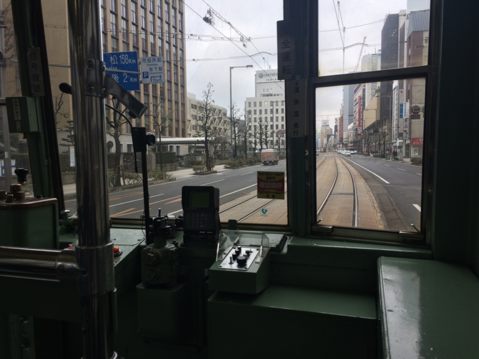
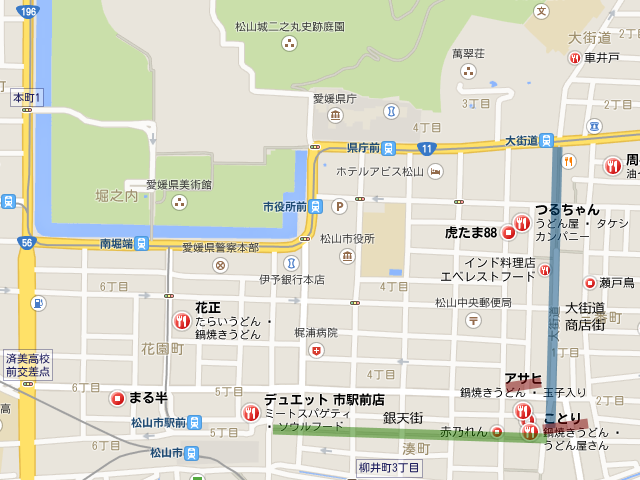
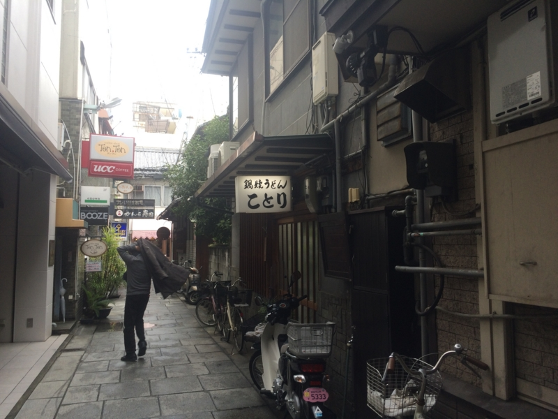
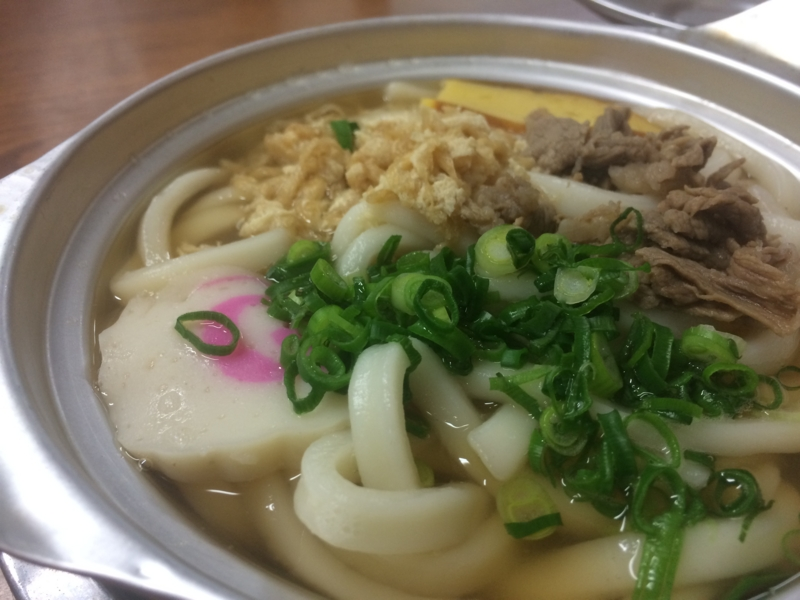

ちょっと市役所に行く用事があったので（税金の申告のために、住基カード作って電子署名書いてもらってた）ので、ちょっと足を伸ばし、また鍋焼きうどん食べに行った。前回は「アサヒ」にいったので、今回は「ことり」。よく知らないけど、松山の鍋焼きうどん界を牛耳るのがこの二店舗なのだという。

<ul>
<li><a href="https://blog.daruyanagi.jp/entry/2015/01/24/173023">&#x934B;&#x713C;&#x304D;&#x3046;&#x3069;&#x3093;&#x304C;&#x677E;&#x5C71;&#x306E;&#x30BD;&#x30A6;&#x30EB;&#x30D5;&#x30FC;&#x30C9;&#x3089;&#x3057;&#x3044;&#x306E;&#x3067;&#x3001;&#x3061;&#x3087;&#x3063;&#x3068;&#x98DF;&#x3079;&#x3066;&#x304D;&#x305F;&#x3002; - &#x3060;&#x308B;&#x308D;&#x3050;</a></li>
</ul>
場所は、ここら辺。自分は市役所からてけてけ歩いたけど、まぁ、10分ちょいぐらい？　たいした距離じゃない。

銀天街の脇に入ったところにあるのだけど、注意してみないとよくわかんないかも。

前回紹介した『永遠のゼロ』の漫画版の描写とほぼ同じで、漫画家の人ってやっぱり絵がうまいんだなーと思った（小並感

早速注文。稲荷寿司もメニューにあるのだけど（鍋焼きうどん520円、稲荷寿司（2個）260円？　だったかな、記憶曖昧）、隣の人が頼んで断られていたので、残念ながら品切れだった模様。今回は鍋焼きうどんだけ食べた。

ご到着！　例によって支払は鍋焼きうどんの到着後なので、あらかじめテーブルにお金を出しておくとよいかも。

「ことり」は厨房の様子がちょっと見えるのだけど、このお馴染の鈍い銀色をした鍋が並ぶさまは割と壮観。

ちなみに、「アサヒ」はこんな感じだった。

具はほとんど同じだけど、「ことり」は伊達巻っぽい卵焼きとナルト、「アサヒ」はカマボコとチクワ、わずかに違がある。味は「ことり」のほうが甘さ控えめって感じかなぁ（記憶をたどってるから、間違いがあるやもしれぬ）。出汁の奥の方に、ほんのりお魚の香りがする。

どちらも甲乙つけがたいけれど、個人的な好みでいえば「アサヒ」かな？　奈良の野菜たっぷりな甘々ラーメン（「神座」みたいなやつ）で育ったしね。どっちでも空いてる方、先に見つけた方に入ればいいんじゃないでしょうか（適当

帰りは大街道から伊予鉄に乗ったけど、運よく本町線を捕まえられた。家の近くまで寄り道せずに行ってくれるのだけど、30分に1本しか走ってないレア路線な（？）のだ！　ちょっと気分良かった。

