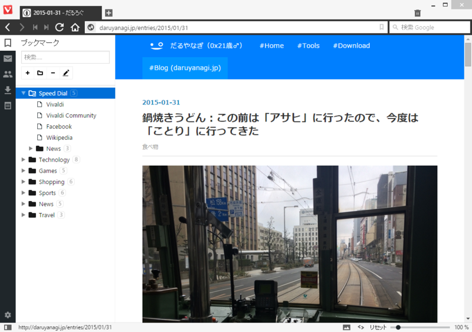
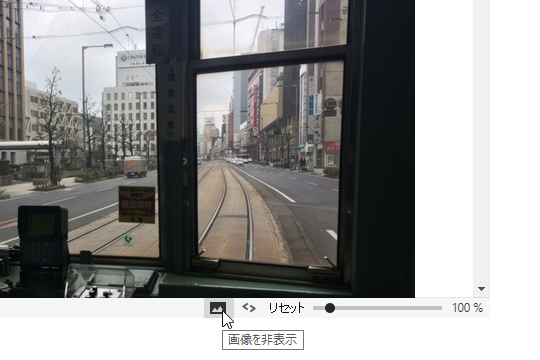
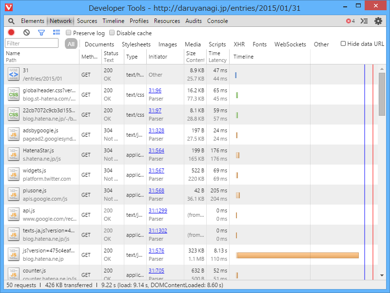
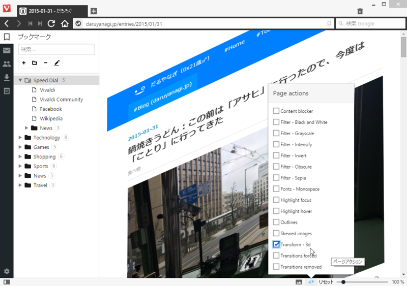
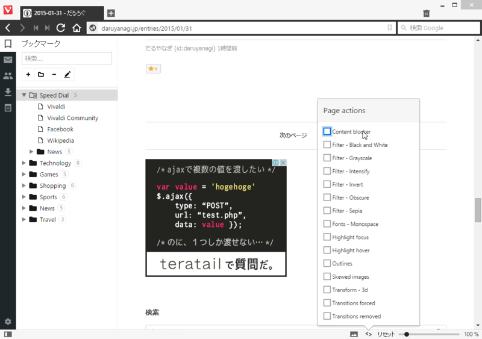
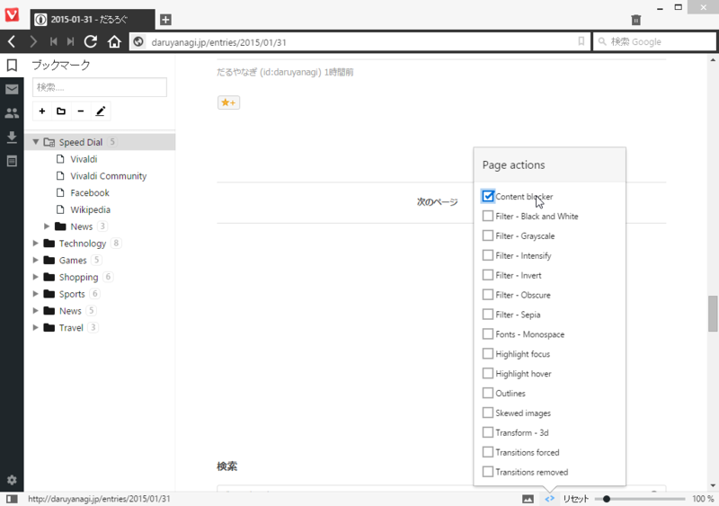
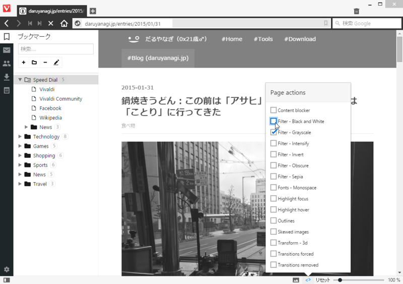
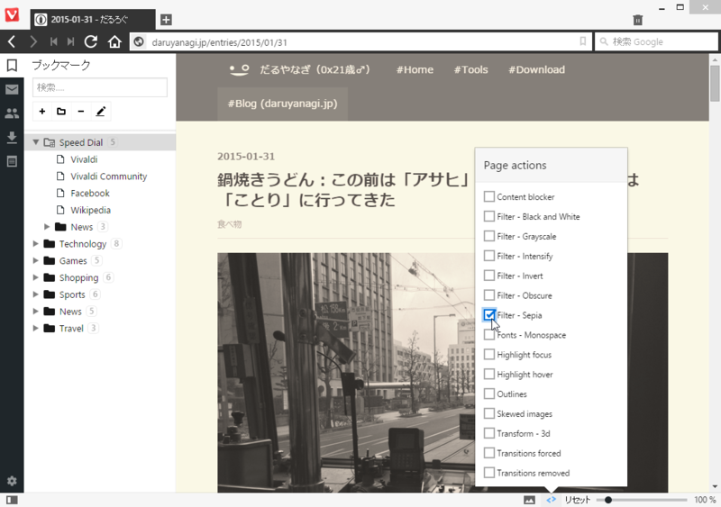

自分は別におぺらーではないので（「Opera」をメインに使っていたのは、BeOS 時代のことだ。確か v5 ぐらいではなかったかと思う）、「Opera」の何がいいのかあまりわかってないが……「Vivaldi」は割かしユニークだなーと思った。 

<ul>
<li><a href="http://www.forest.impress.co.jp/docs/news/20150128_685746.html">&#x5143;Opera&#x306E;Tetzchner&#x6C0F;&#x7387;&#x3044;&#x308B;Vivaldi Technologies&#x3001;&#x65B0;&#x30D6;&#x30E9;&#x30A6;&#x30B6;&#x30FC;&#x300C;Vivaldi&#x300D;&#x3092;&#x516C;&#x958B; - &#x7A93;&#x306E;&#x675C;</a></li>
</ul>

<h3>画像を非表示</h3>

ステータスバーにあるボタン一発で画像を消せる。

画像の非表示を有効化してる状態だと、画像はリクエストされないみたい。パケット通信してるときには助かるかも。Click & Load みたいな機能（画像のある場所にプレースホルダを置いて、クリックすると個別に読み込める）つけてくれるともっとありがたいんだけどね。

<h3>ページアクション</h3>

ページにさまざまな追加効果を施せる。［Transform - 3D］は、実用性はいざ知らず、インパクトはかなりのものだな。

みんなが好きそうなのは、［Content blocker］。

広告が消えた（＾ｖ＾）……まぁ、広告で食ってる身からすると、割と微妙な気分になるのだけどね。早く広告以外のまっとうなマネタイズの方法が開発されるといいんだけど。

フィルターも何種追加搭載している。これは［Filter - Grayscale］。

個人的には［Filter - Sepia］が気に入った。目に優しい感じ。使いようによっては便利で、単なるお遊び機能ではないなーって感じた。

今のところ、重要な機能としては同期機能、メール機能（メール統合は旧「Opera」の象徴って感じだわな）、拡張機能あたりが欠けているけれど、そこらへんがカバーされたら割といい感じになりそう。まぁ、「Google Chrome」で不便は感じていないのだけど、最近“Chromebook”由来の機能をデスクトップにねじ込んでくることもあるから（いきなりユーザー切り替えメニューが付いたりな！　個人的には便利に使わせてもらってるけど）、そういうのが気に入らない人はこういうオルタナティブがあると助かるよね。

