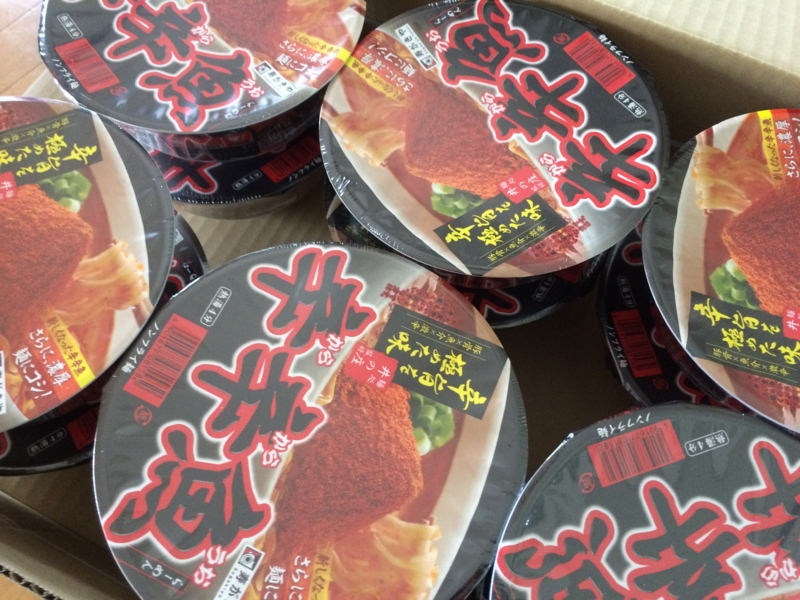

<h3>2月1日</h3>

<blockquote class="twitter-tweet" lang="ja">
怖いもの食べたさある / “<a href="http://t.co/gYxEI6Omi5">http://t.co/gYxEI6Omi5</a>： 寿がきや 麺処井の庄監修 辛辛魚らーめん 136g×12個: 食品・飲料・お酒” <a href="http://t.co/PRBZ0doQHO">http://t.co/PRBZ0doQHO</a>
&mdash; 俺、だるやなぎになります。 (@daruyanagi) <a href="https://twitter.com/daruyanagi/status/561719634777235456">2015, 2月 1</a></blockquote> 

<h3>2月2日</h3>

<blockquote class="twitter-tweet" lang="ja">
ん……なんかうちに「辛辛魚」きたんだけど……たのんだっけ
&mdash; 俺、だるやなぎになります。 (@daruyanagi) <a href="https://twitter.com/daruyanagi/status/562122719987511296">2015, 2月 2</a></blockquote>

どなたか存じませんが、ありがとうございます……ありがとうございます……。

<h3>2月4日</h3>

意を決して食べてみた。

「大変辛いラーメンです。辛いものが苦手な方はご注意ください」という注意書きが、食欲と恐怖心をかきたてる。お尻がやられそうな予感に、穴がむずむずする。

熱湯四分、液体スープと後入れ粉末投入。唐辛子と魚粉が、鼻孔を責めたてる。ちょっとくしゃみした。

麺は太目で、縮れてる。スープは辛く、飲むとむせそう。麺に絡めて啜る。これだったらつけ麺でもいいかもしれないな。

完食。お腹がぐるぐるするけれど、これはこれでおいしい。でも、これ、2週間に1回ぐらいでいいな……1ケース送られてきたんだけど、いつなくなるんだろう？

