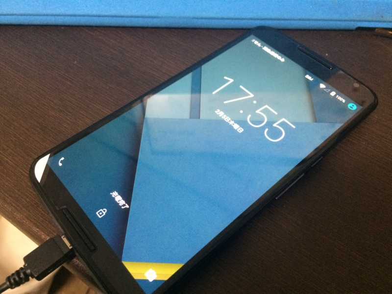

<a href="https://blog.daruyanagi.jp/entry/2015/02/05/194810">au &#x306E; iPad mini &#x3092;&#x89E3;&#x7D04;&#x3057;&#x305F; - &#x3060;&#x308B;&#x308D;&#x3050;</a> ので、新しい携帯電話を買った。Y!mobile の Nexus 6（32GB）、色はホワイト。

<ul>
<li><a href="http://www.ymobile.jp/lineup/nexus6/">Nexus 6&#xFF5C;&#x904E;&#x53BB;&#x306E;&#x88FD;&#x54C1;&#xFF5C;&#x88FD;&#x54C1;&#xFF5C;Y!mobile - &#x683C;&#x5B89;SIM&#x30FB;&#x30B9;&#x30DE;&#x30DB;&#x306F;&#x30EF;&#x30A4;&#x30E2;&#x30D0;&#x30A4;&#x30EB;&#x3067;</a></li>
</ul>
この分野ではパイオニアだった Apple の勢いにも陰りが見え、反対に Android は充実してきた印象がある（若干カオスっぽいけど）。そろそろ iPhone を捨てて、Android にしてもよいころあいだと思う。 ――Windows Phone？　知らない子ですね……。

端末を選ぶときの条件は、最新の Android 5.0 Lolipop 搭載であること、SIM フリーであること、余計な機能が付いておらず、かといって足りない機能もないこと――というわけで、自然とリファレンス機的なポジションを占めるこいつをチョイスすることになった。Google Play では入荷待ちだけど、ワイモバイルなら在庫がある。変に国産端末なんかに手を出して、OS アップデートしてもらえないとかになったらイヤだしね。やっぱり Nexus が安牌だよね。

あと、今回はオンラインショップで買ったのだけど、これがとても簡単でよかった。申し込みの際に入力した電話番号が固定回線のモノではないということで電話を1度もらったことを除けば<a href="#f-87276d70" name="fn-87276d70" title="んなもん、フォームのバリデーションで対応できないのか？　実家の番号を教えて凌ぐ">*1</a>、何のトラブルもなく、契約完了の翌日には実機が送られてきた。

開梱し、SIM を挿すだけで作業は終わり！　お店に並んで、長ったらしい説明を聞いて、何回もサインして端末を買うのがバカらしくなるぐらい簡単だ。今度からはなるべくオンラインで買うことにしよう。

　

起動すると Android 5.0.1 へのアップデートが案内されてきたので、おとなしくアップデート。すっかりバッテリーがへたり、アップデートのたびに動作がもさもさしていく iPhone 5s とは段違いの反応が楽しい。大きさは二回りほど大きいが、いつも両手で QWERTY キーボードを打っているので、むしろこれぐらい大きいほうが使いやすい……ポケットにいれたいひとは iPhone 5s の大きさじゃないとイヤだろうけど。

まぁ、そこのところの評価は使うひと次第なんじゃないかな。個人的にはすこぶる印象のよい端末だ。

今メインで使っている iPhone 5s は今年9月に契約が終わる（<a href="https://blog.daruyanagi.jp/entry/2013/09/24/072910">iPhone 5S &#x8CB7;&#x3063;&#x305F;&#x3063;&#x305F;&#x3002; - &#x3060;&#x308B;&#x308D;&#x3050;</a>）ので、そしたら MVNO にでも MNP するつもり<a href="#f-50046e5c" name="fn-50046e5c" title="そのころには技適のない Windows Phone が国内で使えるようになっているハズ（知らんけど）">*2</a>。それまでは iPhone 5s と Nexus 6 の二足わらじで暮らすことになるけれど、また気が付いたことがあれば書こうと思う。

<a href="#fn-87276d70" name="f-87276d70" class="footnote-number">*1</a>:んなもん、フォームのバリデーションで対応できないのか？　実家の番号を教えて凌ぐ

<a href="#fn-50046e5c" name="f-50046e5c" class="footnote-number">*2</a>:そのころには技適のない Windows Phone が国内で使えるようになっているハズ（知らんけど）

