

<h3>ソーシャルネットワーク、電子書籍……とりあえず使いそうなアプリ入れる</h3>

とりあえず iPhone でつかってたアプリをガシガシいれる。ガシガシガシガシ……

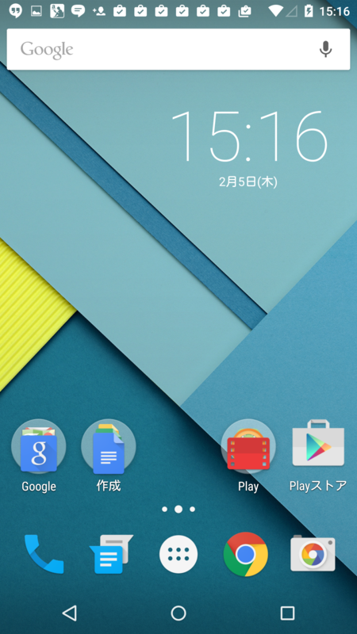 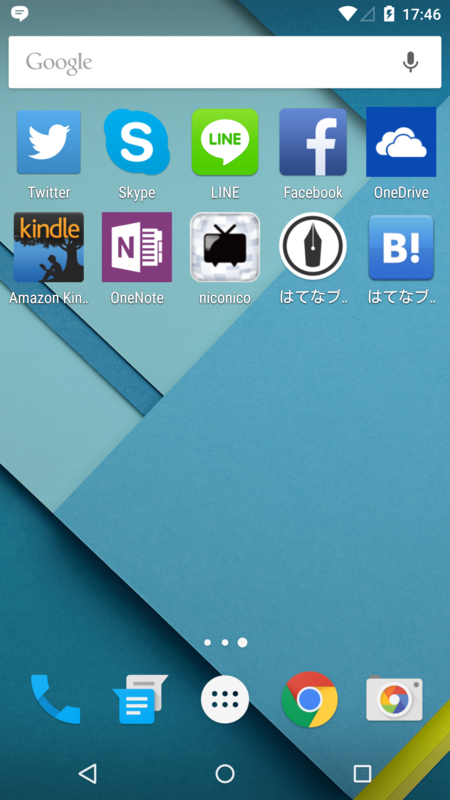 

<table>
<tr>
<td>アプリ</td>
<td>コメント</td>
</tr>
<tr>
<td><a href="https://play.google.com/store/apps/details?id=com.twitter.android&hl=ja">Twitter - Google Play &#x306E; Android &#x30A2;&#x30D7;&#x30EA;</a></td>
<td>自分は純正派。</td>
</tr>
<tr>
<td><a href="https://play.google.com/store/apps/details?id=com.facebook.katana&hl=ja">Facebook - Google Play &#x306E; Android &#x30A2;&#x30D7;&#x30EA;</a></td>
<td>どのプラットフォームでも使い勝手がたいして変わらんのは偉いなーと思う。</td>
</tr>
<tr>
<td><a href="https://play.google.com/store/apps/details?id=com.skype.raider&hl=ja">Skype - Google Play &#x306E; Android &#x30A2;&#x30D7;&#x30EA;</a></td>
<td>なくても困らない人はいると思うけど、自分には必要不可欠</td>
</tr>
<tr>
<td><a href="https://play.google.com/store/apps/details?id=jp.naver.line.android&hl=ja">LINE&#xFF08;&#x30E9;&#x30A4;&#x30F3;&#xFF09; - &#x7121;&#x6599;&#x901A;&#x8A71;&#x30FB;&#x30E1;&#x30FC;&#x30EB;&#x30A2;&#x30D7;&#x30EA; - Google Play &#x306E; Android &#x30A2;&#x30D7;&#x30EA;</a></td>
<td>大嫌いだが、入れざるを得ない。ってか、こっちで有効化すると iPhone 5s で無効化されるの、超不便なんですけど。</td>
</tr>
<tr>
<td><a href="https://play.google.com/store/apps/details?id=com.foursquare.robin&hl=ja">Swarm - Google Play &#x306E; Android &#x30A2;&#x30D7;&#x30EA;</a></td>
<td>散歩した犬が電柱におしっこひっかけるじゃないですか。そういうアプリ。自分には必須</td>
</tr>
<tr>
<td><a href="https://play.google.com/store/apps/details?id=com.nianticproject.ingress&hl=ja">Ingress - Google Play &#x306E; Android &#x30A2;&#x30D7;&#x30EA;</a></td>
<td>あんまりやってないんだけど、Android にしたし、多少はね？</td>
</tr>
<tr>
<td><a href="https://play.google.com/store/apps/details?id=com.pushbullet.android&hl=ja">Pushbullet - Google Play &#x306E; Android &#x30A2;&#x30D7;&#x30EA;</a></td>
<td>超便利。今度これ単独で記事にしたい。</td>
</tr>
<tr>
<td><a href="https://play.google.com/store/apps/details?id=org.videolan.vlc.betav7neon&hl=ja">VLC for Android beta - Google Play &#x306E; Android &#x30A2;&#x30D7;&#x30EA;</a></td>
<td>入れてはみたけど要らないかも。</td>
</tr>
<tr>
<td><a href="https://play.google.com/store/apps/details?id=com.nikon.wu.wmau&hl=ja">WirelessMobileUtility - Google Play &#x306E; Android &#x30A2;&#x30D7;&#x30EA;</a></td>
<td>Nikon 1 V3 からワイヤレスで写真をチューチューするためのアプリ。必須。</td>
</tr>
<tr>
<td><a href="https://play.google.com/store/apps/details?id=com.piriform.ccleaner&hl=ja">CCleaner - Google Play &#x306E; Android &#x30A2;&#x30D7;&#x30EA;</a></td>
<td>お掃除アプリ。Android には要りそうな気がする</td>
</tr>
<tr>
<td><a href="https://play.google.com/store/apps/details?id=jp.nicovideo.android&hl=ja">niconico (&#x30CB;&#x30B3;&#x30CB;&#x30B3;&#x52D5;&#x753B;&#xFF0F;&#x30CB;&#x30B3;&#x30CB;&#x30B3;&#x751F;&#x653E;&#x9001;) - Google Play &#x306E; Android &#x30A2;&#x30D7;&#x30EA;</a></td>
<td>iPad mini で見るから要らんのだけど、一応。将棋中継みたい。</td>
</tr>
<tr>
<td><a href="https://play.google.com/store/apps/details?id=jp.ne.hatena.blog&hl=ja">&#x306F;&#x3066;&#x306A;&#x30D6;&#x30ED;&#x30B0; - Google Play &#x306E; Android &#x30A2;&#x30D7;&#x30EA;</a></td>
<td>ブログかくため、というよりは PV とかお知らせをチェックするため。</td>
</tr>
<tr>
<td><a href="https://play.google.com/store/apps/details?id=com.hatena.android.bookmark&hl=ja">&#x306F;&#x3066;&#x306A;&#x30D6;&#x30C3;&#x30AF;&#x30DE;&#x30FC;&#x30AF; - Google Play &#x306E; Android &#x30A2;&#x30D7;&#x30EA;</a></td>
<td>ないと死ぬ。</td>
</tr>
<tr>
<td><a href="https://play.google.com/store/apps/details?id=com.amazon.kindle&hl=ja">Kindle&#x96FB;&#x5B50;&#x66F8;&#x7C4D;&#x30EA;&#x30FC;&#x30C0;&#x30FC;:&#x4EBA;&#x6C17;&#x5C0F;&#x8AAC;&#x3084;&#x7121;&#x6599;&#x6F2B;&#x753B;&#x3001;&#x96D1;&#x8A8C;&#x3082;&#x591A;&#x6570; - Google Play &#x306E; Android &#x30A2;&#x30D7;&#x30EA;</a></td>
<td>Kinoppy は台数制限キツくて……入れてない。</td>
</tr>
<tr>
<td><a href="https://play.google.com/store/apps/details?id=com.microsoft.skydrive&hl=ja">OneDrive - Google Play &#x306E; Android &#x30A2;&#x30D7;&#x30EA;</a></td>
<td>スマフォで撮った写真をワイヤレスでデスクトップに。Dropbox でもいいんだけど、こっちのほうが容量いっぱいある（45GB）</td>
</tr>
</table>
まぁ、WirelessMobileUtility あたりを除けば、ごくフツーのラインナップだと思う。

<h3>電池減るのが不安</h3>

いい感じのバッテリーレポートアプリないかな……と思っていくつか試してみた。余計な節電機能なんぞ要らん、バッテリーの減りがグラフ表示できて、どのアプリがバッテリー食ってるのかリストで晒してくれれば十分。あと、できたらデザインがいいアプリがよい。萌えとか、Visual Basic 風の色遣いとか要らん。

――というわけで、とりあえずこんなの入れてみた。

<ul>
<li><a href="https://play.google.com/store/apps/details?id=com.macropinch.pearl&hl=ja">&#x96FB;&#x6C60; - Battery - Google Play &#x306E; Android &#x30A2;&#x30D7;&#x30EA;</a></li>
</ul>
名前がド直球でよろしい。メインにはバッテリー残量がでっかく表示されていて、右へスワイプすると詳細が見れる。

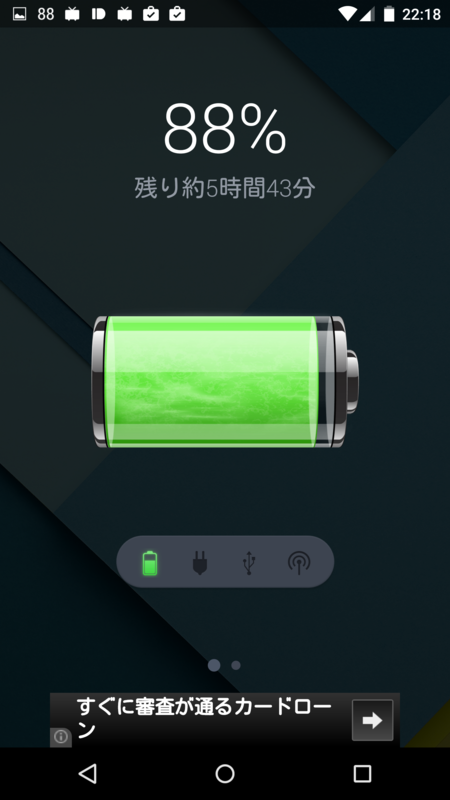　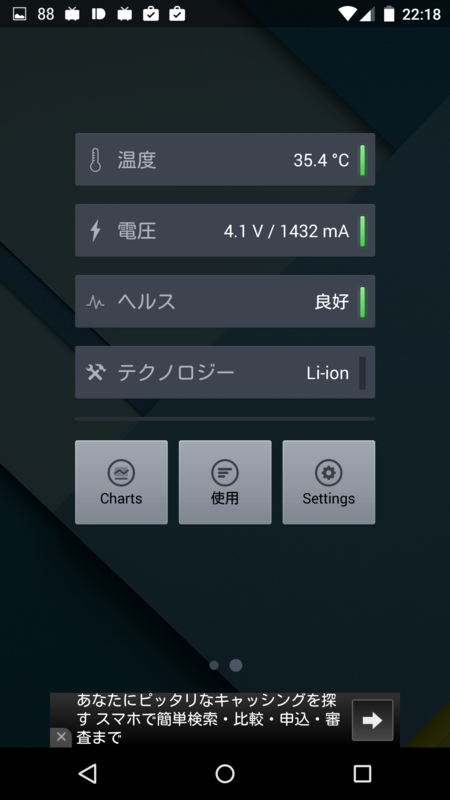 

さらに詳細画面下のボタンを押すと、チャートやアプリごとのバッテリー消費が見られる。

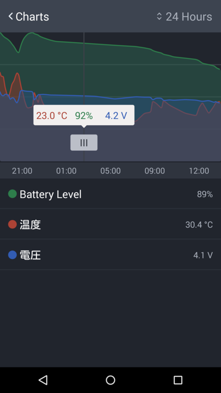　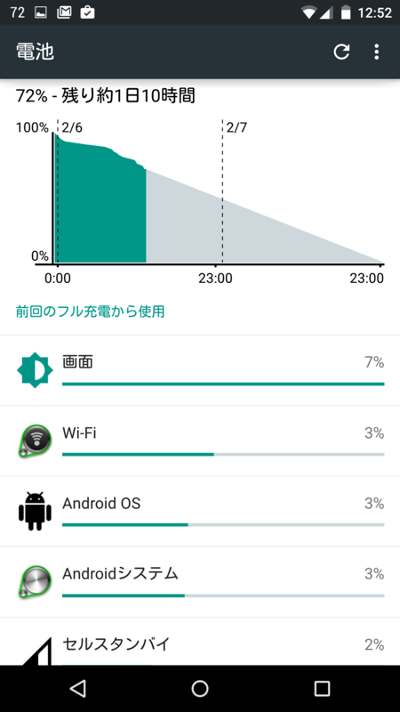

シンプルでいい。あと、ロック画面や左上の通知（0～100の数字）でバッテリー残量をチェックできるのもいいな。

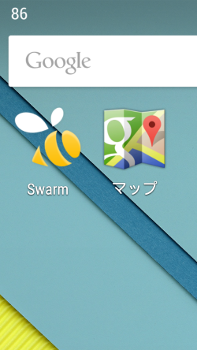　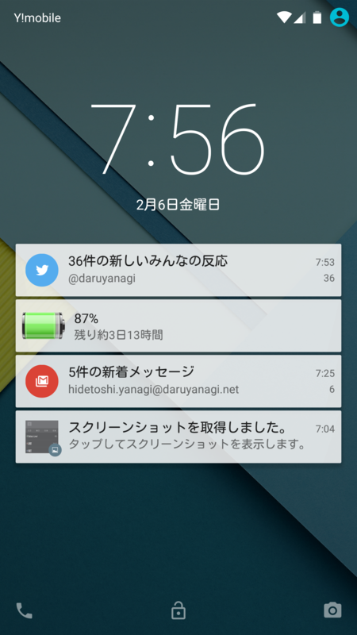

とりあえず、これを常用してみようかと思う。広告消えないかな？　お金出すけど。

<h3>マナーモードがない！？</h3>

Nesus 6 つかって不思議に思ったのは、マナーモードのボタンが見当たらないことだった。もしかしてない！？――わけない。Android 5.0 Lolipop にもちゃんとマナーモードはある。ただ、やたら高機能で、しかも初期設定ではワンボタンで呼び出せるようにはなってないということらしい。

――というわけで、マナーモードを簡単に切り替えられるウィジェットを探してみた。

<ul>
<li><a href="https://play.google.com/store/apps/details?id=com.muisika.puchiwidget_manner_m0001&hl=ja">&#x30D7;&#x30C1;&#x30A6;&#x30A3;&#x30B8;&#x30A7;&#x30C3;&#x30C8;&#x30FB;&#x30DE;&#x30CA;&#x30FC; - Google Play &#x306E; Android &#x30A2;&#x30D7;&#x30EA;</a></li>
</ul>
　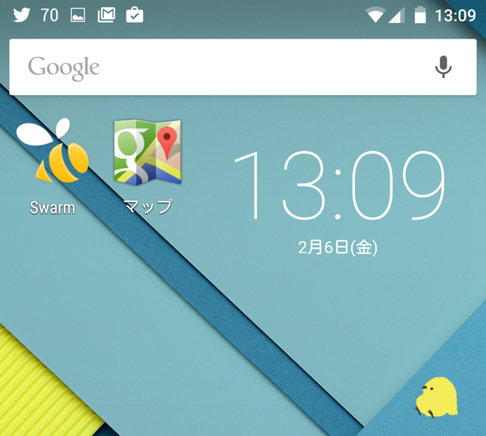

右下のヒヨコがそれ。起きていれば通常モード。タップしてマナーモードになるとお休みになられる。かわいい（小並

通知のバイブなんかも全部切るサイレントモードにもできるらしいけれど、自分は使わないので、単純に通常 ⇔ マナーモードの切り替えウィジェットとして使ってる。もっと高解像度で、アニメーションとかしてくれるとかわいいのにな、素材はクラウドワークスでお願いして、自分で作るか。

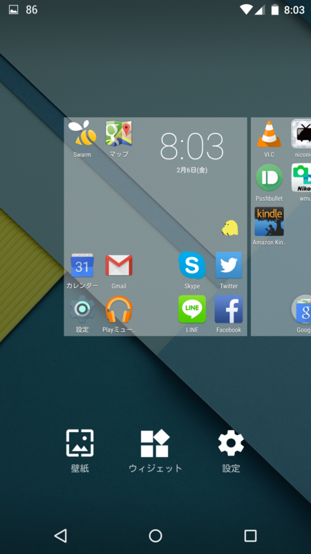　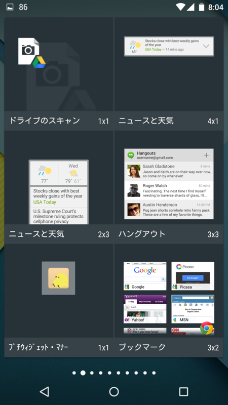

あと、これのおかげで、ホーム画面（ウィジェットなど）のカスタマイズ方法も覚えた。ホーム画面で何もないところでホールドすると設定画面に切り替わるので、そこでウィジェットを追加。アイコンやウィジェットはドラッグ＆ドロップで自由に移動（＆削除）できる。なるほろ。

そのほかにも、SUICA リーダーなんかが便利らしい。残念ながら伊予鉄カードでは使えなかったけど（そらそうだ）。カスタマイズはとりあえずこれでひと段落。あとはぼちぼちやっていくことにする。

