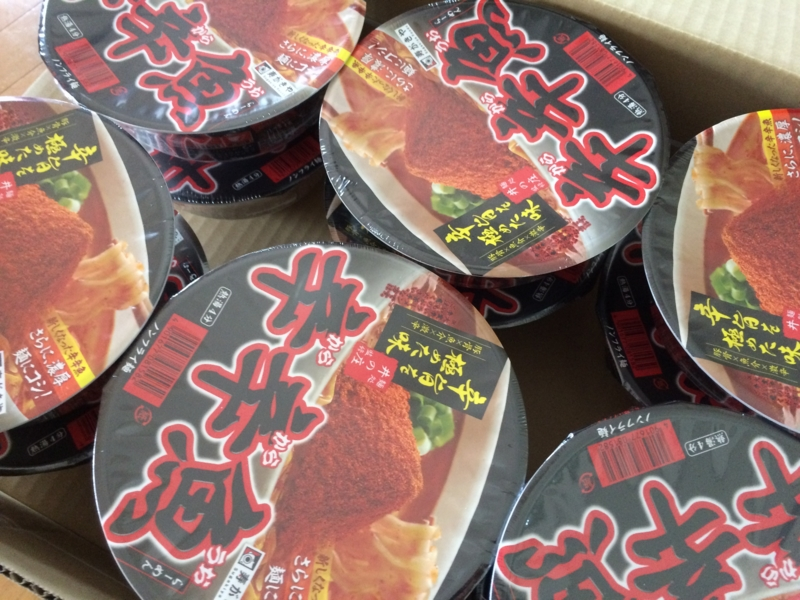
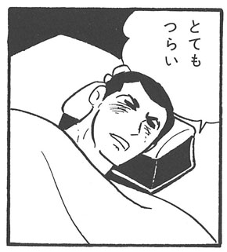
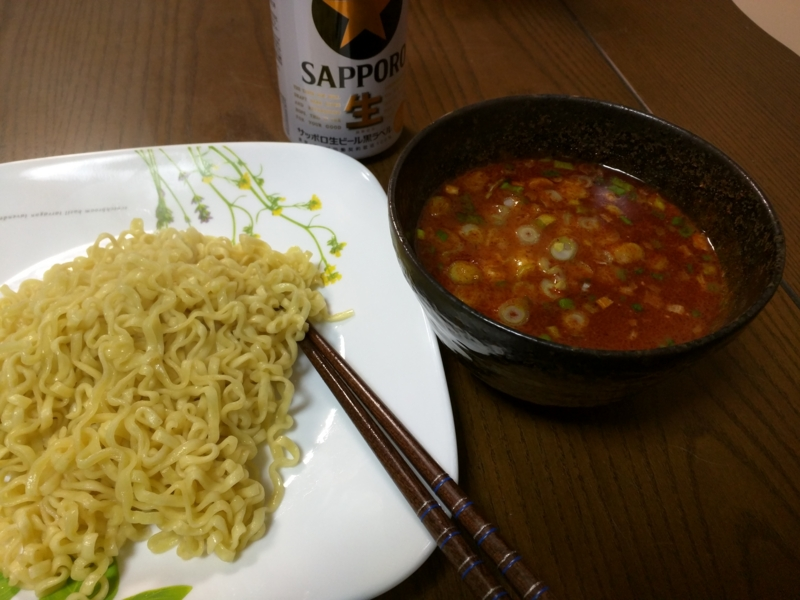
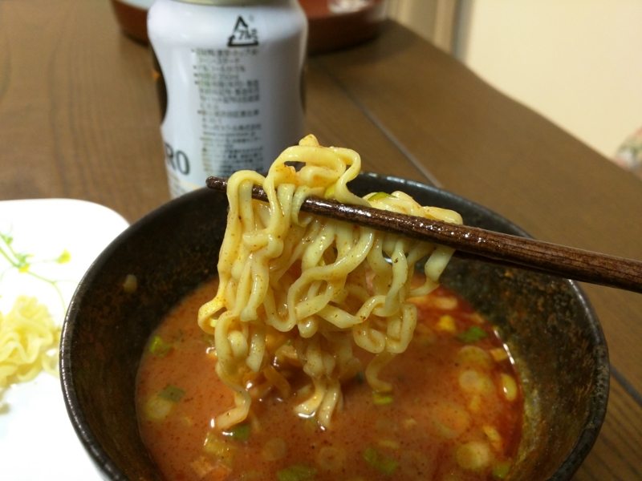
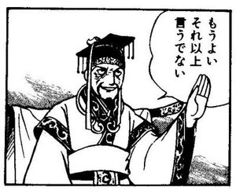

<a href="https://blog.daruyanagi.jp/entry/2015/02/04/204808">&#x300C;&#x8F9B;&#x8F9B;&#x9B5A;&#x300D;&#x304C;&#x9001;&#x3089;&#x308C;&#x3066;&#x304D;&#x305F;&#x306E;&#x3067;&#x98DF;&#x3079;&#x3066;&#x307F;&#x305F;&#x3002; - &#x3060;&#x308B;&#x308D;&#x3050;</a> で「辛辛魚」のスープまで完食したけど、ぶっちゃけこれはやりすぎた。その日の晩からお腹を壊し、ベッドとトイレを往復。おそらく気のせいだと思うが、心なしかお尻の穴が熱い。とてもじゃないが、ゆっくり眠れぬ。

でも、残り11個もある。捨てるなんてもってのほか。週末に飲み会で会う @nakaji と @ramusara にいくつか押し付けたとしても、残り8つほどは自分で食べなければならぬ。しかし、8つともスープまで飲み干せば、確実に死ぬ。幼少のみぎりからご飯は残さず食べるように教育を受けてきた俺様だ。スープといえども残すなどもってのほか。ぐぬぬ……これぞ前門の「辛辛魚」、肛門のトラ。この矛盾をどう解決すべきか……。<i>ﾋﾟｺｰﾝ（＾ｖ＾）ﾊﾟｯﾊﾟﾗｯﾊﾟｰ！</i>

スープの素を半分だけ使って、つけ麺スタイルにしてみた。なんて頭がいいんだ、俺は！　片栗粉でちょっととろみをつけて麺に絡むようにしてみたけど、割といい感じ。ついでに卵の黄身と、刻み葱も追加してみた。なかなかよろしい。

完食したけれど、今回はお腹も痛くならない。うまい、完食、痛くない！！　完璧だ！　残りの「辛辛魚」もモリモリ食べられるぞ！

残したスープの素は……なんかキムチ鍋っぽいものにして食べるのに使えるんじゃないだろうか（知らんけど）。……完全に独身のおっさんのグルメだって？

<a href="http://www.amazon.co.jp/exec/obidos/ASIN/B00HYONNYK/bestylesnet-22/">寿がきや 麺処井の庄監修 辛辛魚らーめん 136g×12個</a>
<ul><li>出版社/メーカー: 寿がきや食品</li><li>発売日: 2014/01/29</li><li>メディア: 食品&飲料</li><li><a href="http://d.hatena.ne.jp/asin/B00HYONNYK/bestylesnet-22" target="_blank">この商品を含むブログ (1件) を見る</a></li></ul>

