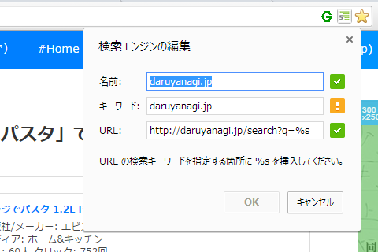

検索機能の新しいユーザーインターフェイスが日本語版でも利用できるようになったらしい。これは割りと便利だと思った。

で、それを試していたところ、変なのを見つけた。

<a href="http://www.opensearch.org/Home">Home - OpenSearch</a> っていう規格があって、それに対応しているサイトを検索エンジンとして組み込めるようだ。“Firefox Add-ons”のソースコードを覗いてみると、こんな記述があった。

<pre class="code lang-html" data-lang="html" data-unlink>&lt;link title=&quot;Firefox アドオン&quot;
      rel=&quot;search&quot; type=&quot;application/opensearchdescription+xml&quot;
      href=&quot;/ja/firefox/opensearch.xml&quot; /&gt;
</pre>
href で参照されている XML の中身はこんな感じ。

<pre class="code lang-xml" data-lang="xml" data-unlink>&lt;OpenSearchDescription xmlns=&quot;http://a9.com/-/spec/opensearch/1.1/&quot;&gt;
&lt;ShortName&gt;Firefox アドオン&lt;/ShortName&gt;
&lt;Url type=&quot;text/html&quot; method=&quot;get&quot; template=&quot;https://addons.mozilla.org/ja/firefox/search/?q={searchTerms}&quot;&gt;&lt;/Url&gt;
&lt;Image height=&quot;16&quot; width=&quot;16&quot;&gt;
data:image/x-icon;base64,iVBORw0KGgoAAAANSUhEUgAAABAAAAAQCAYAAAAf8%2F9hAAAABHNCSVQICAgIfAhkiAAAAAlwSFlz%0D%0AAAAN1wAADdcBQiibeAAAABl0RVh0U29mdHdhcmUAd3d3Lmlua3NjYXBlLm9yZ5vuPBoAAAKoSURB%0D%0AVDiNjZNLaJRnFIaf75vvy2UGTWr8NYkxl0IFUYkNXSSZQNWFWlxIEVy1FLLo0i4adddVXRnS4kJw%0D%0AYxci2GaRTWlSFGKFGRXNmFBF62VMO4TENBdjMv9k5p%2F%2FOy4SLzgqHs7yPc95eTlHiQjvqniPbVYR%0D%0AzuBoR%2BFQDEvId4neIPNCY945DayNVff%2F8NUvn9XXNJMv5hhKnTvYP3ymHmj%2FIMBSbmHjjP8fycxv%0D%0A%2BMEzGqtatUI1vK7R7wM4J32XUv3Li%2Fl5imGBkbtXlsMw%2FPF1jXozg3iP3aM0Z8XRBFDr1fl7Og9E%0D%0AnTguXx30p%2F6fjAIozb%2Fi6C4BdB2z6QOfH27ZUFNL0QUELs%2Ftycs4J2zdGEerCADTM1P8df3PxyUZ%0D%0AiKPF8zyGHpwGFLC6QCCRuYA4QQQ6mw4hjhYT77GN2qiBWFnV5sXc0xMAgfKx5foVYKURB2vLPbxo%0D%0AM8auODE6ws%2FfH%2B77dHtjhxp5OHzywpWf%2FIIsRk25Rq0CRFY4UVNNndkmqZFRf3YuWaYUS0aE3RP5%0D%0AMXX3%2FiCOgu3Y1WYfL90sdSDgxRoYTY5mZ2anjwC%2FAqEBdM4tMJ4dwYs1YiOGSBkYrVHqlQNxoC34%0D%0AOV8BdxK9gQ%2Bguo7bwdYdrXu92nU6nR7Pzc%2FPSXxfazTj30IpRaWpIqbX4UQoBDkWJlRwLzVeLBTy%0D%0AGs2UcUX5duzvsfPqNpvDovQhnBIdELGaWFk1hclYmLx2fxmFbNm5qXJNvdi2DQ1WAsO1P%2F5petsh%0D%0Ayf6v25gJ0nxUUUeiP531s%2FkvAcor7MDOL2pjz3JzVKpqUoMTpb8QsSqdeTT98fomjyDv8LP5aKI3%0D%0AuAgQP2orCkGAVRVMZxbQhnQJIAzkm3s3Js6GSfkEQEd4%2Bbpa8%2BTW71P1ANqoB65I93OA2DgV%2BZ%2Bo%0D%0AmgAAAABJRU5ErkJggg%3D%3D
&lt;/Image&gt;
&lt;OutputEncoding&gt;UTF-8&lt;/OutputEncoding&gt;
&lt;InputEncoding&gt;UTF-8&lt;/InputEncoding&gt;
&lt;/OpenSearchDescription&gt;
</pre>
かなり昔からあるもののようで、そういえば聞いたことがあるような、ないような気もする。

Internet Explorer や Google Chrome でも対応していたっぽいのだけど、まったく気づかず（IE の検索プロバイダーってこれなんだっけ……？）、ユーザーインターフェイスの変更で気付いたという次第。余力があればこういうのにも対応しておくと、サービスの使い勝手向上につながるのかもしれない。

ちなみに Google Chrome だと OpenSearch の XML ファイルを用意しなくても、検索エンジンとして追加できる。

検索フォームのコンテキストメニューから追加。

よくわかんないけど、キーワードの部分を %s にでもしておくといいみたい。

オムニバーで検索エンジン名を入力して［Tab］キーを押すと……

サイトの検索が行える。

この機能は割と便利で、いつもお世話になっていたりする。調べてみると「Opera」（Chrome とほぼ同じ）や「Firefox」（“この検索にキーワードを設定”という、一度聞いただけではよく意味が分からないメニューを使えば実現できる）でも利用できるようだ。世の中、知らないことだらけだな。

<ul>
<li><a href="http://www.forest.impress.co.jp/docs/news/20131120_624409.html">&#x300C;Opera 18&#x300D;&#x304C;&#x30EA;&#x30EA;&#x30FC;&#x30B9;&#x3001;&#x300C;Opera Developer 19&#x300D;&#x3067;&#x306F;&#x540C;&#x671F;&#x6A5F;&#x80FD;&#x3092;&#x5B9F;&#x9A13;&#x7684;&#x306B;&#x30B5;&#x30DD;&#x30FC;&#x30C8; - &#x7A93;&#x306E;&#x675C;</a></li>
</ul>
――わざわざ拡張機能みたいな仕組みを使わなくても、サイトの検索機能をブラウザーに追加できることがあるよ、という話でした。

たとえば、カーリルなんかを追加しておくと便利かもしれない。

<ul>
<li><a href="http://blog.calil.jp/2010/06/firefoxieopensearch.html">Firefox&#x3001;IE&#x306E;OpenSearch&#x691C;&#x7D22;&#x30D7;&#x30E9;&#x30B0;&#x30A4;&#x30F3;&#x306B;&#x30AB;&#x30FC;&#x30EA;&#x30EB;&#x3092;&#x8FFD;&#x52A0;&#xFF01; | &#x30AB;&#x30FC;&#x30EA;&#x30EB;&#x306E;&#x30D6;&#x30ED;&#x30B0;</a></li>
</ul>
Amazon は Chrome だとはじめから組み込まれているのかな？　これも結構使える。

