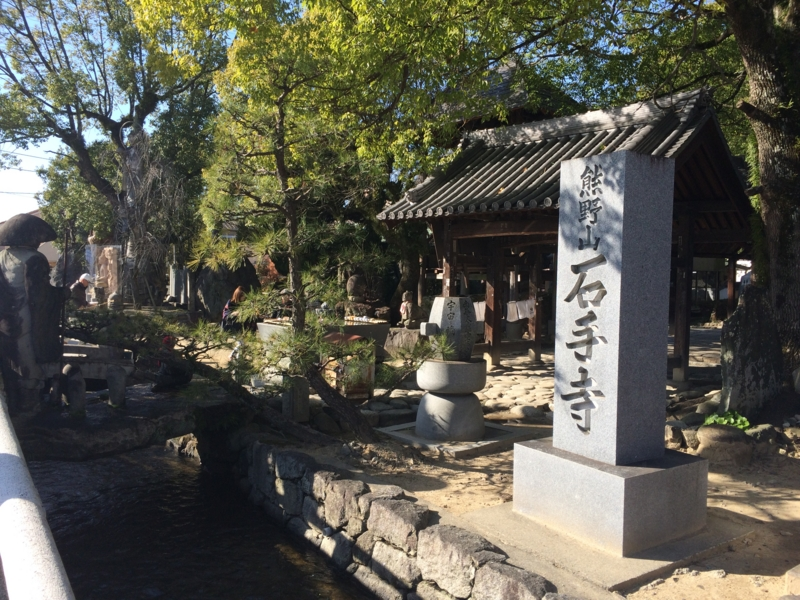
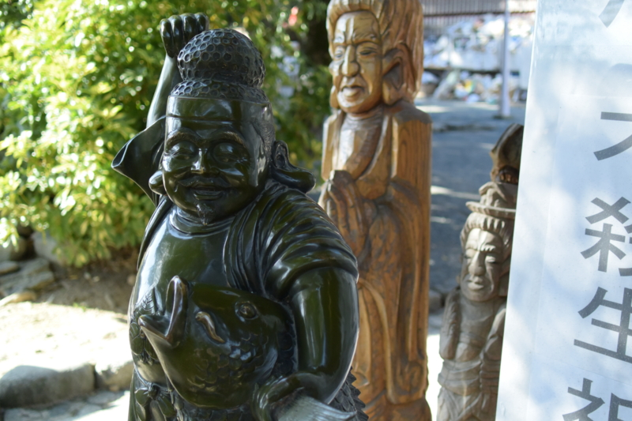
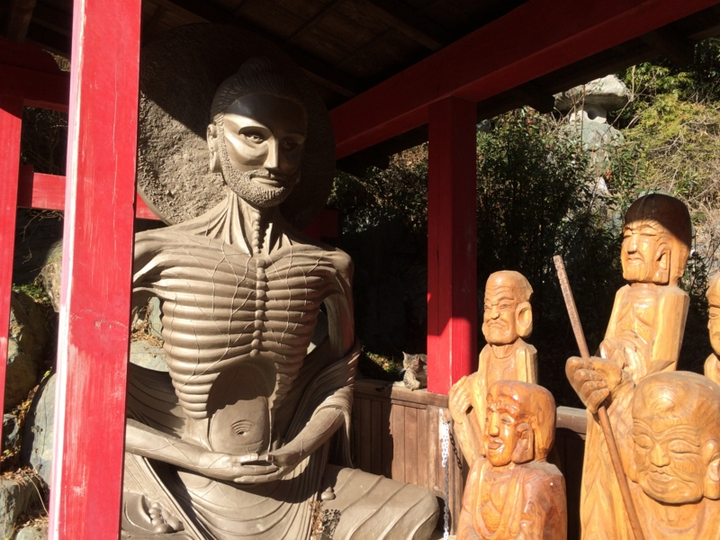
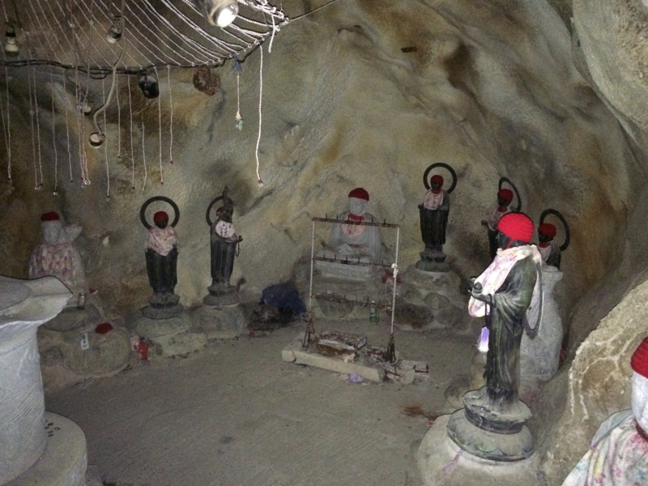
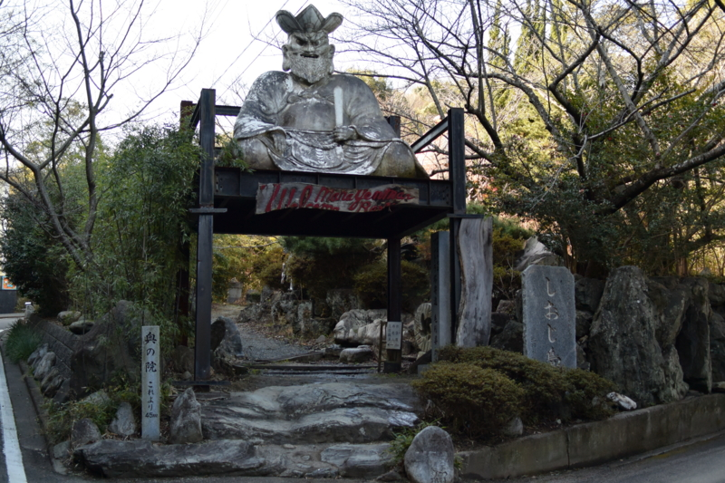
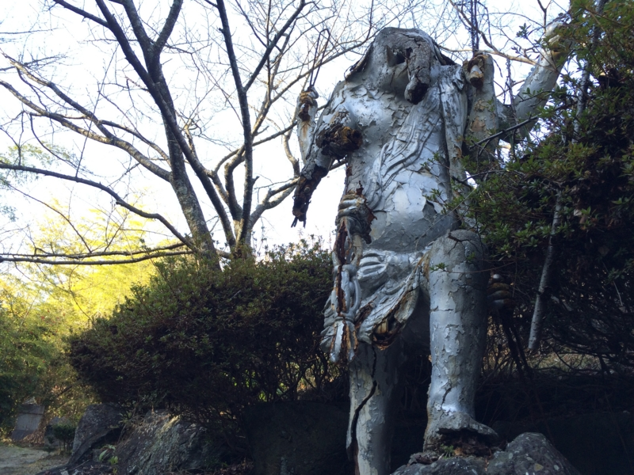
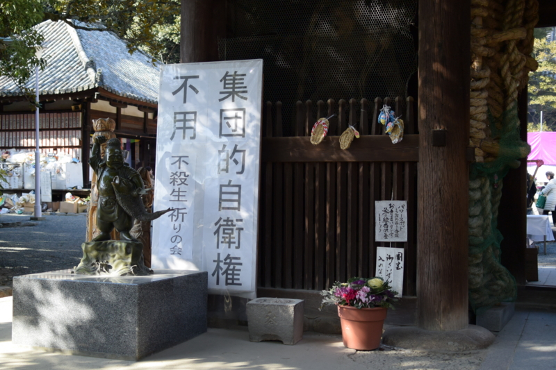
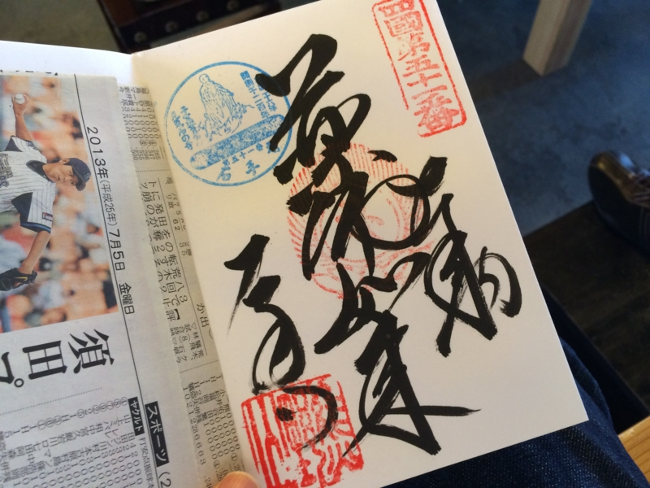

 

<blockquote cite="http://ja.wikipedia.org/wiki/%E7%9F%B3%E6%89%8B%E5%AF%BA">

石手寺（いしてじ）は、愛媛県松山市石手にある真言宗豊山派の寺院。熊野山（くまのさん）、虚空蔵院（こくうぞういん）と号す。本尊は薬師如来。四国八十八箇所霊場の第五十一番札所。遍路の元祖とされる衛門三郎の再来伝説ゆかりの寺でもある。

<cite><a href="http://ja.wikipedia.org/wiki/%E7%9F%B3%E6%89%8B%E5%AF%BA">&#x77F3;&#x624B;&#x5BFA; - Wikipedia</a></cite>
</blockquote>

2月1日、石手寺に連れてってもらった。いろんな意味で面白かったのだけど、今までブログに書かずに放置していた。なんというか、自分の理解の範疇を越えているのだ。

<ul>
<li><a href="http://nehan.net/">&#x77F3;&#x624B;&#x5BFA;&#x5236;&#x4F5C;&#x516C;&#x5F0F;HP-&#x60A9;&#x307F;&#x76F8;&#x8AC7;&#x30FB;&#x99C6;&#x3051;&#x8FBC;&#x307F;&#x5BFA;&#x30FB;&#x56DB;&#x56FD;&#x970A;&#x5834;/&#x4ECF;&#x6559;&#x4FE1;&#x4EF0;&#x904D;&#x8DEF;&#x89E3;&#x8AAC;&#x30FB;&#x56FD;&#x5B9D;&#x91CD;&#x6587;7&#x70B9;&#x5384;&#x3088;&#x3051;&#x5B50;&#x5B9D;&#x5B89;&#x7523;</a></li>
</ul>

<h4>理解不能な点その一：変なのがいっぱいいる</h4>

まず、境内に変なのがいっぱいいる。

自分の知ってるお寺じゃない。まぁ、でも、日頃見慣れたお寺がジャパナイズされ過ぎってだけなのかもしれない。仏教はインド生まれなのだから、もっとヒンドゥーチックなのが本来なのだろう。

ちなみに、石手寺では「ほんとうの仏教」みたいな感じの謎の冊子がもらえる。

<h4>理解不能な点その二：変な洞窟がある</h4>

なぜか境内に洞窟がある。めっちゃ暗い。通路の真ん中にお地蔵さんが建っていて、交通整理をしてくれているのだけど、たまにどちらかに偏っている。おかげで、おちんちんを強打しそうになった。睾丸を破壊するトラップか何かだと思う。

<h4>理解不能な点その三：奥の院がやばい</h4>

この洞窟を抜けると奥の院があるのだが、これが境内に輪をかけてヤバい。

ヤバい。ヤバいとしか言えない。

<h4>理解不能な点その四：妙に政治的主張が激しい</h4>

これは個人的意見だが、多様なひとを受け入れるべき公共の場にあって、こういうのはあまりよくないと思う。主義主張の是非ではなくね。たとえば、小学校や図書館の前にこう言うのが建っていたらどうだろう？　まぁ、気にしない人は気にしないだろうけど。

悪気がないのは、ビルマでの戦没者を慰霊するために建立されたストゥーパ（これまたこのお寺の怪しい雰囲気を醸し出すのに一役買っている）を見るとわかるのだけどね。

よく考えたら、自分はお坊さんに親鸞さんの話とかは聞いたことはあっても、肝心のお釈迦様の話はあまり聞いたことがないように思う。そういう点で、石手寺の展示はとても興味深かった。今度そういう本も読んでみたい。

とにかくいろいろ面白かった。銀閣寺（<a href="https://blog.daruyanagi.jp/entry/2015/01/11/031410">&#x8E74;&#x4E0A;&#x304B;&#x3089;&#x9280;&#x95A3;&#x5BFA;&#x3078; - &#x3060;&#x308B;&#x308D;&#x3050;</a>）に続き、御朱印もゲット！　また来てみたいと思う。

