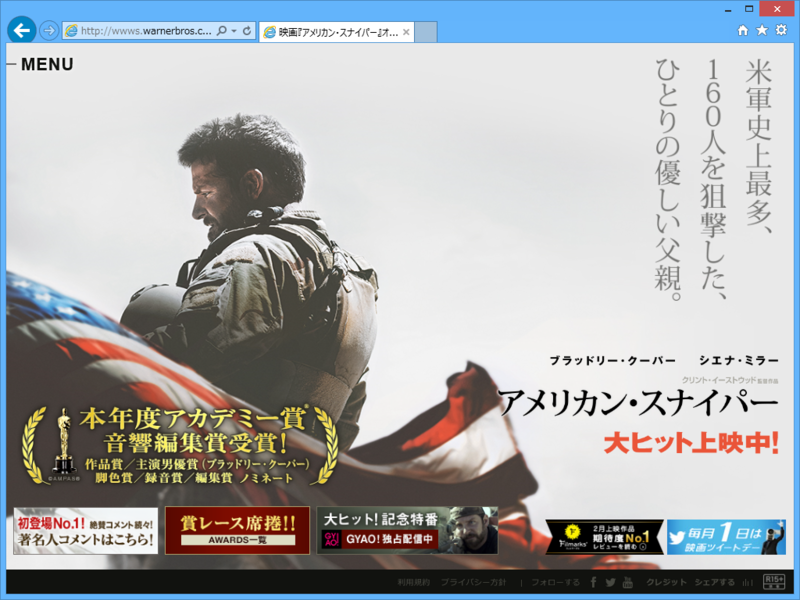

独りで夜の映画館へぶらりと。なんだかんだで一人で映画観たの初めてかも？　10人ぐらいしかいなくて快適だったので、また行こうかなと思う。

<ul>
<li><a href="http://wwws.warnerbros.co.jp/americansniper/">&#x6620;&#x753B;&#x300E;&#x30A2;&#x30E1;&#x30EA;&#x30AB;&#x30F3;&#x30FB;&#x30B9;&#x30CA;&#x30A4;&#x30D1;&#x30FC;&#x300F;&#x30AA;&#x30D5;&#x30A3;&#x30B7;&#x30E3;&#x30EB;&#x30B5;&#x30A4;&#x30C8;</a></li>
</ul>
本作は実話をもとにしたらしい。

アクションシーンは割と気合が入っているけれど、そういうのが観たいのならば『ブラックホーク・ダウン』の方が上かな。まぁ、スナイパーものだから多少はね？　

個人的には、やっぱりメインは後半かな。主人公のカイルは戦争で心に傷を負うが、それは「戦場が恐ろしい」とか「人を殺したという罪の意識」からではなく（無論、そういうのもあるだろうけれど）、むしろ「助けられなかった戦友がいる」という負い目からのようだ。だからこそ、戦場でもっとも脅威となっていたムスタファをやっつけたところが家族の元へ帰る決心をつける一つの区切りになったし、自分と同じく心の病を負った人たちを助けることで自分を救うことができた。

戦争を遂行するにあたって、戦友の絆・連帯というのは欠くべからざるものだけど、それに依存してしまうと社会へ復帰するのは難しくなる。「あなたの体は帰ってきたけれど、心はまだ帰ってきていない」。そういう意味で、戦争体験というのは一種の麻薬のようなものなのだろう。“銃を撃ちながらゆっくり話をする”というのは、戦争に参加する過程で植えつけられたドギツイ人間関係への渇望をほぐし、依存を解消していくのに割と効果的だったのかもしれない。

この活動は、残念ながら一つの“不運”によって中断されてしまう。けれど、そうした結末を望まない人々によって賞賛され、記憶されていく。その様子が、実際の映像で間接的に描かれているのが心に残った。まぁ、狙撃主として多くの人を殺したことの是非は脇へ置いとくとして。人によっては彼の運命を因果応報と捉えるかもしれないが、そこまで単純な話にも思えない。

――と、音のないエンドロールを見送りながら思いました。空調の音がやけに大きく聞こえた。

