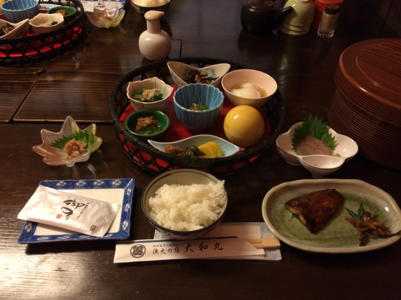

<a href="https://blog.daruyanagi.jp/entry/2015/03/16/175353">&#x8266;&#x3053;&#x308C;&#xFF1A;&#x822A;&#x7A7A;&#x6BCD;&#x8266;&#x300C;&#x5929;&#x57CE;&#x300D;&#x6539;&#x9020;&#x8A18;&#x5FF5;&#x306B;&#x300C;&#x5929;&#x57CE;&#x795E;&#x793E;&#x300D;&#x3078;&#x884C;&#x3063;&#x3066;&#x304D;&#x305F;&#x3063;&#x305F;&#x3002; - &#x3060;&#x308B;&#x308D;&#x3050;</a> でも触れたけど、久しぶりに友人と伊豆へ行ってきた。河津の桜は前も見に行ったので今回はわりとスルー気味で、今回はひたすらご飯と温泉がメイン。

<h3>さくら</h3>

まずは「さくら」でお昼ご飯。ここの“まご茶漬け”は毎回楽しみにしている。最初の半分をアジご飯、残り半分を出汁漬けにして食べるのだけど、アジをちゃんと半分残して出汁を頼まないと「もうちょっと残さないと」と窘められる。まぁ、うまくてついつい食べちゃうんだから許しておくれって感じ。

<blockquote class="twitter-tweet" lang="ja">
ふぁー <a href="http://t.co/E10UykftOS">pic.twitter.com/E10UykftOS</a>
&mdash; ローリング☆だるやなぎズ (@daruyanagi) <a href="https://twitter.com/daruyanagi/status/574059654436687872">2015, 3月 7</a></blockquote>

ちなみに、これが第一形態。

<blockquote class="twitter-tweet" lang="ja">
出汁漬け <a href="http://t.co/zYRdSXtx1x">pic.twitter.com/zYRdSXtx1x</a>
&mdash; ローリング☆だるやなぎズ (@daruyanagi) <a href="https://twitter.com/daruyanagi/status/574064541329313793">2015, 3月 7</a></blockquote>

んで、これが第二形態。サイドメニューの天ぷらとか、ただで食べ放題のトコロテンも美味しい。

<blockquote class="twitter-tweet" lang="ja">
ふぁーーー <a href="http://t.co/HHGiZJ8JGV">pic.twitter.com/HHGiZJ8JGV</a>
&mdash; ローリング☆だるやなぎズ (@daruyanagi) <a href="https://twitter.com/daruyanagi/status/574058436662403072">2015, 3月 7</a></blockquote>

煮魚も追加。なんだったっけ、忘れた。カサゴ？　まぁ、なんでもいいや、美味しかった。真昼間からビールが進むゼ。

<iframe src="https://hatenablog-parts.com/embed?url=http%3A%2F%2Ftabelog.com%2Fshizuoka%2FA2205%2FA220505%2F22001657%2F" title="さくら (松崎町その他/魚介料理・海鮮料理)" class="embed-card embed-webcard" scrolling="no" frameborder="0" style="display: block; width: 100%; height: 155px; max-width: 500px; margin: 10px 0px;"></iframe><cite class="hatena-citation"><a href="http://tabelog.com/shizuoka/A2205/A220505/22001657/">tabelog.com</a></cite> 

<h3>大和丸</h3>

宿はお風呂付の部屋。おっさん3人で一部屋17,000円ほど（税抜き）。いつもはもっと安い宿に泊まる（夕食を船盛にしてもらって10,000円ぐらい）のだけど、今回は急に伊豆行きを決めたのと、河津桜のおかげかいつもの宿がとれなかったっぽくて、ここになった。でも、大満足。

夕ご飯。さくらで食べまくったのであまりお腹が減っていなかったのだけど、一口二口食べるとスイッチが入ってしまい、結局ほとんど残さずに食べた。

なかでもムツのホイル焼きはグッド。焼き石を敷き詰めた上で焼くのだそうで、白い身がホクホク、淡い塩味とともにジュワッと口に広がる。

ちなみに、朝ごはんも4杯食べた。1杯目は納豆で、2杯目は刺身を載せたプリ海鮮丼で、3杯目は焼き魚と一緒に、4杯目は海苔とお味噌汁で。

夕ご飯のお刺身で出してもらったタイのお頭を焼いてもらったのだけど、これの破壊力がなかなか高く、ご飯が進んでしまうのである。

<iframe src="https://hatenablog-parts.com/embed?url=http%3A%2F%2Fwww.jalan.net%2Fyad385010%2F" title="漁火の宿　大和丸 - 宿泊予約は＜じゃらん＞" class="embed-card embed-webcard" scrolling="no" frameborder="0" style="display: block; width: 100%; height: 155px; max-width: 500px; margin: 10px 0px;"></iframe><cite class="hatena-citation"><a href="http://www.jalan.net/yad385010/">www.jalan.net</a></cite> 

<h3>そのほか</h3>

あとは港を散歩したり、黄金岬でアメリカに向けて“<b>棒</b>ふれ”をしたり、菜の花畑できゃっきゃうふふと追いかけっこしたり。おっさん同士で楽しく過ごしましたとさ。

