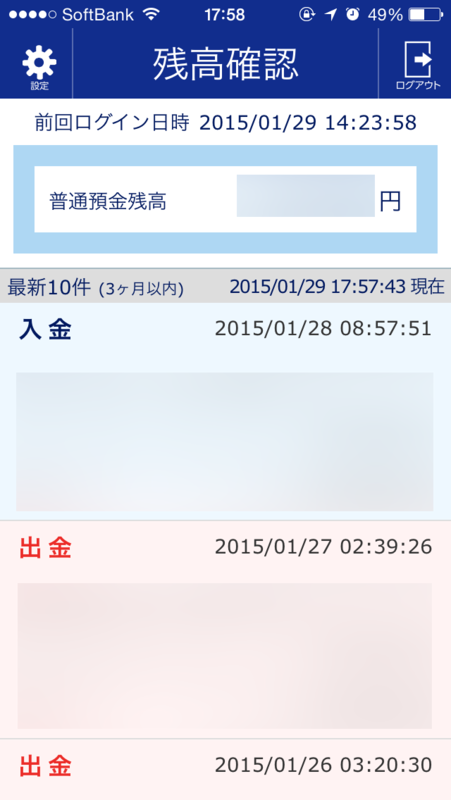

初めての確定申告が終わり、ちょびっとだけ還付金ゲットして少し幸せな だるやなぎ です。

確定申告、よくわからんですよね。自分の場合、前の前の会社で現場作業員兼トラック運転手兼事務経理をやっていたので、仕訳と帳簿の入力ぐらいはやったことがあったのですが、細かいところは税理士さんがやってくれるわけで、正直細かいところはよくわからん。ぶっちゃけ不安ではあったのだけど、今話題の freee の助けを借りてみたところ、割と簡単に乗り切れました。個人事業主プラン 9,800円/年(税込) の価値はあったかも。

<iframe src="//hatenablog-parts.com/embed?url=http%3A%2F%2Fwww.freee.co.jp%2F" title="会計ソフト「freee(フリー)」｜全自動のクラウド会計ソフト" class="embed-card embed-webcard" scrolling="no" frameborder="0" style="display: block; width: 100%; height: 155px; max-width: 500px; margin: 10px 0px;"><a href="http://www.freee.co.jp/">会計ソフト「freee(フリー)」｜全自動のクラウド会計ソフト</a></iframe>

まず第一印象は、割りと使い勝手がいいなーってこと。Web UI なのに、割とサクサク入力できる感じ。今でもたまに弥生会計の入力を手伝うことがあるのですが、freee の方が楽なような気がする（まぁ、企業と個人ではまた違うとも思いますが）。

目玉の、自動入力機能も便利。うちはジャパンネット銀行と伊予銀行を使っているのですが、どちらも対応していて、毎月決まった支払は勝手に仕訳してくれる。ただ、ジャパンネット銀行は「ログイン ID」を設定していると使えなく、泣く泣く解除する羽目になった。とはいえ、これは我慢できる範囲内。

あと、ソフトとしての freee そのものにはあまり関係ないのだけど、仕訳がわかんなくて Web 検索した時に、freee のヘルプページがヒットするのも好感度高しｗ

もちろん、不満点もないではないですが。

これは自分の使い方が悪いのかもだけど、資金の口座移動をすると二重カウントされてしまう。払いだす方と受け取る方、どちらか一方で取引を記録し、もう片方を無視すればいいのですが、最初はそれが分かっておらず、途中で混乱し、全部消して記帳する羽目になりました（最初の3か月分ぐらい）。

これは、資金の移動を片方へ限定することで解決。たとえば「ジャパンネット銀行から伊予銀行やゆうちょ銀行へ移すことはあっても、その逆はしない」って決めておけば、お金の流れが一方通行になり、無用の混乱を防げる。今まで足りなくなったらこっちからあっちへ、あっちからそっちへと適当に資金移動していた今までのやり方を戒めるキッカケにもなりました。

そのほかにも、確定申告の書類を作るとき、家賃の計算に電卓を引っ張り出すハメになったり。どうせならこういうところも自動計算しておいてほしいし、もしそういう機能がすでにあるなら、それとわかるナビゲーションがほしいかな。

一年使ってだいぶ慣れたし、来年はもっと使いこなせたらいいなぁ、と思いました。

たとえば、クレジットカードの明細も自動入力しちゃいたい。対応しているカードだったら自動でやってくれるッぽいけど、残念ながら自分はそうではないので、今まで手で入力していました。月一度だから、と我慢していたけれど、今年はジャパンネット銀行の VISA デビッドも活用していこうかなと。これを使えば、明細が口座の取引として乗るので、freee の自動記帳の対象になる。

で、ちょっと試験運用をしているのですが、それでわかったことが一つ。

ジャパンネット銀行が最近、残高をチェックできるスマホアプリを出しているのだけど、最初はこれの何が便利なのかわからなかった。振り込みもできず、ただ残高をチェックするだけなんだよ？

 

でもこれ、クレカ決済をする時の残高チェックには割と便利なんだな。SUICA リーダーで残高チェックするようなノリで使える。少し見直したかも。

まぁ、VISA デビッドは引き落としが2回に分かれたり、差額の返金があったりする場合があるので、そこがちょっとややこしくなりそうな気もしますけど……少額ならテキトーに雑収入・雑費で処理しちゃダメかな（＾ｖ＾）？

なにはともあれ、来年度もよろしくお願いします、freee さん！

<h4>P.S.</h4>

最初は e-Tax 使おうと思ってリーダーと電子証明用意したのだけど、途中で面倒になって、freee で印刷したのをそのまま税務署に郵送しました（ぁ

あと、還付金の振込み口座にネット銀行は使えないのですね。書類を送付した後に気づきました。あとで税務署から「（税金の引き落としに指定している）伊予銀行に振り込むやで？」と電話があって（午後8時ぐらいに！　お仕事お疲れ様です……）、勝手に処理してくれました。

ありがとうございますだ～（＝人＝

