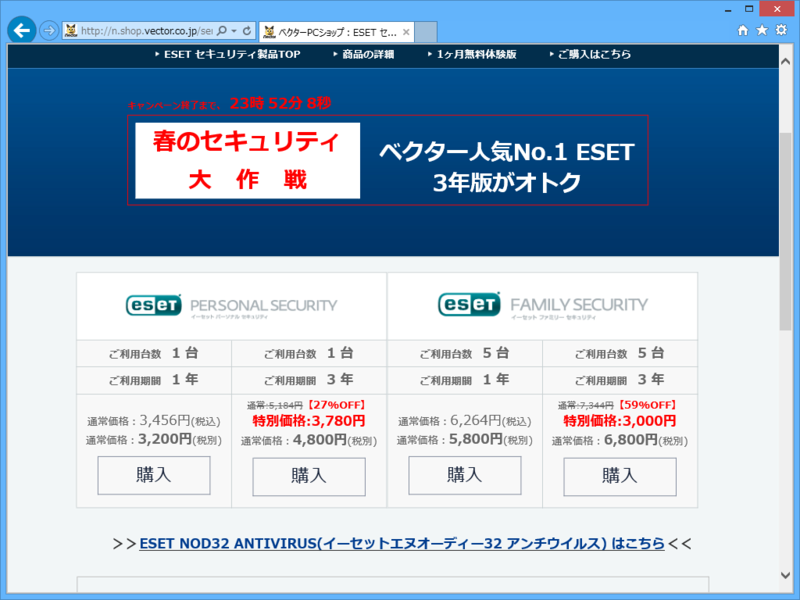

<a href="http://nasunoblog.blogspot.jp/2015/03/eset-smart-security-3000-yen-term-limited.html">#ESET &#x30D5;&#x30A1;&#x30DF;&#x30EA;&#x30FC; &#x30BB;&#x30AD;&#x30E5;&#x30EA;&#x30C6;&#x30A3; 3&#x5E74;&#x7248;&#x304C;3,000&#x5186;&#x3067;&#x8CFC;&#x5165;&#x3067;&#x304D;&#x307E;&#x3059;&#xFF5E;3/28 17:00&#x304B;&#x3089;24&#x6642;&#x9593; - &#x5143;&#x300C;&#x306A;&#x3093;&#x3067;&#x3082;&#x30A8;&#x30F3;&#x30B8;&#x30CB;&#x5C4B;&#x300D;&#x306E;&#x30C0;&#x30E1;&#x65E5;&#x8A18;</a> で知ったので購入。最近はアンチウイルスソフトのライセンスが不足気味だったので助かったかも（Surface Pro 3 を Windows 10 ＆ 8.1 のデュアルブートにしたのだけど、10 は無防備だった）。

<blockquote cite="http://nasunoblog.blogspot.jp/2015/03/eset-smart-security-3000-yen-term-limited.html">

<h5>ESET ファミリー セキュリティ</h5>

個人向けセキュリティ アプリケーション

<ul>
<li>インストール可能なOSは3種類
<ul>
<li>Windows XP - 8.1</li>
<li>Mac OS X v10.6(Snow Leopard) - 10.10(Yosemite)</li>
<li>Android v2.2 - 5.0</li>
</ul></li>
<li>利用期間は3年間</li>
<li>インストール台数は最大5台</li>
<li>ライセンス有効期間内はメジャー・アップデートに対応</li>
</ul>
サポート対象外のOSになりますが、Windows 10 Technical Preview Build 9879にインストール出来ました。

<cite><a href="http://nasunoblog.blogspot.jp/2015/03/eset-smart-security-3000-yen-term-limited.html">#ESET &#x30D5;&#x30A1;&#x30DF;&#x30EA;&#x30FC; &#x30BB;&#x30AD;&#x30E5;&#x30EA;&#x30C6;&#x30A3; 3&#x5E74;&#x7248;&#x304C;3,000&#x5186;&#x3067;&#x8CFC;&#x5165;&#x3067;&#x304D;&#x307E;&#x3059;&#xFF5E;3/28 17:00&#x304B;&#x3089;24&#x6642;&#x9593; - &#x5143;&#x300C;&#x306A;&#x3093;&#x3067;&#x3082;&#x30A8;&#x30F3;&#x30B8;&#x30CB;&#x5C4B;&#x300D;&#x306E;&#x30C0;&#x30E1;&#x65E5;&#x8A18;</a></cite>
</blockquote>

余ったライセンスは Nesus 6 で使おうかな？

