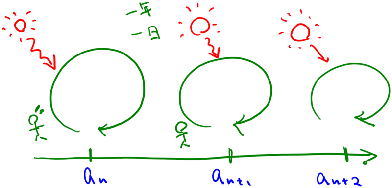

世の中には、“永遠”に続いていくものなど一つもない。始まりがあれば終わりが来るし、終わったものはいつか始まったはず。けれど、それらが“循環”しつつ繋がっていれば、個々の終わりを乗り越えることはある程度可能だ。つまり、“永遠”に近づくことができる。

<blockquote>

</blockquote>

 

“神”を単なる“不可知の擬人化”と捉えているからかもしれない。“神”というのはもっと複合的な概念だと思う。たとえば、世の中のルールを支配・維持するためにときに制裁を加えるもの（規範の擬人化）だったり、世界を機械論的にとらえた時の、その“機械”を最初に動かした力、およびそれへの畏敬（“第一原因”の擬人化）
 
 

 

