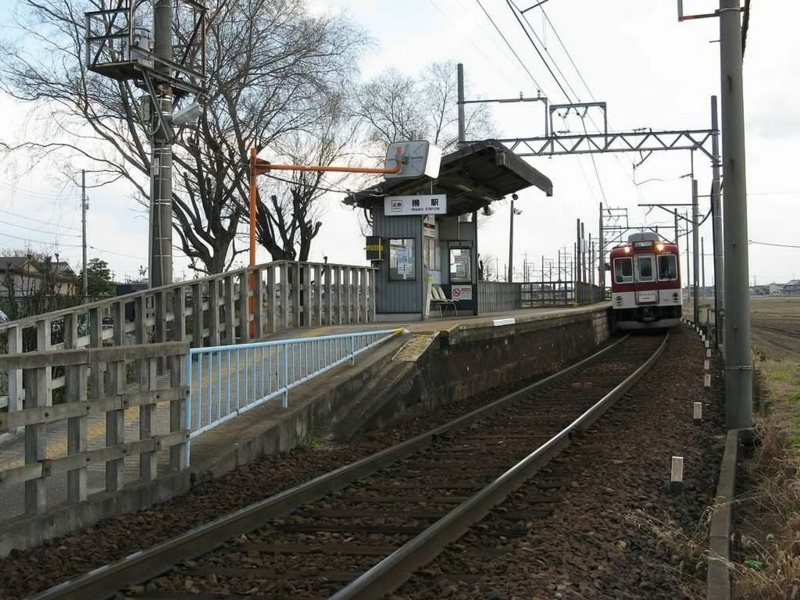
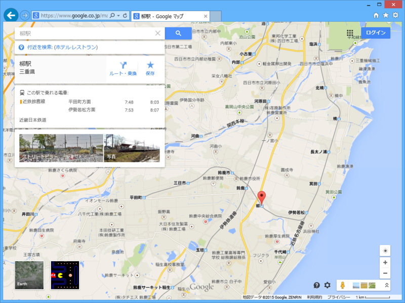

 

<blockquote cite="http://ja.wikipedia.org/wiki/%E6%9F%B3%E9%A7%85">

柳駅（やなぎえき）は、三重県鈴鹿市柳町にある、近畿日本鉄道（近鉄）鈴鹿線の駅である。

<cite><a href="http://ja.wikipedia.org/wiki/%E6%9F%B3%E9%A7%85">&#x67F3;&#x99C5; - Wikipedia</a></cite>
</blockquote>

どやぁ。割と栄えていると思う（ぁ

思ったのだけど、自分の名字と同じ名前の駅がある人って、それほど多くないかも？　名字って地名に由来することが多く、その場合は駅名になっていることもさほど珍しくないけれど、「加藤」「佐藤」みたいなハイブリッド系（加賀の藤原、左衛門尉・佐渡の藤原）だとそうもいかない。

柳駅は、伊勢若松と鈴鹿市、平田町を結ぶ近鉄鈴鹿線にある。

<blockquote class="twitter-tweet" lang="ja">
うぇーい <a href="http://t.co/tqWAJIpcpL">pic.twitter.com/tqWAJIpcpL</a>
&mdash; ローリング☆だるやなぎズ (@daruyanagi) <a href="https://twitter.com/daruyanagi/status/583848273863053312">2015, 4月 3</a></blockquote>

伊勢若松は急行しか止まらない。難波から行く場合は、アーバンライナー（甲特急）で津まで行き（最近は全車両、津に止まるらしい）、連絡している（乙）特急で白子、さらに白子（鈴鹿サーキットの最寄り駅かも）で急行や不通に乗り換える必要がある。メンドクサイ。

鈴鹿線の終点となっている平田町は、ホンダの鈴鹿工場があるんだな。なんでこんなところにわざわざ支線が引かれているんだろうと思ってたけど、降りてみて合点がいった。鈴鹿線はワンマン運転になっていて、自分が乗った時間帯（お昼の1時ごろ）は学生が多いようだった。

<blockquote cite="http://ja.wikipedia.org/wiki/%E8%BF%91%E9%89%84%E9%88%B4%E9%B9%BF%E7%B7%9A">

鈴鹿線（すずかせん）は、三重県鈴鹿市の伊勢若松駅から平田町駅までを結ぶ近畿日本鉄道（近鉄）の鉄道路線。 
鈴鹿市の市街地を通る平田町駅周辺の工場への通勤路線である。

<cite><a href="http://ja.wikipedia.org/wiki/%E8%BF%91%E9%89%84%E9%88%B4%E9%B9%BF%E7%B7%9A">&#x8FD1;&#x9244;&#x9234;&#x9E7F;&#x7DDA; - Wikipedia</a></cite>
</blockquote>

<blockquote class="twitter-tweet" lang="ja">
きたーーー！ 柳 駅きたーーー！ 任務達成 <a href="http://t.co/XDOnCtdzGk">pic.twitter.com/XDOnCtdzGk</a>
&mdash; ローリング☆だるやなぎズ (@daruyanagi) <a href="https://twitter.com/daruyanagi/status/583854950762950656">2015, 4月 3</a></blockquote>

うさん臭そうに見る女子高生の視線を感じながら、通過する柳駅を激写。

実はこの柳駅、小学校の頃に来たことがある。当時の自分は近鉄ヲタク、しかも乗る方のヲタクで、近鉄のポケット時刻表を集めるのが趣味だった。ポケット時刻表というのは、三つ折りにするとちょうど定期入れなどに入れられる小さな時刻表で、駅ごとに違う（ローカル線だと、全駅がひとまとめになっていることもある）。ダイヤが改正されると駅で無料配布されるのだけど、年によってデザインがちょびっと変わってたりして、古いものや珍しい駅のものはガキどものあいだではレアとされていたのだった。

小さい頃の自分はあまり親におねだりをしないタイプの子だったが、小6の夏休みだったかな？　3日間の近鉄全線フリーパスを買ってもらってスタンプラリーに参加。確か乗車距離がちょうど1,000kmだか何だかになるように調整しつつ、駅名しりとりをしながらスタンプを集めるという小学生には割と難易度の高いものだったが、友達と一緒に挑戦して、確か記念品のメダルをゲットしたように思う。効率よく駅を回るために、時刻表とにらめっこしてスケジュールを立てるのがとても楽しかった。

そのスタンプラリーのついでにやったのが、ポケット時刻表コレクションを完成させること。それまでもちょくちょく貯めていたのだけど、そういう機会でもなければ行けない遠い駅というものもある。なんせ近鉄は二府三県にまたがっていて、駅も確か当時で300駅以上あった。塾の帰りに寄り道して集めるだけでは、コンプリートは難しい。湯の山温泉や賢島の方まで行ってポケット時刻表を集められたのはとてもうれしかった。

この時コンプリートした時刻表は菓子のカンカンに入れて、今でも大事に保存してあるはず……だが、あいにく押し入れがカオスになっていて、存在を確かめることができない。

