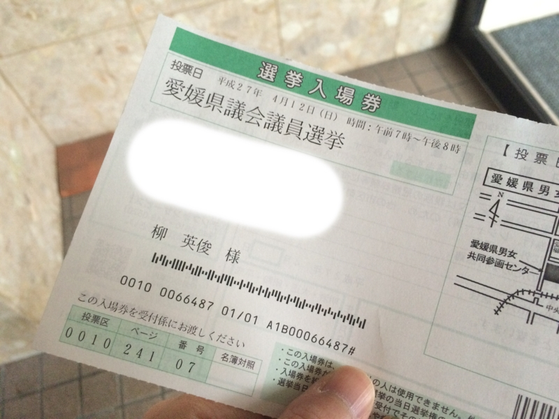
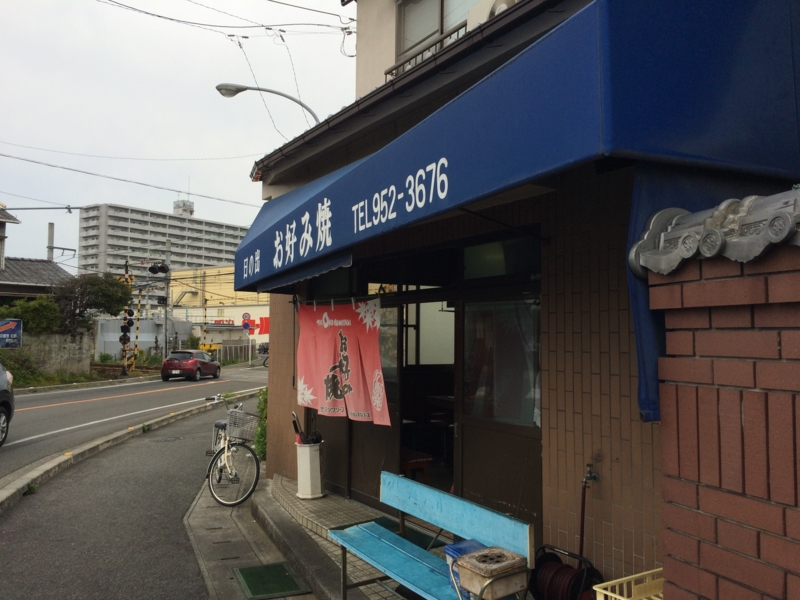
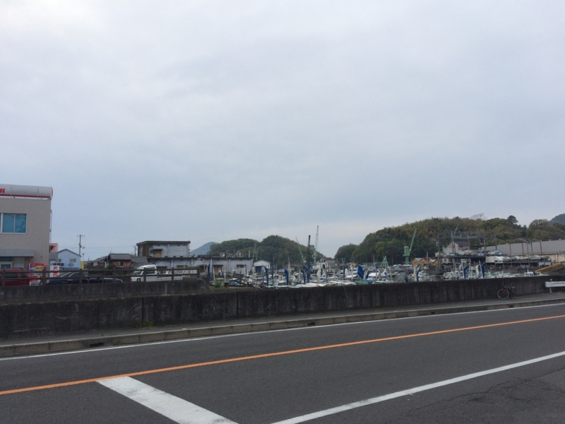
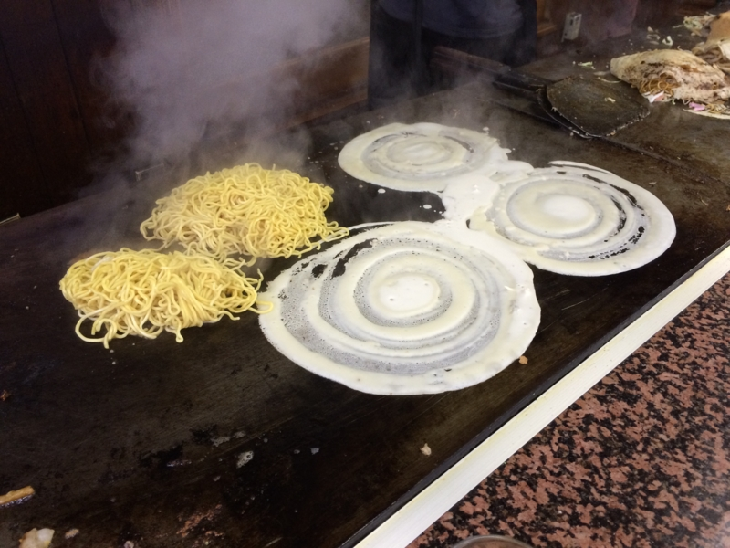
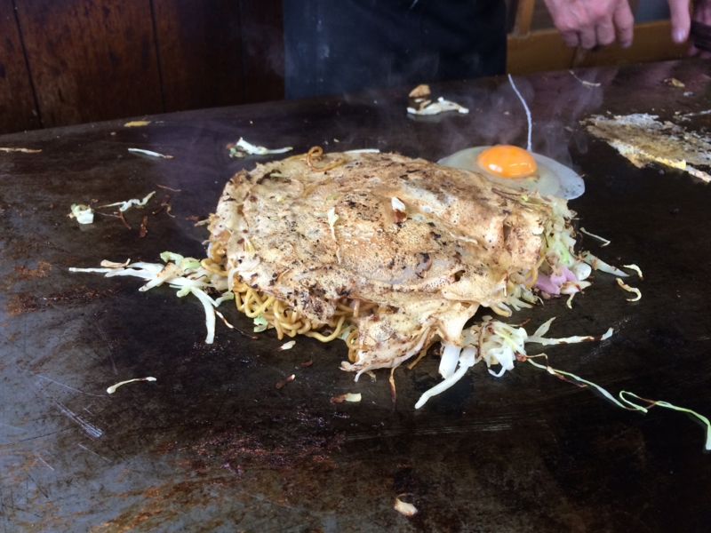
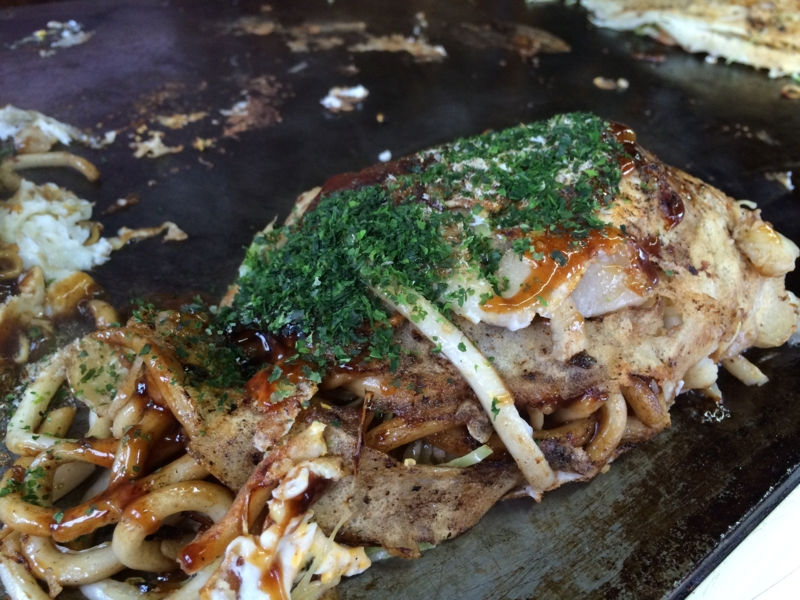
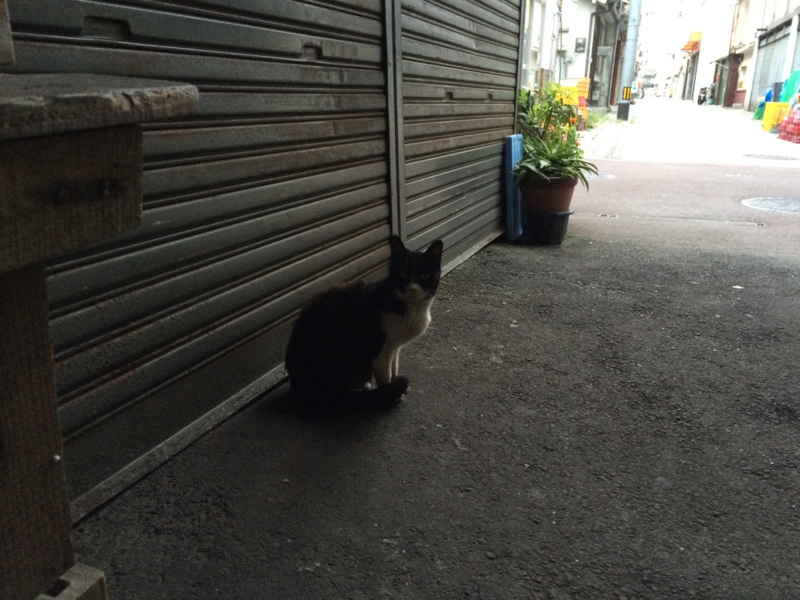

日曜日は、県会議員選挙。外に出るのが超億劫で、布団の中で「三津浜焼き食べたい」とかわけのわかんないことをツイートしていたのだけれど、@ramusaraさんが「連れてってやんよ（意訳」みたいなことを言ってくれたので、それに甘えることにした。おかげで選挙にも行くことができた。

<blockquote cite="https://www.asahibeer.co.jp/area/09/38/mitsuhamayaki/appeal/">

万葉の時代から港町として栄えてきた三津浜（聖徳太子が温泉入りにきたらしいやで）。その歴史の中で根付いてきた文化や暮らしがあります。その一つが「浜焼き」と呼ばれるお好み焼き。ひと味違うその味のひみつとは？　それは意外と庶民的な素材が鍵なのです。

<cite><a href="https://www.asahibeer.co.jp/area/09/38/mitsuhamayaki/appeal/">&#x4E09;&#x6D25;&#x6D5C;&#x713C;&#x304D;&#x306E;&#x9B45;&#x529B;&#xFF06;&#x89B3;&#x5149;&#x5DE1;&#x308A;Map</a></cite>
</blockquote>

連れていかれたのは「日の出」。三津ではメジャーな店らしい。“三津浜焼き”ではなく、あくまでも“お好み焼き”を主張しているのがいい。

港に面した道路沿いにあり、目の前には港町っぽい風景が広がっている。ここにきたのは <a href="https://blog.daruyanagi.jp/entry/2014/08/30/221903">&#x6226;&#x8266;&#x9678;&#x5965;&#x306E;&#x304A;&#x5893;&#x53C2;&#x308A;&#x884C;&#x3063;&#x3066;&#x304D;&#x305F; - &#x3060;&#x308B;&#x308D;&#x3050;</a> 以来のことか。あのときは船に間に合わなくて、泣きながら走っていたところ、親切なおばちゃんがクルマで送ってくれた。改めてあのやさしさが思い起こされる。

お店はカウンターと、テーブルが一つ。でっかい鉄板の上に、次々と「浜焼き」が焼かれていく。予約と持ち帰りの電話がひっきりなしに鳴っていて、大変そう。

作り方は、記事を薄くクレープのように薄く広げ、その上に麺とキャベツを乗せて焼く感じ。麺は“台”と呼ばれているらしく、中華そばとうどんが選べる。自分はうどんの台付き、@ramusara さんはそばの台付きを頼んだ。脂付きにすると、牛の背脂？が入るっぽくて、それがいい感じ。

<blockquote class="twitter-tweet" data-lang="ja">
<a href="https://twitter.com/daruyanagi?ref_src=twsrc%5Etfw">@daruyanagi</a> 「台」の件ですが、下に引いてたクレープ状の生地のことかもです。「台」無しは見たことないような気がするけど…
&mdash; (＃＾ω＾)ﾗﾑﾗﾑ (@ramusara) <a href="https://twitter.com/ramusara/status/587677627256668160?ref_src=twsrc%5Etfw">2015年4月13日</a></blockquote>

いい感じに焼けたのを半分に折り畳み、ソースなどをかけるとできあがり。

この半月の形が、「浜焼き」の特長らしい。とても軽い感じで、むしろおやつにいいかも？　ゆっくり飲んでバンバン食べたかったけれど、お店が忙しそうなので退散。またゆっくり食べにきたい。

そのあとは、三津でだいぶ呑んだ。タクシーで帰ろうと思ったけれど、三津の駅にはタクシーがいない。流しのタクシーもいないので、しょうがなく歩いて帰ったけれど、まぁ、歩けない距離ではなかった。40分ぐらいかな？　頭の中で道路がつながったのが収穫ｗ

あと、ブログ書いて思い出した。居酒屋さんで傘を借りたので、今度返しに行かないと。

