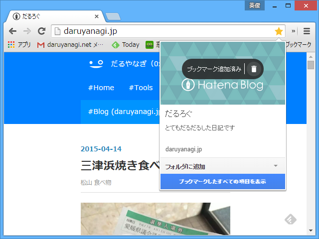
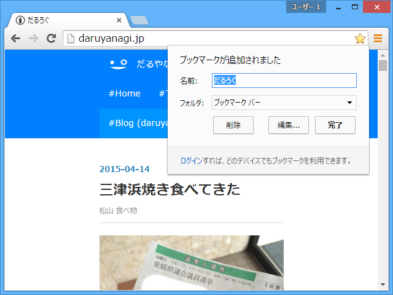
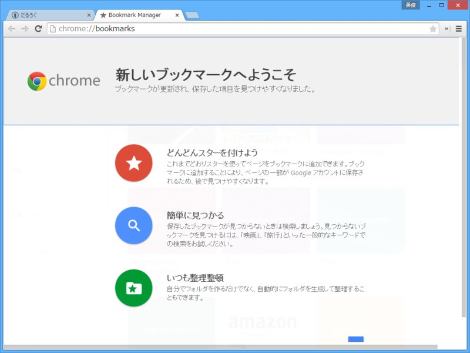
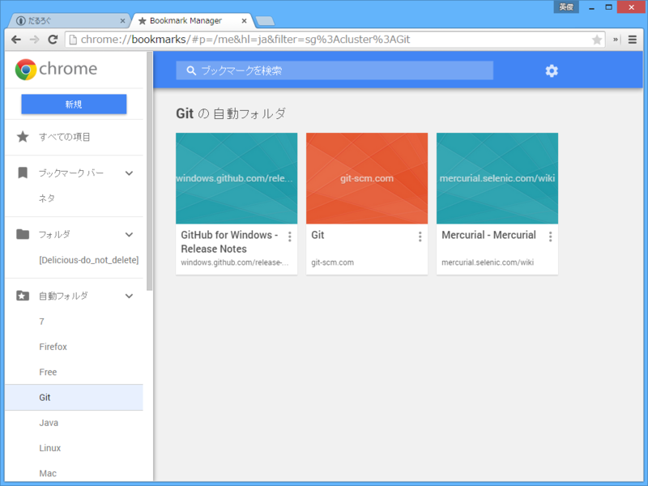
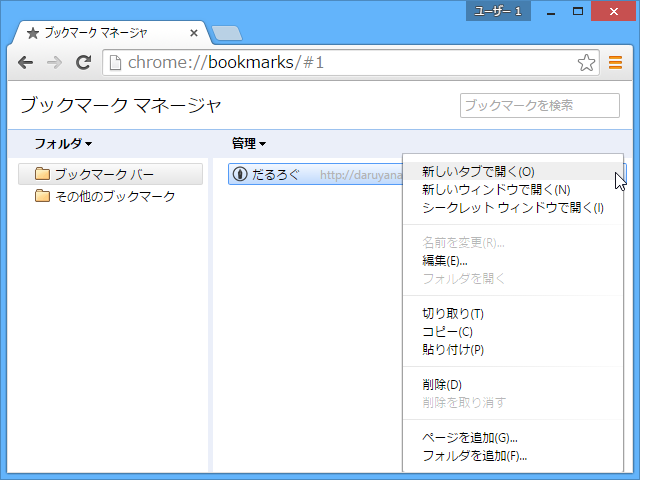

「Google Chrome 42」で確認。［ブックマーク］ボタンが［スター］ボタンになってた。ブックマークにカバーイメージや概要なんかも指定できるようになっているのかな。ちょっとリッチになった感じ。

ちなみに、アカウントでログインしていない場合は、従来の［ブックマーク］ボタンが表示されるみたい。よく注意してないと、変わったのを見過ごしてしまいそう。

<h5>追記</h5>

アカウントでログインしていない場合でも chrome://bookmarks にアクセスすると有効化されたかも？　よくわかんないな。

試しに chrome://bookmarks を開くと、新しいブックマークマネージャーの案内が表示される。

新しい chrome://bookmarks では、ブックマークがタイル表示になっている（リスト表示にすることも可能）。“自動フォルダ”にブックマークが勝手にカテゴライズされていくのが便利くさい。

ちなみに、古いヤツ。こちらのほうが味わい深い（？）けど、新しいのに比べるとだいぶ見劣りするかも。まぁ、それでも<i>「古い方じゃないとイヤだ！　新しいのはクソ！」</i>っていうヒトがある程度いそうな気がする。自分はブックマークツールバーを使う派なので、割とどうでもいいかなって感じ。“自動フォルダ”が期待通りに賢ければいいんだけど（今のところはいい感じ）。

<ul>
<li><a href="http://www.forest.impress.co.jp/docs/news/20150415_697913.html">&ldquo;Push API&rdquo;&#x3092;&#x30B5;&#x30DD;&#x30FC;&#x30C8;&#x3057;&#x305F;&#x300C;Google Chrome 42&#x300D;&#x304C;&#x6B63;&#x5F0F;&#x7248;&#x306B; - &#x7A93;&#x306E;&#x675C;</a></li>
</ul>

