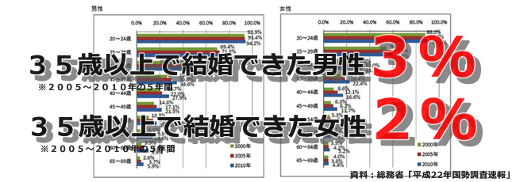
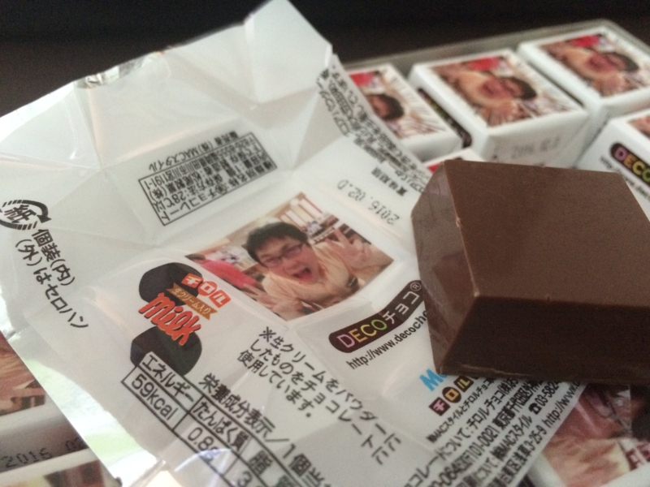
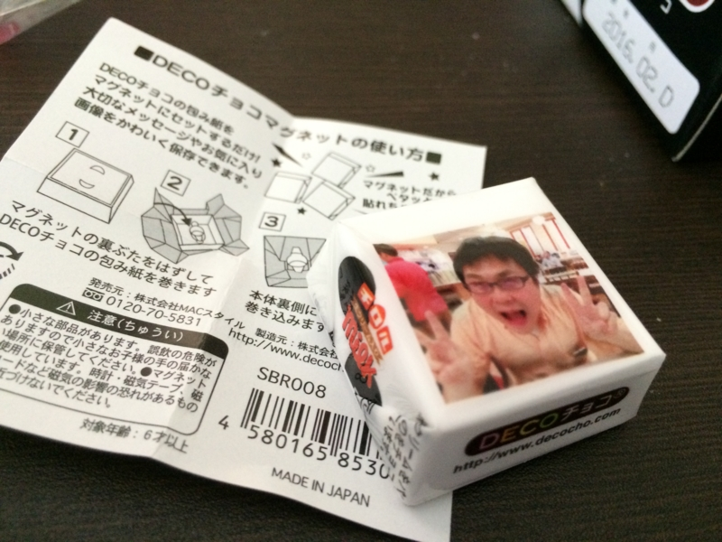

 

<h3>ごめんなさい</h3>

港区のおばあちゃん、「35歳までに結婚する」という約束、果たせませんでした。ごめんなさい。軽く死にたい。

っていうか、もうダメっぽいです。っていうか、婚活みたいな無駄な努力するより、甥や姪っこにランドセルと学習机ぐらい買ってあげられる伯父さんになりたいです。

<blockquote cite="http://ja.wikipedia.org/wiki/J%E3%83%BBB%E3%83%BBS%E3%83%BB%E3%83%9B%E3%83%BC%E3%83%AB%E3%83%87%E3%83%B3">

「2人の兄妹、4人の甥、8人のいとこのためなら喜んで命を差し出すだろう」

<cite><a href="http://ja.wikipedia.org/wiki/J%E3%83%BBB%E3%83%BBS%E3%83%BB%E3%83%9B%E3%83%BC%E3%83%AB%E3%83%87%E3%83%B3">J&#x30FB;B&#x30FB;S&#x30FB;&#x30DB;&#x30FC;&#x30EB;&#x30C7;&#x30F3; - Wikipedia</a></cite>
</blockquote>

の精神で！

<h3>ありがとさんやでぇ</h3>

今回もいろいろプレゼントをいただきました。ありがとう。去年もらったのにお返しできなかったひと、ごめんなさい。誰になにもらったかメモするの忘れてた。直に会うことがあれば、文句言ってください。何かお返ししたいです。

エントリーナンバー1、@mentaro より。だるやなぎチロルチョコ。正直キモいと思いました（軽く死にたい）が、中身は普通に美味しかったです。

これ、勉強会のおやつにいいな？

マグネットがいくつか付いていて、包装紙を巻けるようになってた。冷蔵庫にメモ貼るのに使おうかな。

エントリーナンバー2、@shibayan より。辛辛魚1ケース。

<ul>
<li><a href="https://blog.daruyanagi.jp/entry/2015/02/04/204808">&#x300C;&#x8F9B;&#x8F9B;&#x9B5A;&#x300D;&#x304C;&#x9001;&#x3089;&#x308C;&#x3066;&#x304D;&#x305F;&#x306E;&#x3067;&#x98DF;&#x3079;&#x3066;&#x307F;&#x305F;&#x3002; - &#x3060;&#x308B;&#x308D;&#x3050;</a></li>
<li><a href="https://blog.daruyanagi.jp/entry/2015/02/10/003213">&#x300C;&#x8F9B;&#x8F9B;&#x9B5A;&#x300D;&#x3067;&#x6B7B;&#x306B;&#x304B;&#x3051;&#x305F; &rarr; &#x30EA;&#x30D9;&#x30F3;&#x30B8; - &#x3060;&#x308B;&#x308D;&#x3050;</a></li>
</ul>
泣きながら消費すること丸2カ月、ようやく前の辛辛魚を食べきったところへ、新しいのが送られてきました。軽く死にたい。

<ul>
<li><a href="http://www.amazon.co.jp/gp/registry/wishlist/17CIQBD4FKZQW">Amazon.co.jp</a></li>
</ul>
ちなみにこちらがウィッシュリストになります。よろしくお願いします。

<h3>産廃ですが、これからもよろしくお願いします</h3>

なんていうの、ちゃんと生きて、フツーに死ぬのがこんだけ大変なことだとは思わなんだわ！

