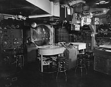
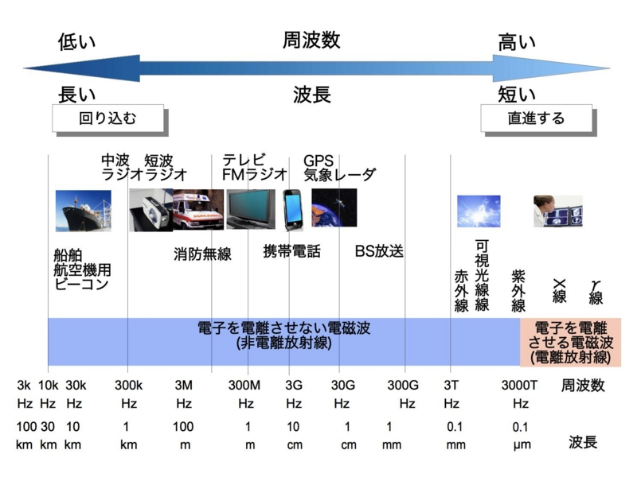
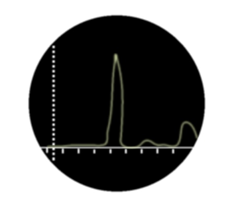
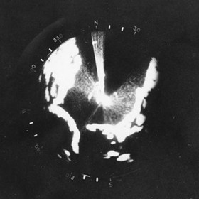
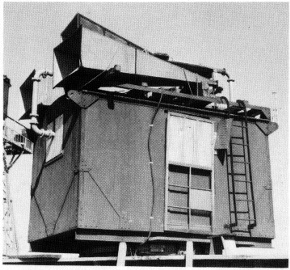

<a href="http://www.amazon.co.jp/exec/obidos/ASIN/4041954142/bestylesnet-22/">太平洋戦争 日本の敗因〈3〉電子兵器「カミカゼ」を制す (角川文庫)</a>
<ul><li>作者: NHK取材班</li><li>出版社/メーカー: 角川書店</li><li>発売日: 1995/07</li><li>メディア: 文庫</li><li>購入: 1人 クリック: 5回</li><li><a href="http://d.hatena.ne.jp/asin/4041954142/bestylesnet-22" target="_blank">この商品を含むブログ (6件) を見る</a></li></ul>

太平洋戦争期の電探について読みたかったのだけど、ふと中学生ぐらいの頃に読んだこの本のことを思い出して、中古で取り寄せてみた。テーマごとに、確か五巻本になっているモノの1冊。

テレビ番組をみているかのような構成で（NHK だし多少はね？）、読みやすいけれど内容は薄めだった。内容も記憶とはちょっとずれていて、電探＋VT信管の本になっていた。2015年の視点で見れば、VT信管（電波式近接信管）についての内容は若干過大評価気味かな、と感じられる。確かに従来の時限式信管（爆発までの時間をあらかじめ設定するタイプ）よりは優秀だったかもしれないが、VT信管が活躍したとされるマリアナ沖海戦では十分に量産されておらず、全体に占める割合は2割ほどであったという。また、VT信管は艦砲に用いられたが、そもそも日本攻撃隊の位置は電探で探知されていて、艦隊に到達するまでにあらかた撃ち落されていた。

――さて、その電探の話。本書の内容は薄かったので、他の資料も使いながら、文系人間でもわかる範囲で。

（瑞鶴の22号（二号二型）電探。一号が陸上見張用、二号が艦載見張用、三号が艦載水上射撃用、四号が陸上対空射撃用、五号が航空機用（PPIスコープ使用）、六号が陸上誘導用）

電探は第二次世界大戦で初めて実用化された“兵器”だったが、日本軍は電探を“兵器”とみなし、積極的にそれを取り入れようという気風に乏しかった。また、“兵器”としてみなされるようになってからも、艦砲よりも優先度の劣る“防衛兵器”としての立場しか与えられなかった。専門の担当部署もなく、ある艦では「航海に使うから」という理由で航海科が片手間で担当し、別の艦では「電波を発する」という理由で通信兵の範囲とされる始末だった。そもそも、電探を電探を防御・攻撃のどちらかに位置付けようとする発想が誤りであろう。どちらにも役に立つのだから。

（空母「レキシントン」の集中指揮所（CIC）。レーダーを主兵装と位置づけ活用していた。一方、日本海軍は紙の海図で……）

自分はあまりちゃんと理解していないが、レーダーの原理は要するにコウモリが自分の居場所をチェックするのに使うアレである。えっと、電波をだして、その反射を受信、その角度か何かよくわかんないけど、そういうものから相手の位置を割り出すらしい。知らんけど。

で、電波には波長の長さというのがあり、メートル波（VHF）よりもセンチ波（UHF～SHF）の方が分解能が高い（細かいのを識別できる）。逆に、メートル波の方がセンチ波よりも遠くまで届き、雨や霧による影響が少ない。あと、電波は直進性が高いが、屈曲しないわけでもない。なので、目視（光）では水平線の向こうなど逆立ちしたって見えないが、電波ならばちょっとイケる。ただ、イケないこともないみたいな感じなので、航空機が低高度でつっこんでくるとやっぱり見えなかったりするっぽい。

そんな感じで、電波にもいろいろな種類があるため、長所短所を組み合わせて利用するのが有効だ。たとえば、遠くのデカい艦隊を捕える場合（長距離探索用の早期警戒レーダーってヤツがそれ）はメートル波がよいし、航空機などの小さな物体を捕える場合（航海レーダーや射撃用レーダー）はセンチ波のほうがよいだろう。空を見てちっこい飛行機を探す対空電探と、だいたいの方角と距離が分かれば十分、それよか島と艦を間違えないようにする方が大事な水上見張り電探が別なのも分かる。

ただし、第二次世界の頃はメートル波が主流で、センチ波の研究を頑張ってやっているという段階だった。つまり、当時の開発競争はいかにレーダーの波長を短いものにして、目標を正確に映し出せるかという勝負だったらしい。あんまり向き不向き言ってられない時代だったんだね。

また、レーダーで得た情報をどのように表示するかというのも大きな問題だった。当時は液晶モニターなんかないから、ブラウン管に表示する。

日本軍の場合、こういうタイプのヤツを利用していた。特定の方向にたいして、どの距離に対象があるかというのが表示される。

一方、米軍は PPI スコープというのを実用化していた。これは360度、全周に対して、どの距離に対象があるのかが直観的にわかる。なんか線がぐるぐる回っていて、対象を見つけるとチカッ、チカッと光る現代でもお馴染のヤツだ。

まぁ、これでは勝てませんわな。日本軍のヤツは PPI スコープでいうと“レーダーの線”の断面だけを表示しているようなものだもの。でもちょっとだけ日本軍のを弁護すると、方角が決まっている射撃レーダーではこの方式の方が見やすい場合もある。が、普通は PPI 表示の方がいいわな。

あと、電探の大きさもまた問題だった。電探は電波の発信と受信を行う。そのため、それぞれにアンテナが必要になる。それらは話して設置しなきゃいけないので、どうしても場所をとってしまう。陸上に設置する電探ならともかく、艦艇に載せるとなると厳しい。

しかし、米軍では一つのアンテナで送受信を切り替えるデュプレクサを実用化しており、レーダーを大幅に小型化するのに成功していた（日本軍はしてなかったのかな）。レーダーが小型であれば、小さな艦艇や航空機にも載せられる。

というのも、初期のまともなレーダーは小さな小屋ぐらいの大きさがあり、重量もバカにならなかった。しかも、最初はこの小屋が丸ごと回転していたらしい（今はアンテナだけがぐるぐる回るよね）。わぉ。そりゃ、小さくしたいわなぁ。

日本だって、世界水準の技術をもっていないわけではなかった。たとえば、八木アンテナやエレクトロンなどは世界に誇れる技術だったと思う。しかし、肝心のそれらを組み合わせて活用する能力が日本軍の官僚組織に欠けていた。電探の開発者が闇市で物資調達して逮捕される、なんて愉快だが笑えないことがおこるのも日本軍のセクショナリズムのせいであり、ひとえに<i>「オーケストラの指揮者がいなかった」</i>が故のことだ。日本の軍艦は軍人以外の乗組員を受け入れるのを好まなかったため、せっかく完成した電探も研究室という箱庭での産物に過ぎず、いざ実戦の場にだすと故障が続出したり、チューニングが行き届かずにポテンシャルを発揮できずに終わった。

