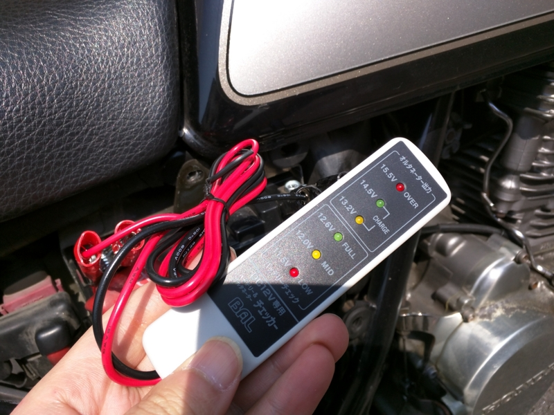
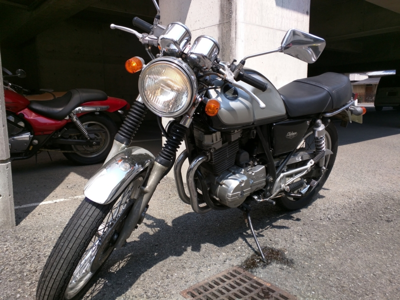

木曜日。早起きして手持無沙汰だったので、三津港の居酒屋さんで借りた傘を返しに行こうと思い立つ。もちろん店は開いてないだろうが、店先に置いておけばよかろう。バイクにまたがり、エンジンに火を入れる。

――が、かかんない。

バッテリーがあがってしまったのかな？　ヤフオクの中古バイクあるあるだな。まぁ、バッテリーは遅かれ早かれ新品に交換しなければならなかったし、さっそく密林に注文した。

<a href="http://www.amazon.co.jp/exec/obidos/ASIN/B00B6XM1KM/bestylesnet-22/">TAIWAN YUASA [ 台湾ユアサ ] シールド型 バイク用バッテリー YTX9-BS</a>
<ul><li>出版社/メーカー: TAIWAN YUASA (台湾ユアサ)</li><li>メディア: Automotive</li><li><a href="http://d.hatena.ne.jp/asin/B00B6XM1KM/bestylesnet-22" target="_blank">この商品を含むブログを見る</a></li></ul>

4,000円。クソ安いのでちょっと不安だけど、まぁ、一年もてばいいか。ついでにレンチもなかったので買っておく。

<a href="http://www.amazon.co.jp/exec/obidos/ASIN/B00FB91SLK/bestylesnet-22/">SUN UP コンビネーションレンチ 6丁組</a>
<ul><li>出版社/メーカー: SUN UP</li><li>メディア: Tools & Hardware</li><li><a href="http://d.hatena.ne.jp/asin/B00FB91SLK/bestylesnet-22" target="_blank">この商品を含むブログを見る</a></li></ul>

GB250 の場合、10mm のが一本あれば大丈夫そうだが、一応セットで買っておいた。あと、側面のカバーを外すために大きめのドライバーが必要になる。なければついでに買っておきましょう。

モノが到着したのは土曜日の午前中だった。午後から予定があるので日曜日にやろうかと考えていたのだけれど、思ったよりはやく来たのに放っておくのもなんだかなーと思い、さっそくつけてみることにした。

<a href="http://www.amazon.co.jp/exec/obidos/ASIN/B000SR2RFG/bestylesnet-22/">バル(BAL) バッテリー&オルタネーターチェッカー バッテリー直結 No.1722</a>
<ul><li>出版社/メーカー: バル(BAL)</li><li>発売日: 2007/06/11</li><li>メディア: Automotive</li><li> クリック: 4回</li><li><a href="http://d.hatena.ne.jp/asin/B000SR2RFG/bestylesnet-22" target="_blank">この商品を含むブログを見る</a></li></ul>

1,500円で一緒に頼んでおいた簡易バッテリーチェッカーも試してみる。バッテリー残量は“Medium”で、やはり交換しておいたほうがよさげ。

バッテリーの交換自体はあっさり終わった。マイナス・プラスではずし、プラス・マイナスの順に繋ぐだけ。バッテリーは充電済みで、液を入れたり、充電したりといった面倒がない。

おかげでセルの回りは元気ビンビンになり、おれさま大満足。しかし、肝心のエンジンには火が入らない。これは困った。

<blockquote cite="http://clubman1997.hatenablog.jp/entry/2012/12/26/230908">

キャブレター内に前の古いガソリンが残ってるとかかりづらくなるので捨てて、

その上でキャブに新しいガソリンを供給してチョーク引いてセル回すとエンジンかかるかもヨ

<cite><a href="http://clubman1997.hatenablog.jp/entry/2012/12/26/230908">GB250 &#x30AF;&#x30E9;&#x30D6;&#x30DE;&#x30F3; &#x51AC; &#x30D0;&#x30A4;&#x30AF; &#x30BB;&#x30EB;&#x304C;&#x56DE;&#x308B;&#x306E;&#x306B;&#x30A8;&#x30F3;&#x30B8;&#x30F3;&#x304C;&#x304B;&#x304B;&#x3089;&#x306A;&#x3044;&#x6642; - &#x96D1;&#x60F3;&#x7D2F;&#x7A4D;&#x6240;</a></cite>
</blockquote>

とのことなので、とりあえずドレンプラグを抜き、なんか汚い液体を抜いて（写真右下にたれてるやつ）、もう一度セルを回してみた。相変わらずかからない。でも、3回目ぐらいでかすかなアタリを感じたので、ダメもとで押がけしてみると……見事かかった。チョークを引かないとすぐにエンジンが止まってしまうけど。

とりあえず近所を一周してちゃんと走ることを確認して様子見。

 

