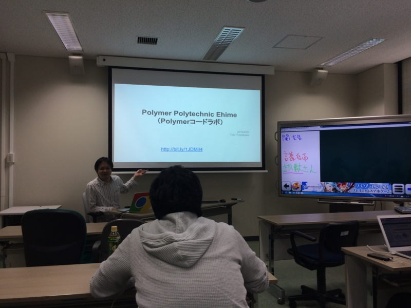
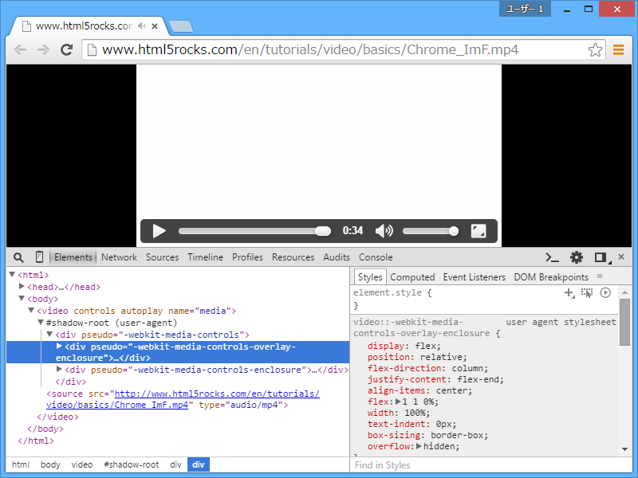
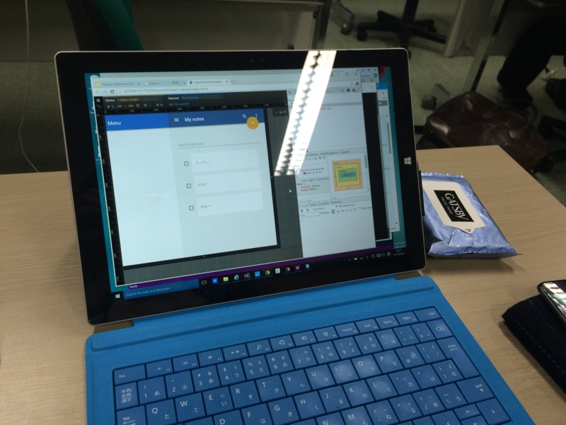
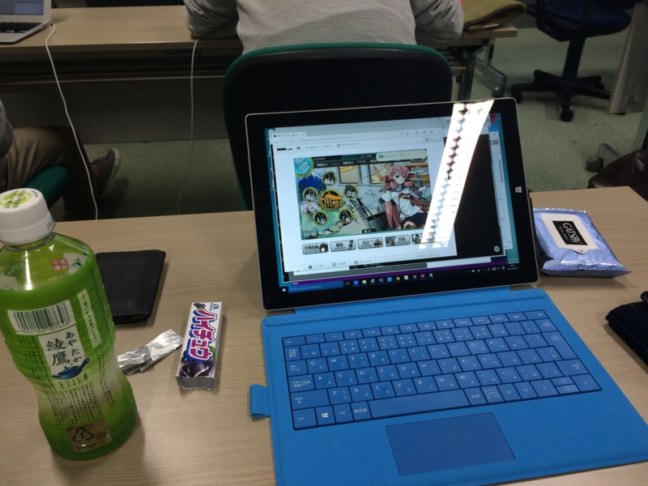

Google Developers Groups Shikoku（GDG四国）開催のお勉強会、Polytechnic Ehime に参加してきました。

<iframe src="//hatenablog-parts.com/embed?url=http%3A%2F%2Fgdgshikoku.connpass.com%2Fevent%2F13838%2F" title="Polytechnic Ehime (2015/04/25 13:00〜)" class="embed-card embed-webcard" scrolling="no" frameborder="0" style="display: block; width: 100%; height: 155px; max-width: 500px; margin: 10px 0px;"><a href="http://gdgshikoku.connpass.com/event/13838/">Polytechnic Ehime (2015/04/25 13:00〜)</a></iframe>

土曜日のお昼から、愛媛大学の情報メディアセンターで。当日は11時半ごろに家を出て、途中、なか卯で英気を養いました。歩いて行っても30分ぐらいかな？　電車乗ろうかとも思ったけど、最近運動不足なのでネ。集まったのは10人ぐらいだろうか。@ramsara さん以外は知らない人ばかりだった。

講師は Google Developer Expert（GDE）の吉川 徹さん。<a href="http://html5j.org/">html5j &#x2015; &#x300C;&#x3064;&#x306A;&#x304C;&#x308B;&#x300D;&#x300C;&#x5B66;&#x3079;&#x308B;&#x300D;&#x300C;&#x76DB;&#x308A;&#x4E0A;&#x304C;&#x308B;&#x300D;</a> の方だそうで。温和な感じの方でした。

今回のお題は、Polymer（<a href="https://www.polymer-project.org/">Welcome - Polymer</a>）。Web Components を使いやすくするためのライブラリなのだそうだ。自分は「名前は聞いたことある」程度で、中身についての知識はほとんどない。

こいつのなにがうれしいのかというと、たとえば Polymer 化された Google Map をこんなふうに扱える。

<pre class="code lang-html" data-lang="html" data-unlink>&lt;!-- Polyfill Web Components support for older browsers --&gt;
&lt;script src=&quot;components/webcomponentsjs/webcomponents.min.js&quot;&gt;&lt;/script&gt;

&lt;!-- Import element --&gt;
&lt;link rel=&quot;import&quot; href=&quot;google-map.html&quot;&gt;

&lt;!-- Use element --&gt;
&lt;google-map lat=&quot;37.790&quot; long=&quot;-122.390&quot;&gt;&lt;/google-map&gt;
</pre>
ぐちゃぐちゃとタグやスクリプトを書きなぐらなくても、シンプルに <google-map> って感じで使える。カッケー。

さらに地図にマーカーをたてたい場合はこんな感じ（あくまでもこんな“感じ”）でいいようだ。

<pre class="code lang-html" data-lang="html" data-unlink>&lt;google-map lat=&quot;37.790&quot; long=&quot;-122.390&quot;&gt;
&lt;google-map-marker lat=&quot;37.790&quot; long=&quot;-122.390&quot; /&gt;
&lt;/google-map&gt;
</pre>
いいね！　こうやって自分だけのタグが作れるのが Polymer なんですな。ちなみにタグの名前に“-”を入れるのは、将来 HTML でタグが追加された時に名前が衝突するのを避けるためなんだって。&lt;x-hoge&gt; とつけたりするらしいのだけど、個人的には“ベンダー名・ライブラリ名-名前”っぽくつけるのがよさそうだと思う。

さて、Polymer というのは4つの HTML5 技術から成るのだそうだ。

<ul>
<li>HTML Import（&lt;link rel="import" href="google-map.html"&gt;）</li>
<li>Custom Element（&lt;google-map&gt;）</li>
<li>HTML Template</li>
<li>Shadow DOM</li>
</ul>
HTML Template というのは、今までタグをスクリプトで組み立てていたやり方<a href="#f-9f703d9a" name="fn-9f703d9a" title="CSRF だかなんだかしらんけど、そういう変なバグ作るの怖い！">*1</a>や、ユーザーが見えない位置にタグを用意しておくやり方<a href="#f-a15caa4f" name="fn-a15caa4f" title="ハックされて見えちゃうとダサいし、ページがロードされると同時に活性化しちゃうのでオンデマンドに使えない">*2</a>に代わる方法。&lt;templete&gt; のなかへ宣言的に HTML の切れ端を書いておける感じ。DOM に組み込まれるまで活性化されない<a href="#f-e360b515" name="fn-e360b515" title="「使うやでー」って言うまで黙って待ってくれる">*3</a>ので、実際に“使われない”なら副作用も一切ない。

Shadow DOM は……今までもうっすら知ってたけど、他人に説明するのは面倒な技術だったのだけど、&lt;video&gt; のコントロールを実装するためにユーザーエージェントが使ってるアレって教えてもらって、あぁ、それは分かりやすいなーと思った。

（開発者ツールでオプションを有効化すると Shadow DOM が見える）

ダイレクトに外から見えたりアクセスされるとあんまりよくないときに使える感じ。Custom Element だって中身までユーザーに見せる必要ないもんねー。

コードラボという形式の勉強会は初めてだったのだけど、基本的に教材をもとにコードをコピペしていくだけだった。JavaScript 力の低いおれ様でもまったく大丈夫！<a href="#f-0679af33" name="fn-0679af33" title="でも、基本的な文法はマスターして、配列のカンマが足りねーとか、コピペミスをすぐに発見できる程度には習得しておくべきだと思う">*4</a>　<a href="https://chrome.google.com/webstore/detail/chrome-dev-editor-develop/pnoffddplpippgcfjdhbmhkofpnaalpg?hl=ja">Chrome Dev Editor (developer preview) - Chrome &#x30A6;&#x30A7;&#x30D6;&#x30B9;&#x30C8;&#x30A2;</a> でプチプチとコードを入力していく。

コピペしていくだけでお勉強になるんかいな、とちょっと思わないでもなかったけれど、手を動かすというのは大事らしい。コピペミスで動かない！　なんでだ！　とかやってるうちに自分がハマりやすいポイントというのが分かってきて、だんだん要領がよくなってくる。時間が余ったらデベロッパーツールで DOM ツリーを眺めたり、コンソールでログを確認したり。とりあえず動いたけど何で動いてるのかわかんねーところは、質問してもいい。個人的には Bower に触れたのも収穫だった。お勉強しなきゃなーと思っていたけれど、必要に迫られないとなかなかやらないわけで（ぉ

あと、なんといっても、何か動くものが自分の手で作れるというのは楽しいということ。レベル的には BB 戦士のガンダム組んでいるだけなのだろうけれど、ちゃんとモノが完成するとやっぱりうれしくて、それがモチベーションになる感じ。次はあれやりたいなーってね。

こういうの、独りでは絶対めんどくさがってやらない。あと、独りでやるのと、他の人に説明してもらうのを耳で聞くのとでは効率も違う。あと、終わったら呑み会もあるしね。機会があればまた参加したいと思ったかも。

<h4>追伸</h4>

コード書くのに夢中になりすぎて、艦これの遠征を忘れていた。危うくデイリー任務を消化しきれないところだった。

<a href="#fn-9f703d9a" name="f-9f703d9a" class="footnote-number">*1</a>:CSRF だかなんだかしらんけど、そういう変なバグ作るの怖い！

<a href="#fn-a15caa4f" name="f-a15caa4f" class="footnote-number">*2</a>:ハックされて見えちゃうとダサいし、ページがロードされると同時に活性化しちゃうのでオンデマンドに使えない

<a href="#fn-e360b515" name="f-e360b515" class="footnote-number">*3</a>:「使うやでー」って言うまで黙って待ってくれる

<a href="#fn-0679af33" name="f-0679af33" class="footnote-number">*4</a>:でも、基本的な文法はマスターして、配列のカンマが足りねーとか、コピペミスをすぐに発見できる程度には習得しておくべきだと思う

