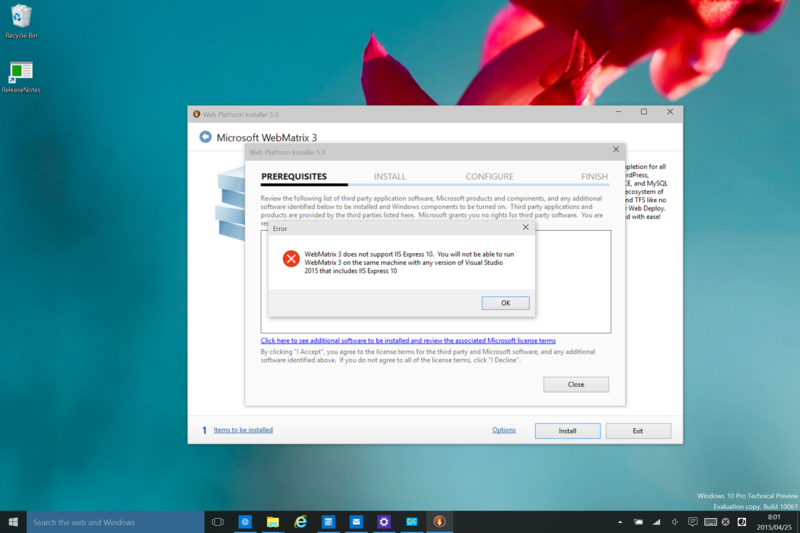

 

<blockquote>

WebMatrix 3 does not support IIS Express 10. You will not be able to run WebMatrix 3 on the same machine with any version of Visual Studio 2015 that includes IIS Express 10

</blockquote>

とうとうこの日が来たかーって感じですね！　一応、<i>IIS Express 10 に対応した WebMatrix（WebMatrix 4）がリリースされる</i>という可能性もなきにしもあらずですが、あんまり期待はもてなさそう。また、Visual Studio 2015 を使わないという手もありますが……WebMatrix と Visual Studio だったら Visual Studio 選びますわな。

まぁ、でも、WebMatrix のおかげでいろいろ楽しかったです。Visual Studio がジェット戦闘機ならば、WebMatrix はレシプロ複葉機みたいなもんですが、自分みたいな趣味として片手間で触るような人間にはぴったりでした。入門向けとしてはなかなかいいツールではないかと思うのですが、あんまり普及しなくて残念です。

<ul>
<li><a href="https://blog.daruyanagi.jp/archive/category/WebMatrix">WebMatrix &#x30AB;&#x30C6;&#x30B4;&#x30EA;&#x30FC;&#x306E;&#x8A18;&#x4E8B;&#x4E00;&#x89A7; - &#x3060;&#x308B;&#x308D;&#x3050;</a></li>
</ul>
というわけで、完全に死んだ頃を見計らってお葬式イベントでもやりたいと思います。

<h4>追伸</h4>

<blockquote cite="http://blog.xin9le.net/entry/2015/04/20/220238">

これで WebMatrix とかを完全に捨てられますね！

<cite><a href="http://blog.xin9le.net/entry/2015/04/20/220238">Monaco&#x4E0A;&#x306E;&#x30D5;&#x30A1;&#x30A4;&#x30EB;&#x3092;&#x4E00;&#x62EC;&#x30C0;&#x30A6;&#x30F3;&#x30ED;&#x30FC;&#x30C9;&#x3059;&#x308B; - xin9le.net</a></cite>
</blockquote>

ぐぬぬ（＾ｖ＾）

