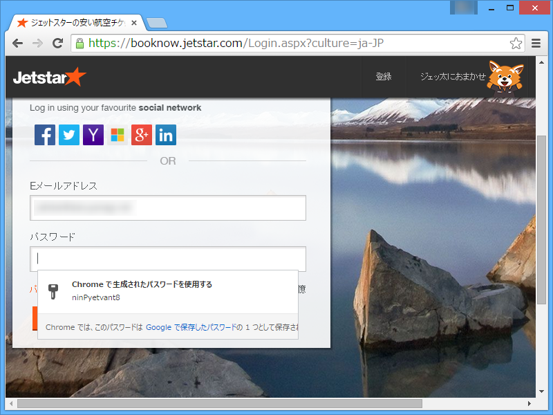
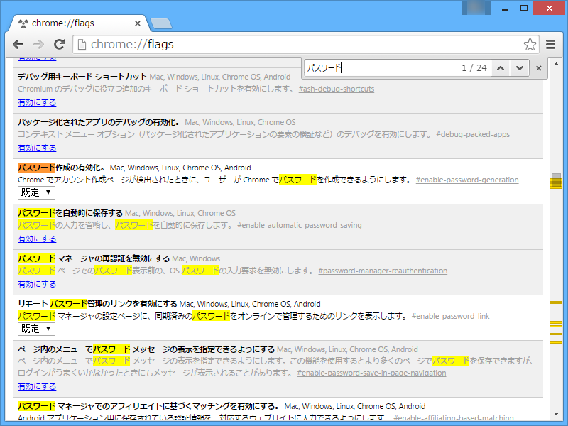

「Google Chrome 43」（beta）でジェットスターのサイトをウロウロしているときにでてきた。

<blockquote cite="https://www.chromium.org/developers/design-documents/password-generation">

Passwords are not a very good form of authentication. They are easy to use but they are trivial to steal, either through phishing, malware, or a malicious/incompetent site owner. Furthermore, since people are so apt to reuse passwords losing one password leaks a substantial amount of your internet identity.

Chrome's long term solution to this problem is browser sign in plus OpenID. While implementing browser sign in is something that we can control, getting most sites on the internet to use OpenID will take a while. In the meantime it would be nice to have a way to achieve the same affect of having the browser control authentication. Currently you can mostly achieve this goal through Password Manager and Browser Sync, but users still know their passwords so they are still susceptible to phishing. By having Chrome generate passwords for users, we can remove this problem. In addition to removing the threat of phishing, automatically generating password is a good way to promote password manager use, which should be more secure and seamless than manual password management.

<cite><a href="https://www.chromium.org/developers/design-documents/password-generation">Password Generation - The Chromium Projects</a></cite>
</blockquote>

去年の秋ごろから Canary で<s>かなり</s>テストされていたみたい。

chrome://flags/#enable-password-generation で無効化が可能。

