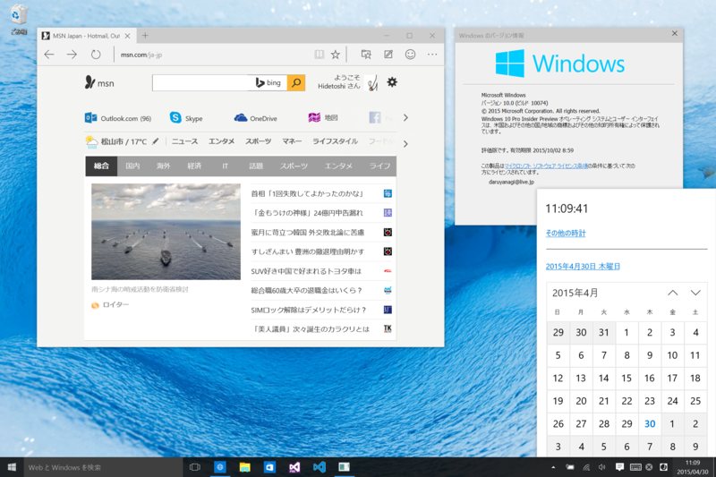
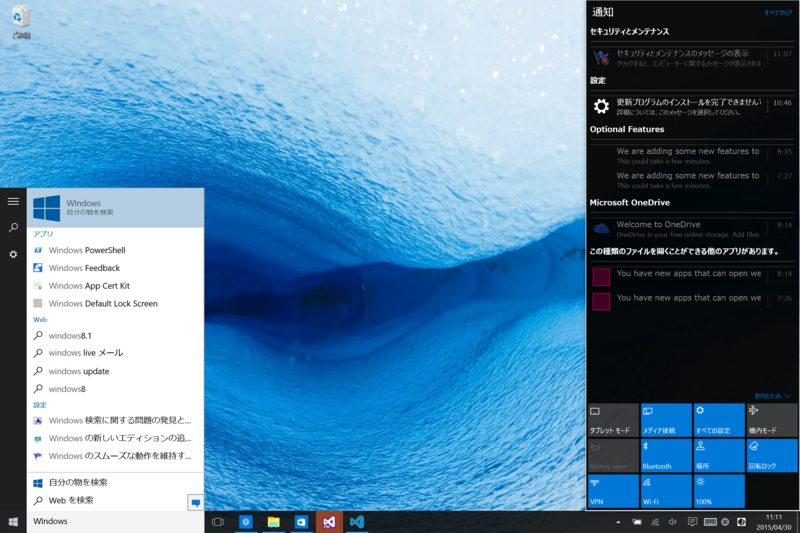
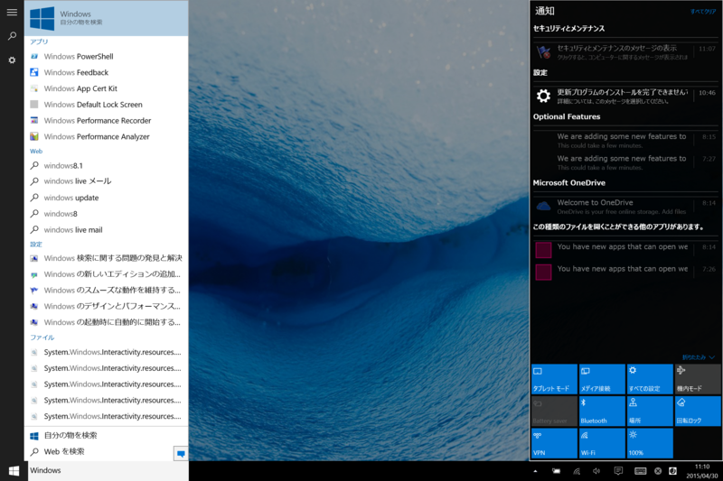
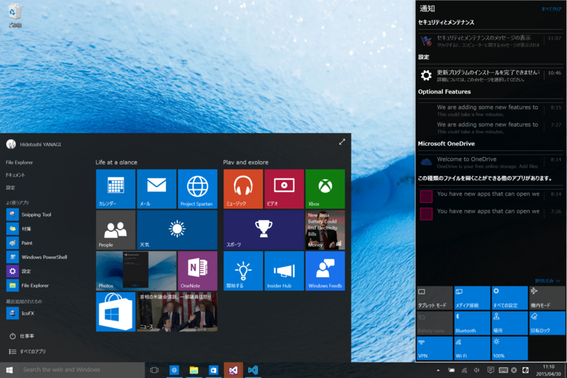
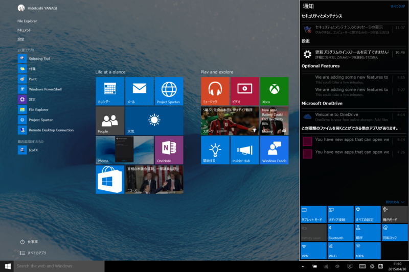
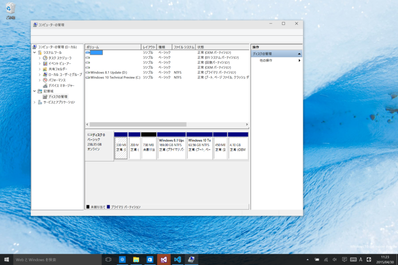
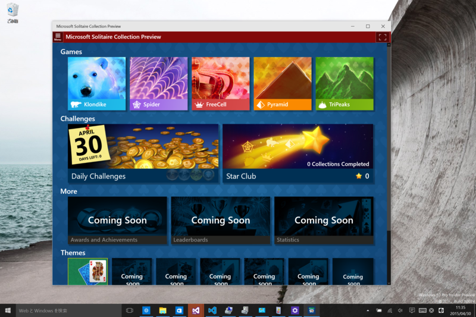

またしてもエラー 0x80246017 が発生してアップデートできないという状況に遭遇したのだけど、Reset と Refresh を試してみたらなんとかアップデートできた。セットアップのステップもだいぶ変わってるんだなーというのが確認できたので、まぁ、それはそれで。英語版に日本語パッチを当てていたので、リフレッシュのあとに言語パックをあてて完成。

<blockquote cite="http://blogs.windows.com/bloggingwindows/2015/04/29/new-windows-10-insider-preview-build-10074-now-available/">

One other subtle change that you’ll notice is that we’ve changed how we talk about the builds from “Technical Preview” to “Insider Preview” to reflect the importance of the Windows Insider community in how we’re building Windows 10.

<cite><a href="http://blogs.windows.com/bloggingwindows/2015/04/29/new-windows-10-insider-preview-build-10074-now-available/">New Windows 10 Insider Preview Build 10074 now available</a></cite>
</blockquote>

よくわかんないけれど、いろいろ新しい要素を盛り込む“Technical Preview”から、ユーザーのフィードバックをもとに細部をブラッシュしていく“Insider Preview”になりましたって感じなのかな。まぁ、単に Windows Insider コミュニティにフィードバックしてくれよ！　って気持ちを込めて“Insider”を冠しただけなのかもしれないけど。

なにはともあれ、大きな要素の追加はもうなさそう。今回のアップデートの変更点も、割とこまい。

検索周りのデザインが変わったり（タブレット モードの ON/OFF で違う）、

ライブタイルがマシになったり。アクションセンターも初期のしょぼしょぼな感じと比べると、だいぶシュッとした感じになった。なんかシステムサウンドも追加されてるのかな？　なんかだいぶ完成に近づいたって雰囲気だ。

コアツールの Per-Monitor-DPI 対応は環境がないからよくわかんないが、Surface Pro 3 の高 DPI 環境でみたところ、頑張っている感じはある。メニューなんかのフォントが崩壊気味だけど、まぁ、これはちゃんと治るんだろう。

あとは、「音楽」「ビデオ」アプリのアップデートとか、Continuum やマルチタスク機能の改善ってところか。

ちなみにソリティアも入っていた。別に“クラシック”なソリティアなんかじゃなく、ストアアプリ版ソリティアがビルトインされた感じ（UI デザインは変わっているが機能はざっと見た感じ一緒だった。ストアアプリの権限で動くみたいだしね）。Windowed であれば、こっそり遊べますよねってことなのだろうかｗ

いろいろ不安定だったけど、ファームウェアップデートも入れたら、多少マシになった……気はする。うーん、7月に間に合うのかなぁ……。

