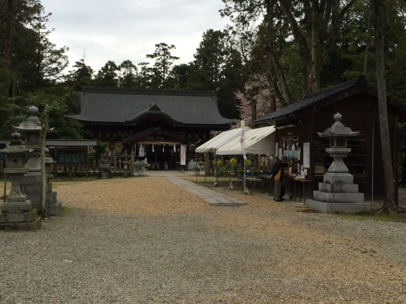
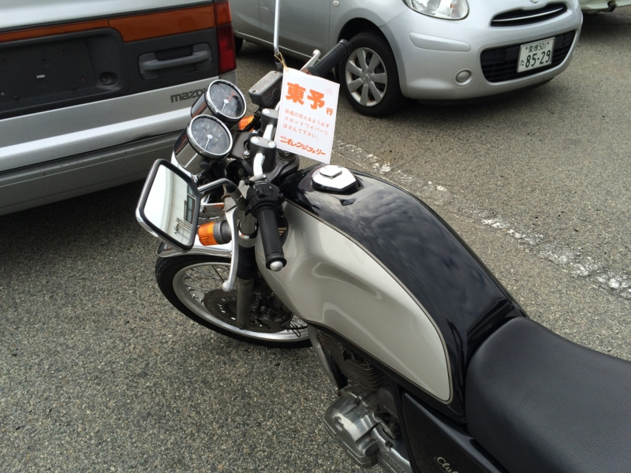
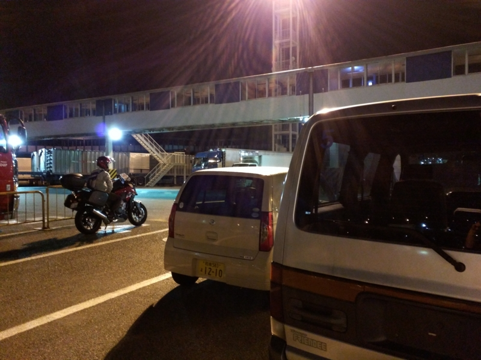
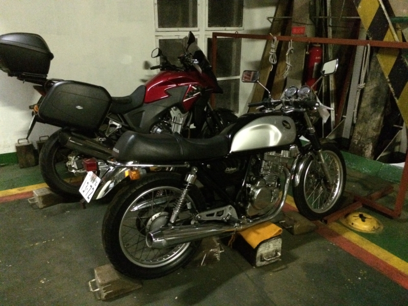
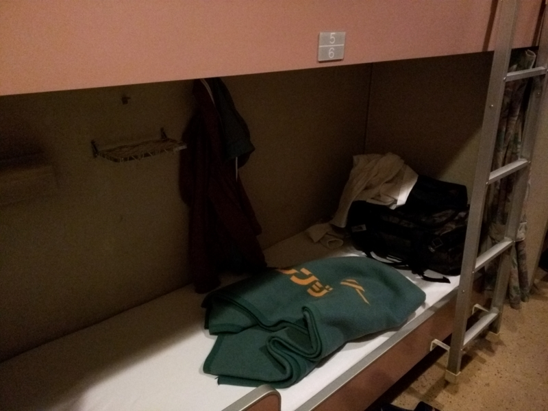
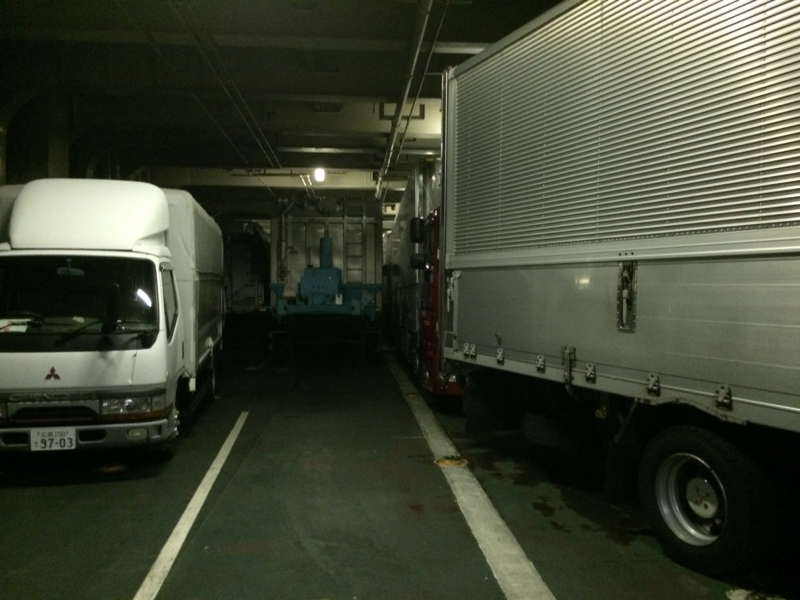
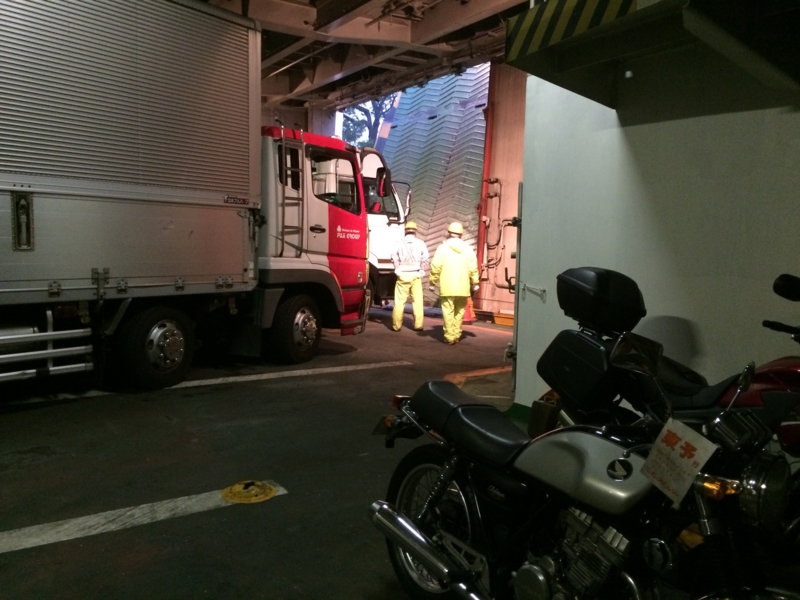

今回が最終話。とくに書くこともないのだけど、なにも書かずに終えるのもなんか尻切れトンボなので。

<ul>
<li><a href="https://blog.daruyanagi.jp/entry/2015/04/10/031139">&#x30D0;&#x30A4;&#x30AF;&#xFF1A;&#x9234;&#x9E7F;&#x304B;&#x3089;&#x4F0A;&#x8CC0;&#x4E0A;&#x91CE;&#x30FB;&#x540D;&#x5F35; - &#x3060;&#x308B;&#x308D;&#x3050;</a></li>
<li><a href="https://blog.daruyanagi.jp/entry/2015/04/16/053928">&#x30D0;&#x30A4;&#x30AF;&#xFF06;&#x8266;&#x3053;&#x308C;&#xFF1A;&#x540D;&#x5F35;&#x304B;&#x3089;&#x5929;&#x7406;&#x3001;&#x6226;&#x8266;&#x5927;&#x548C;&#x6240;&#x7E01;&#x306E;&#x795E;&#x793E;&#x300C;&#x5927;&#x548C;&#x795E;&#x793E;&#x300D;&#x306B;&#x884C;&#x3063;&#x3066;&#x304D;&#x305F; - &#x3060;&#x308B;&#x308D;&#x3050;</a></li>
</ul>
三時ごろに大和神社をお暇し、天理 IC から西名阪・阪神高速を抜け、南港のフェリーターミナルへ向かう。そろそろ雨が降りそうなので、とりあえずフェリーターミナルにバイクを置いてから晩御飯を食べたほうがよかろう。

南港から東予までは、中型バイク（125cc～750cc）で11,000円ぐらい（二等寝室 6,690 円＋自動二輪 4,630 円）。自分は使うのを忘れていたが、JAF の割引が効くらしいので、もうほんのちょっと安くなる。

乗船券（要予約）を購入すると、輪ゴムの付いた名札っぽいものがもらえるので、それをハンドルなどにひっかけておく。あとは乗船待ちのクルマの列に並べばよいらしい（受付で聞くと、どのレーンで待てばいいのか教えてくれる気がする）。

築港へ戻ってばあちゃんと萬集楼でご飯を食べ、乗船時間（20:00）にまた戻ってきた。見渡すとバイク乗りは僕ともう一人だけのようだ。エンジンをかけて待機していると、スタッフが声をかけてくれる。ここで乗船券を見せる必要があるので、あらかじめ用意しておくといい感じ。

もう一人のバイク乗りの人のあとについて、船のなかを右奥へと進む。そこで乗組員の人にバイクを固縛してもらえば、あとは自由時間。デッキにのぼってビールをいただく。

ﾃｨｰﾘｰﾃｨｯﾃｨｰﾃｨｯﾃｨｯﾃｨｰ♪（宿屋の音楽

翌朝、東予港到着。車両甲板に降りると、トラックやらトレーラーがぎっちり止まっている。記憶を頼りにバイクのところへ向かうが、あと少し太ってたら隙間で挟まるところだった。エンジンをかけて走り出す準備をしているトラックもあるし、気を付けないと引かれそう。

乗員の方に挨拶をすると、バイクの固縛を解いてくれる。前をふさいでいるトラックを数台出すと、こちらに合図をしてくれたので、エンジンをかける（もうかけておいたほうがよかったかもしれぬ）。外はあいにくの雨で、鋼鉄製のランプウェイはつるっつる。そのまま道路へ飛び出し（あ、一時停止はしような）、雨に打たれながら松山まで帰りましたとさ。

――雨装備もって行くの忘れたので、高速道路で死にかけますタ。ヒー

