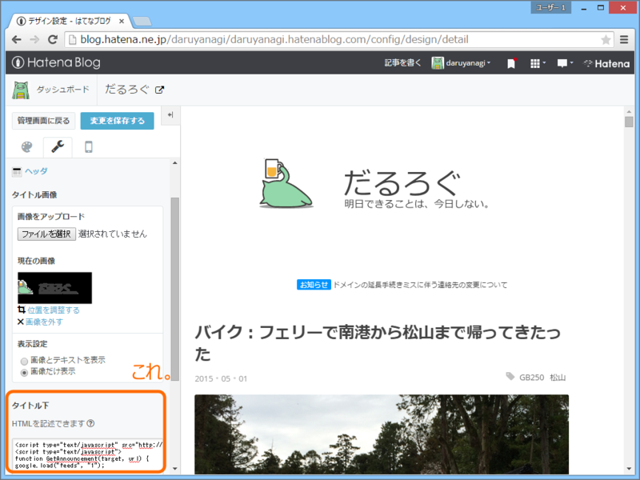

これな。ドメイン失くしてごめんなさい的な告知を出しておきたかった。

<h3>カテゴリーのフィードを探す。</h3>

まずはカテゴリーのフィードを探す。カテゴリーページを開いてソースを見ると……

こんな風に書いてある。

<pre class="code lang-html" data-lang="html" data-unlink>&lt;link rel=&quot;alternate&quot; type=&quot;application/atom+xml&quot; title=&quot;Atom&quot;
href=&quot;https://blog.daruyanagi.jp/feed/category/%E5%91%8A%E7%9F%A5&quot;/&gt;
&lt;link rel=&quot;alternate&quot; type=&quot;application/rss+xml&quot; title=&quot;RSS2.0&quot;
href=&quot;https://blog.daruyanagi.jp/rss/category/%E5%91%8A%E7%9F%A5&quot;/&gt;
</pre>
なんでもいいと思うのだけど、今回は RSS2.0 の方を使った。

<h3>JavaScript でフィードを取得して主力する</h3>

Google Feed API を利用するのが一般的な方法らしい。

<ul>
<li><a href="https://developers.google.com/feed/v1/?hl=ja">Google Developers</a></li>
</ul>
最初の1個だけ取得して、#target 要素を書き換えるようにしてみる。

<pre class="code lang-javascript" data-lang="javascript" data-unlink>&lt;script type=&quot;text/javascript&quot; src=&quot;http://www.google.com/jsapi&quot;&gt;&lt;/script&gt;
&lt;script type=&quot;text/javascript&quot;&gt;
function GetAnnouncement(target, url) {
google.load(&quot;feeds&quot;, &quot;1&quot;);

function initialize() {
var feed = new google.feeds.Feed(url);
feed.setNumEntries(1);
feed.load(function (result) {
if (!result.error) {
var container = document.getElementById(target);
var feed = result.feed.entries[0];
var html = &quot;&lt;a href='&quot; + feed.link + &quot;'&gt;&quot; + feed.title + &quot;&lt;/a&gt;&quot;;
container.innerHTML = html;
} else {
console.log(result.error.code + &quot;:&quot; + result.error.message);
}
});
}

google.setOnLoadCallback(initialize);
}

GetAnnouncement(&quot;feed&quot;, &quot;https://blog.daruyanagi.jp/rss/category/%E5%91%8A%E7%9F%A5&quot;);
&lt;/script&gt;

&lt;span id=&quot;feed&quot;&gt;ここにはいる&lt;/span&gt;
</pre>
JavaScript 力が低い（

ついでにスタイルシートとかもかいて、装飾しておくとよいかと。ソースコードの見た目？　んなもん気にしない。

キャッシュが効いていて更新が遅いので、気になる人は URL の尻尾になんかランダムの値を足しておくといいかも。毎回フィードをとりに行くので、表示は遅くなるが。

<h3>はてなのトップに掲出する</h3>

デザイン設定画面のヘッダーのところにさっきのソースコードをペタッと貼る。あとは見栄えをチェックして完了。

