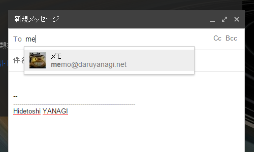
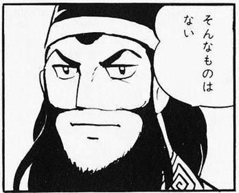
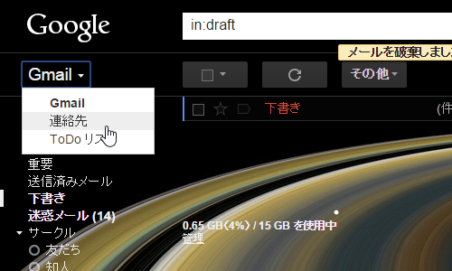
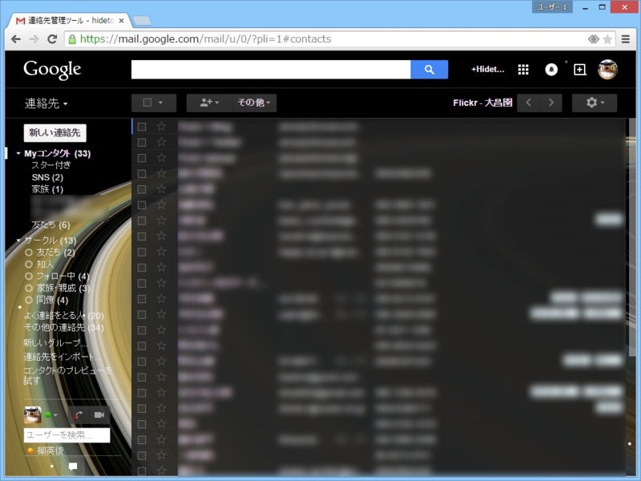
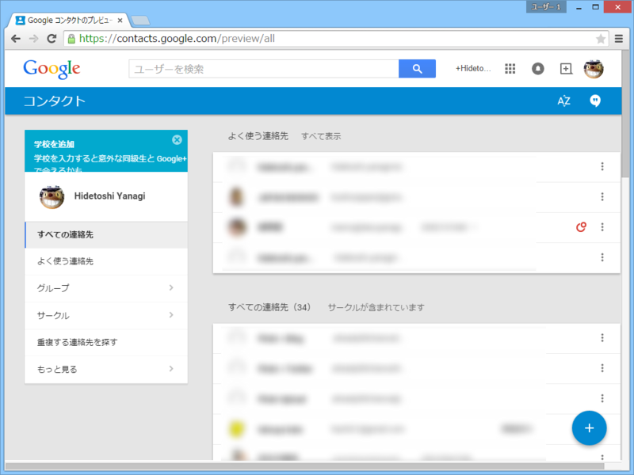
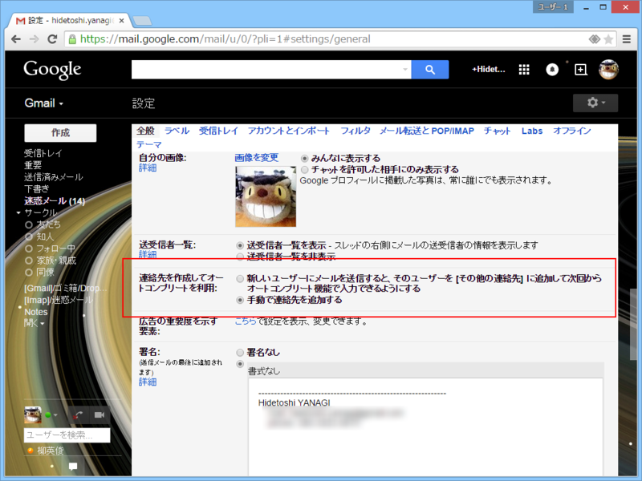

Gmail には宛先のオートコンプリート機能がある。こいつはムチャクソ便利なのだけど、手が滑って間違った宛先を入力してしまう場合がある。っていうか、やらかしました。ごめんなさい。

でもね、失敗は誰にでもあるのさ。問題は繰り返さないことなのさ。

――というわけで。

対策を考えてみた。

<h3>対策1：オートコンプリート機能を無効化する</h3>

だいたい、こんな便利機能があるのが悪い。人類には早すぎるんだよ。可及的速やかに無効化すべきなんだよ。

でも、さすが世界最高の便利さを誇るメールサービス。オートコンプリート機能の無効化はできないっぽい（あったら教えて！）。

 

<h3>対策2：オートコンプリートに出てくる宛先を自分でコントロールする</h3>

今回は最近使っていないメールアドレスへ送ってしまったのだけど、こいつがオートコンプリートの候補に出てこないだけでも個人的にはかなり助かる。というわけで、これを消す。

<blockquote cite="https://support.google.com/mail/answer/6597?hl=ja">

Gmail では最も頻繁にメールを送信するアドレスが最初に候補として表示されます。最も頻繁にメールを送信する連絡先の完全なリストを表示するには、Gmail ページの左上の [Gmail] をクリックし、[連絡先] を選択します。次に、[よく使う連絡先] をクリックします。

<cite><a href="https://support.google.com/mail/answer/6597?hl=ja">&#x30AA;&#x30FC;&#x30C8;&#x30B3;&#x30F3;&#x30D7;&#x30EA;&#x30FC;&#x30C8; - Gmail &#x30D8;&#x30EB;&#x30D7;</a></cite>
</blockquote>

オートコンプリートに出てくる宛先は、Gmail の［連絡先］に登録されているモノらしい。というわけで、Gmail の［連絡先］を掃除する。

やばい。以前に親しくさせていただいた女性の連絡先とかある。酔っ払って変なメールを送る前に削除しておくに限るやわ。汚物＜いらないもの＞は消毒だーーーッ！！

ちなみにプレビュー版のコンタクトを有効化している人はかっちょいい画面になっていると思うけれど、やることは一緒。

あと、［連絡先を作成してオートコンプリートを利用］というオプションを［手動で連絡先を追加する］に変えておく。これをしないと、一度でも入力したメールアドレスがもりもりコンタクトに保存されちゃう。手動管理の手間はあるけれど、宛先は自分で把握しておきたいわな。

<h3>対策3：送る前に宛先をちゃんと確認する</h3>

 

<h3>追記</h3>

<blockquote class="twitter-tweet" lang="ja">
<a href="https://twitter.com/daruyanagi">@daruyanagi</a> どうして…どうしてGmail誤送信防止用のディレイをかけていなかったんだ…！(´；ω；｀)
&mdash; おにぎりマン (@reki_frequent) <a href="https://twitter.com/reki_frequent/status/594419097984585728">2015, 5月 2</a></blockquote>

<blockquote class="twitter-tweet" lang="ja">
<a href="https://twitter.com/daruyanagi">@daruyanagi</a> 誤送信ってすぐ気付いた感じですか？（送信先違うの気付いてたのに、誤って送信ボタン押したとか）　Gmailなら送信取消機能あるので、すぐ気付いたなら取り消しいけますよ
&mdash; (＃＾ω＾)ﾗﾑﾗﾑ (@ramusara) <a href="https://twitter.com/ramusara/status/594464750437736448">2015, 5月 2</a></blockquote>

ま、そういうのもあるみたいなんだけど、押したときに気づくって個人的にはあまりないんだよねぇ。「返事こないけどなんでだろー」って確認したら間違ってました／(＾o＾)＼みたいなパターンばっかりなので、自分には役に立たない。

<blockquote class="twitter-tweet" lang="ja">
<a href="https://twitter.com/daruyanagi">@daruyanagi</a> 対策っていうから、新しい gmail プラグインの紹介かなってワクワクしながらブログみたら違ってましたw 　文面をベイズ統計で分析して、送信者がハズレてそうなときに警告してくれるようなのがあると最高なのですがw  まぁでも連絡先の整理整頓は一番大事です。
&mdash; 河原　太郎 (@tarokawa) <a href="https://twitter.com/tarokawa/status/594468873983758336">2015, 5月 2</a></blockquote>

ほんと、そういう機能があるといいんだがなって思う。

