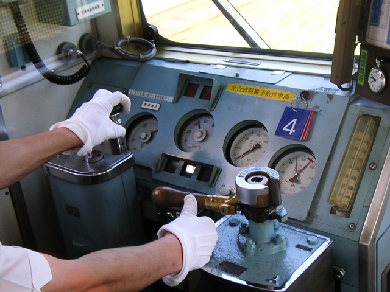
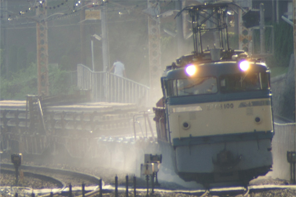

<blockquote class="twitter-tweet" lang="ja">
【高徳線】車両不調　遅延［08:48更新］讃岐相生駅〜阿波大宮駅間で列車が空転したため、同区間を運転する列車を中心に遅れが発生しています。… <a href="http://t.co/kVJvrTn2D5">http://t.co/kVJvrTn2D5</a>
&mdash; JR_Sikoku (@JR_Sikoku) <a href="https://twitter.com/JR_Sikoku/status/594650094516862976">2015, 5月 2</a></blockquote>

「空転のため遅延」ってあまり聞いたことがないなぁ、と思ったのでちょっと調べてみた。

<blockquote cite="http://detail.chiebukuro.yahoo.co.jp/qa/question_detail/q1374803158">

雨などでレールの踏面が滑りやすくなると、車輪が空転します。 
通常の電車は、自動進段式になっているので、車輪側の負荷が軽くなるとどんどん進段してしまいます。 
この結果、一時的に空転したことにより、過負荷状態が発生してしまい、遮断器が落ちてしまいます。 
リセット(又入なんて書いてありました）しないと復帰できません。(最近の電車は自動リセットしますけれど） 
で、結果的に遅延が発生するのですね。

<cite><a href="http://detail.chiebukuro.yahoo.co.jp/qa/question_detail/q1374803158">&#x305F;&#x307E;&#x306B;&#x898B;&#x304B;&#x3051;&#x308B;&#x96FB;&#x8ECA;&#x306E;&#x9045;&#x5EF6;&#x539F;&#x56E0;&#x306B;&#x300C;&#x8ECA;&#x8F2A;&#x7A7A;&#x8EE2;&#x300D;&#x3068;&#x3042;&#x308B;&#x306E;&#x3067;&#x3059;&#x304C;&#x3001;&#x5177;&#x4F53;&#x7684;&#x306B;... - Yahoo!&#x77E5;&#x6075;&#x888B;</a></cite>
</blockquote>

“自動進段式”というのがまたよくわからない述語だが……

<blockquote cite="http://ja.wikipedia.org/wiki/%E4%B8%BB%E5%88%B6%E5%BE%A1%E5%99%A8">

<h3>進段方式</h3>

抵抗制御では、抵抗値等を切り替え速度を上げていくことを進段と呼ぶが、その途中で抵抗を介している段（ノッチ）は、抵抗器が焼損するため短時間の使用に限られ、抵抗を介さない直列、並列、弱め界磁などの段しか連続運転できない。

<h4>手動進段</h4>

目的の速度になるまで運転士の判断でノッチを切り替えていく。ノッチ位置と抵抗器の接続が常に一対一対応しているということもできる。

<h4>自動進段</h4>

マスター・コントローラーで設定できるノッチは数が少なく、それを目標として、そこまでの抵抗器の接続を電流の変化にもとづいて（限流値を設定して）自動的に次々と変えていく方式である。両者が混在した方式もある。一般に電気機関車では手動進段、電車では自動進段が多く用いられる傾向にある。

<cite><a href="http://ja.wikipedia.org/wiki/%E4%B8%BB%E5%88%B6%E5%BE%A1%E5%99%A8">&#x4E3B;&#x5236;&#x5FA1;&#x5668; - Wikipedia</a></cite>
</blockquote>

やっぱりよくわからなかったけれど、小学校の頃、近鉄電車の運転席を覗いているときに、なんかそういう操作をしているのを見たことがあるような気がする。

とにかく、「空転」っていうのは車輪と線路が噛み合わず滑り、前に進まなくなること。これで解決！

――と思いきや。

<blockquote class="twitter-tweet" lang="ja">
<a href="https://twitter.com/daruyanagi">@daruyanagi</a> 空転と滑走がある
&mdash; Daisuke Nomura (@daisuke_nomura) <a href="https://twitter.com/daisuke_nomura/status/594658878580633600">2015, 5月 3</a></blockquote>

前に進まなくなる「空転」の逆として、止まらなくなる「滑走」という状態もあるらしい（<a href="http://detail.chiebukuro.yahoo.co.jp/qa/question_detail/q1315661983">&#x9244;&#x9053;&#x306E;&#x8A71;&#x3067;&#x3059;&#x3002;&#x7A7A;&#x8EE2;&#x3068;&#x6ED1;&#x8D70;&#x306F;&#x540C;&#x3058;&#x75C7;&#x72B6;&#x3092;&#x3055;&#x3057;&#x307E;&#x3059;&#x304B;&#xFF1F; - &#x7A7A;&#x8EE2;&#x306F;&#x304A;&#x3082;&#x306B;&#x52A0;&#x901F;&#x6642;&#x306B;&#x767A;&#x751F;&#x3059;... - Yahoo!&#x77E5;&#x6075;&#x888B;</a>）。

<ul>
<li>空転：加速時に滑る状態。前に進まない。</li>
<li>滑走：減速時に滑る状態。止まれない。</li>
</ul>
こういうのを防ぐために、線路に砂をまく機構が列車に備え付けてあったり、線路の回りの植生管理を行ったりするわけだね（葉っぱ踏んだら走り出したり止まりにくくなる）。また、先頭車両より中間の車両の方が滑走の影響を受けにくいので、そこでブレーキをかけたりするみたい。いろいろ考えているんだね。

（<a href="http://blog.livedoor.jp/yoo_sa/archives/1190698.html">&#x95A2;&#x897F;&#x4E2D;&#x5FC3;&#x306E;&#x9244;&#x9053;&#x5199;&#x771F;:EF65&#x306E;&#x8C6A;&#x5FEB;&#x306A;&#x7802;&#x6492;&#x304D; - livedoor Blog&#xFF08;&#x30D6;&#x30ED;&#x30B0;&#xFF09;</a>）

そもそも鉄道というのは、<i>車輪＋レールの組み合わせ＝抵抗が少ない→エネルギー効率がよい</i>のがメリット。けれど、それは「止まりにくい（滑走）」「上り坂が苦手（空転）」ことを意味している。なので、勾配を考えずに適当にレールを敷いたり、最高速度ばっかり追い求めて止まることを考えないのもダメなんだねぇ。

おっけ、解決。

<blockquote class="twitter-tweet" lang="ja">
<a href="https://twitter.com/daruyanagi">@daruyanagi</a> あと、フラット
&mdash; Daisuke Nomura (@daisuke_nomura) <a href="https://twitter.com/daisuke_nomura/status/594661048570941440">2015, 5月 3</a></blockquote>

ぇー、まだあんの！

フラットというのは、滑走状態になったときに、車輪がロックして一部分だけが平らに削れてしまうことを言うみたい。

確かにこういうのがあると、走る時にガタンゴトンとうるさくなるよね。自分はあの音をてっきりレールのつなぎ目の音かと思っていたのだけど、もしかしたらフラットになっているせいなのかもしれない（最近のレールはロング化していてあまりつなぎ目がないこともある）。

今回は @daisuke_nomura のおかげで、割といろいろ知ったかも。ただの鉄ヲタじゃなかったんだなと、ちょっと見直した。

<h3>オチ</h3>

<blockquote cite="http://mainichi.jp/select/news/20150504k0000m040027000c.html">

ＪＲ四国は３日、高徳線讃岐相生駅（香川県東かがわ市）−阿波大宮駅（徳島県板野町）間のレール上に毛虫が大量発生し、踏みつぶした普通列車が坂を上り切れず運休したと発表した。前日にも同じ場所で普通列車１本が立ち往生して運休したという。

　同社によると、３日午前８時半ごろ、讃岐相生駅から約２．２キロ南東の県境付近で、高松発徳島行き下り列車（２両編成、乗客５７人）の車輪が空転し、立ち往生した。両駅間約５．６キロは山間部を走る上り坂。急勾配ではないが、踏みつぶした毛虫の油状の体液が車輪に付着し、進めなくなった。このため讃岐相生駅に引き返し、乗客は後続列車に乗り換えた。他の列車に影響はなかった。

　ＪＲ四国広報室は「毛虫による運休はこれまで聞いたことがない。線路沿いの土地は管理者がわからず、勝手に殺虫剤をまくことができないので、苦慮している」と話していた。

<cite><a href="http://mainichi.jp/select/news/20150504k0000m040027000c.html">&#xFF2A;&#xFF32;&#x56DB;&#x56FD;:&#x6BDB;&#x866B;&#x5927;&#x91CF;&#x767A;&#x751F;&#x3067;&#x8ECA;&#x8F2A;&#x7A7A;&#x8EE2;&#x3001;&#x5217;&#x8ECA;&#x904B;&#x4F11;&hellip;&#x9AD8;&#x5FB3;&#x7DDA; - &#x6BCE;&#x65E5;&#x65B0;&#x805E;</a></cite>
</blockquote>

<blockquote class="twitter-tweet" lang="ja">
ヒーーー！ 空転って毛虫かよ！！
&mdash; ハロー！！だるやなぎモザイク (@daruyanagi) <a href="https://twitter.com/daruyanagi/status/594832016849285120">2015, 5月 3</a></blockquote>

わしは毛の生えた虫があまり好きじゃない。

