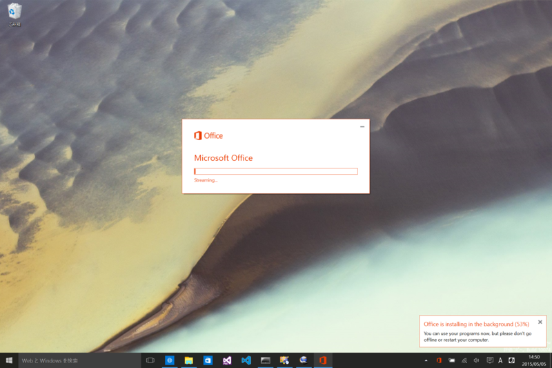
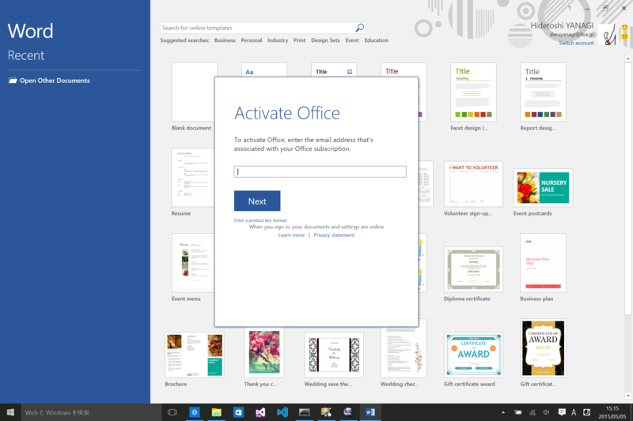
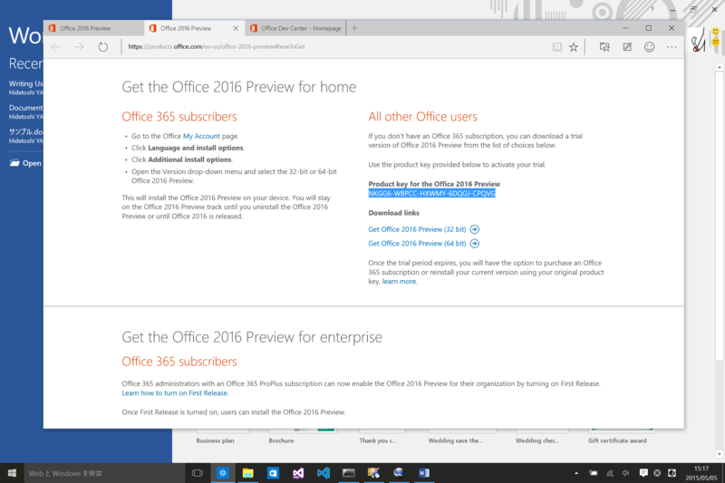
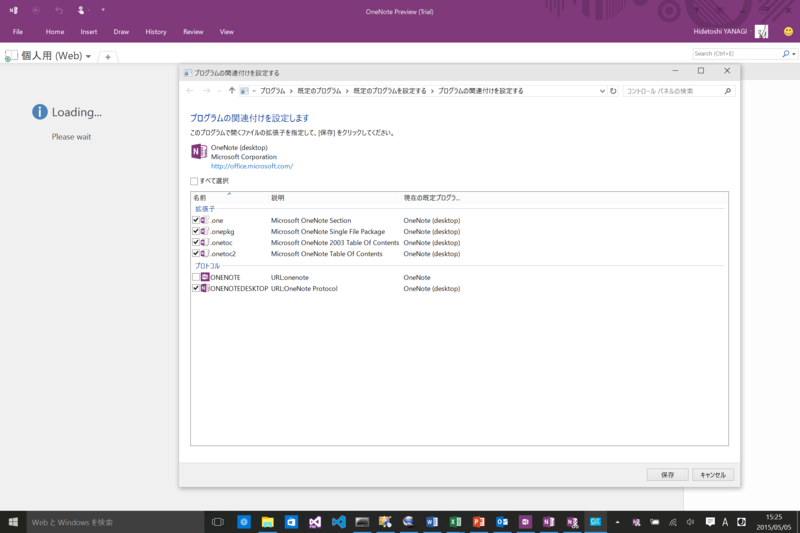
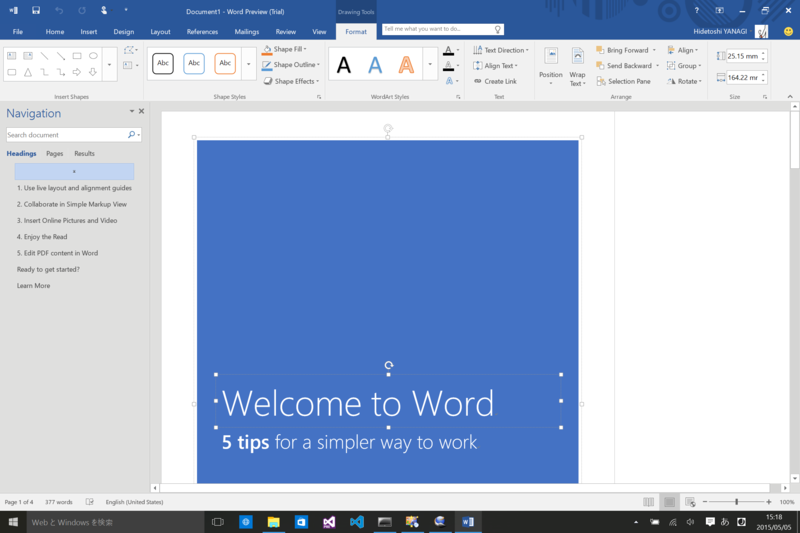
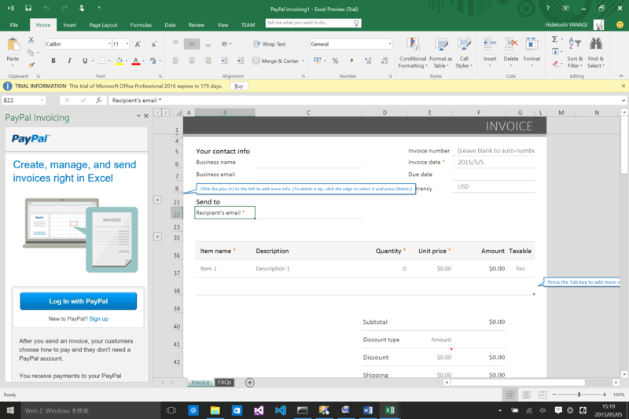
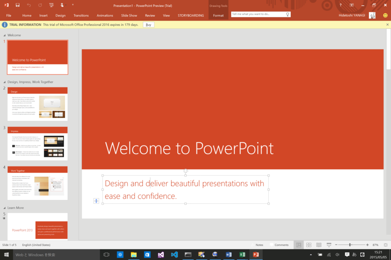
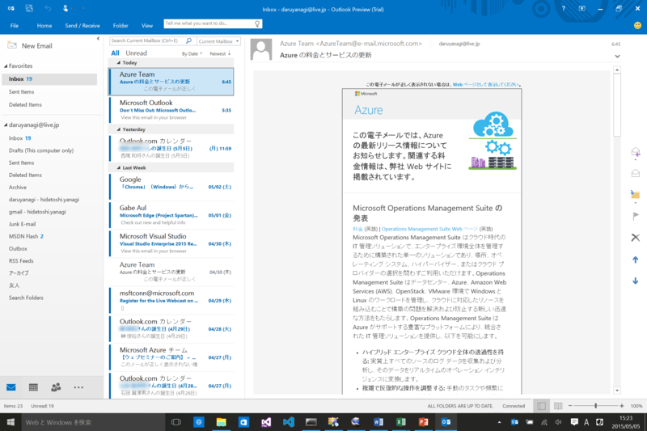
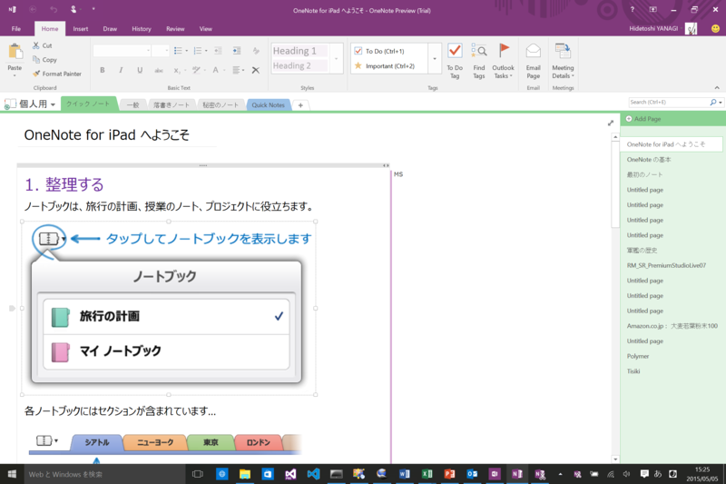

<iframe src="//hatenablog-parts.com/embed?url=http%3A%2F%2Fblogs.office.com%2F2015%2F05%2F04%2Foffice-2016-public-preview-now-available%2F" title="Office 2016 Public Preview now available - Office Blogs" class="embed-card embed-webcard" scrolling="no" frameborder="0" style="display: block; width: 100%; height: 155px; max-width: 500px; margin: 10px 0px;"><a href="http://blogs.office.com/2015/05/04/office-2016-public-preview-now-available/">Office 2016 Public Preview now available - Office Blogs</a></iframe>

これまで IT Pro および開発者向けに限定されていた「Microsoft Office 2016」のプレビューが、下々のものへ拡大されましたので、さっそく Surface Pro 3（Windows 10 Insider Preview）にインストールしてみました。ダウンロードはこちらから。

<ul>
<li><a href="http://products.office.com/en-us/office-2016-preview">Office 2016 Preview</a></li>
</ul>
名前は「Office 2016」だけど、2015年に出るんだね？　そういうものだっけか。注意しなければならないのは、<i>「Office 2013」と共存できない</i>ことです。「Office 2013」を利用している場合は、あらかじめアンインストールしておきましょう。なお、システム要件は Windows 7 以降（Windows 7, Windows 8, Windows Server 2008 R2, or Windows Server 2012）です。Windows 10 Insider Preview は入ってませんが、まぁ、気にしない。

インストールプロセスは、「Office 2013」と同じ感じ（変わるかもしれませんが）。ストリーミングされるので、インストール中でも使えます。

起動するとアクティベート画面が現れ、Microsoft アカウントでのログインを要求されます。しかし、これは無視して［Next］ボタンの下にある［Enter a product key instead］をクリック。

「Office 2016」のダウンロードサイトに書いてあるプロダクトキーを入力しましょう。これで準備は完了。

今回の含まれているのは、

<ul>
<li>Word 2016 Preview</li>
<li>Excel 2016 Preview</li>
<li>PowerPoint 2016 Preview</li>
<li>Outlook 2016 Preview</li>
<li>OneNote 2016 Preview</li>
</ul>
の5つで、英語版のみのようです（サポート言語に日本語は入っていて、日本語入力は可能。言語パックないのかな？）。「OneNote 2016 Preview」は Windows 10 Insider Preview にビルトインされているモノ（Windows ストア アプリ版）とは違う、いわゆるデスクトップ向け。ちょっとややこしいですね。

関連付けできますけど、個人的にはシンプルなビルトイン版の方が好みだったり（まだ日本語に対応していないという弱点はありますが）。

<h3>Word 2016 Preview</h3>

Word、Excel、PowerPoint にコマンド検索機能が付いたみたい。これはちょっと便利かもね。あと、この3つはデータ損失防止（DLP）にも対応しているとのこと。

<h3>Excel 2016 Preview</h3>

ビジネス向けの機能が増えたのかなぁ。

<h3>PowerPoint 2016 Preview</h3>

 

<h3>Outlook 2016 Preview</h3>

多要素認証などに対応。

<h3>OneNote 2016 Preview</h3>

正式リリースは秋になるとのことで、それまで毎月新機能が追加されるらしい。ぼちぼち使っていこうと思う。

