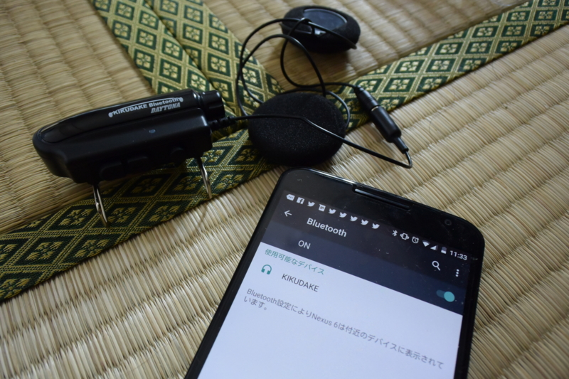
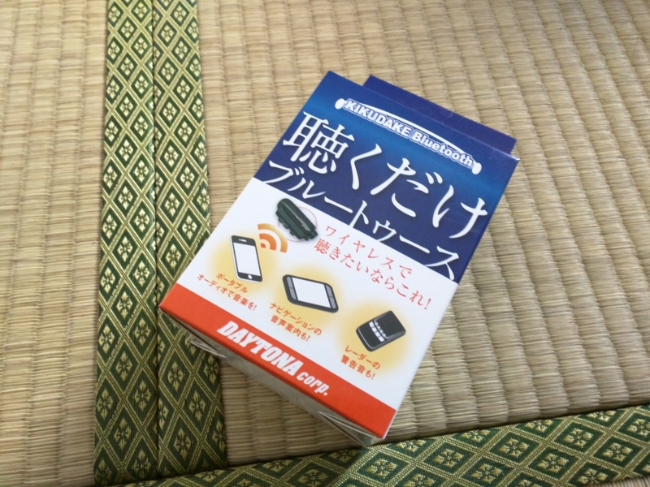
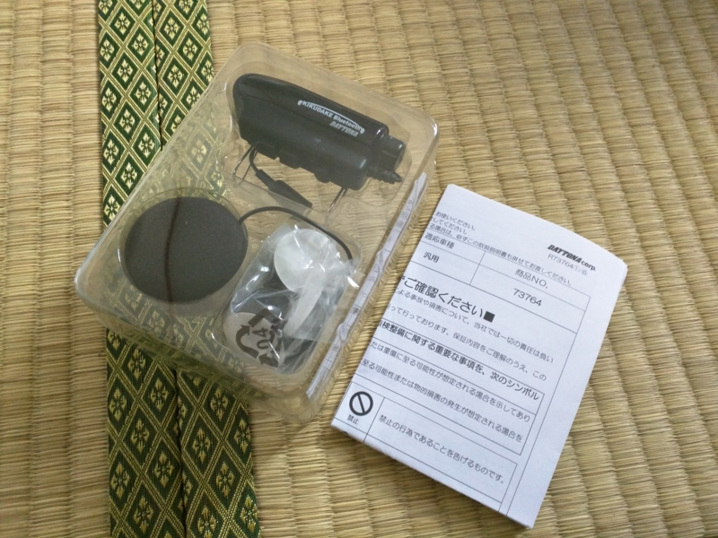
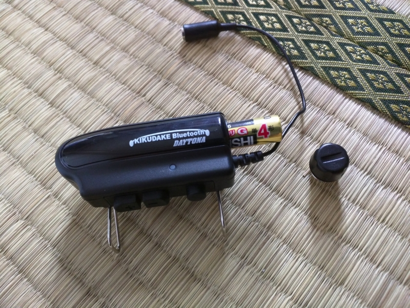
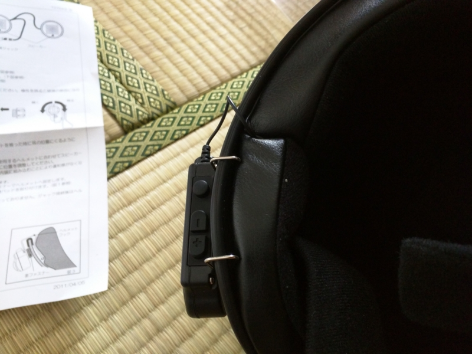

<a href="http://www.amazon.co.jp/exec/obidos/ASIN/B0058FMGLI/bestylesnet-22/">デイトナ(DAYTONA) 聴くだけブルートゥース 73764</a>
<ul><li>出版社/メーカー: デイトナ(DAYTONA)</li><li>発売日: 2012/05/02</li><li>メディア: Automotive</li><li>購入: 1人 クリック: 4回</li><li><a href="http://d.hatena.ne.jp/asin/B0058FMGLI/bestylesnet-22" target="_blank">この商品を含むブログを見る</a></li></ul>

やっぱりバイクにもナビがほしいのだけど、専用機を買ってハンドルに付けるのは金銭的にも心理的にも避けたい。せめてスマートフォンの音声ナビだけでも聞ければいいのになぁ、と思い「デイトナ 聴くだけブルートゥース」を買ってみた。お値段 7,346 円。

<a href="http://www.amazon.co.jp/exec/obidos/ASIN/B005EA4J7Q/bestylesnet-22/">サインハウス(SYGN HOUSE) B+COM MUSIC レシーバー /ブラック 00073012</a>
<ul><li>出版社/メーカー: サインハウス(SygnHouse)</li><li>メディア: Automotive</li><li> クリック: 11回</li><li><a href="http://d.hatena.ne.jp/asin/B005EA4J7Q/bestylesnet-22" target="_blank">この商品を含むブログを見る</a></li></ul>

競合製品としては「サインハウス B+COM MUSIC レシーバー」というのがあるらしい。B+COM ブランドの製品は前にも使ったことがあるが、とくにトラブルもなかった。最初はこちらにしようかとも思っていたのだけど、

<ul>
<li>お値段が 13,931 円と「聴くだけブルートゥース」よりも 5,000 円以上高い</li>
<li>「聴くだけブルートゥース」は乾電池だが、「B+COM MUSIC レシーバー」は充電式</li>
</ul>
ということもあり、さんざん悩んだ末に「聴くだけブルートゥース」をチョイスした。決め手は充電の要らない乾電池式であること。万が一電池が切れてもコンビニで買えるし、日頃はエネループを使えば電池がゴミになることも（ほとんど）ない。内蔵バッテリー方式は、充電忘れや充電切れがめんどくさそうだ。

パッケージはこんな感じ。カラダ全体で“聞くだけやで！　聞くだけやで！”と主張している。しかも「聴く」という漢字を使っているのもニクい。

<blockquote cite="http://dictionary.goo.ne.jp/leaf/jn2/51102/m0u/">

<b>聴く</b>

注意して耳にとめる。耳を傾ける。

<cite><a href="http://dictionary.goo.ne.jp/leaf/jn2/51102/m0u/">&#x304D;&#x304F;&#x3010;&#x805E;&#x304F;&#xFF0F;&#x8074;&#x304F;&#x3011;&#x306E;&#x610F;&#x5473; - &#x56FD;&#x8A9E;&#x8F9E;&#x66F8; - goo&#x8F9E;&#x66F8;</a></cite>
</blockquote>

“聞こえへん？　聞くんとちゃう、聴くんや！　耳を澄ましてへんだら聞こえへんかもしれへんで！”。そんな声が聞こえそうなパッケージ。だんだんちゃんと聞こえるのか心配になってきた。

中身はこんな感じ。本体はコンパクトだけど、ボタンの押し心地はしっかりしていて、タフな感じ。これはあまり壊れなさそうな気がする。ほかにチャチなスピーカーとケーブル、両面ジッパー、スペーサーのスポンジなんかが付属。

本体に電池を挿入。Amazon のレビューには「電池を入れるところのツメが折れて壊れた」といったことが書かれていて若干不安だったが、届いた製品はねじ込み式になっていた。ちゃんと改善されてるっぽい？　ねじ込み式なら水も入りにくいだろうし、ちょっと安心かも。

ヘルメットの耳のくぼみにスピーカーをツッコみ、ケーブルを這わせる。帽体を少し引っぺがし、ケーブルを埋めるようにして取回してみたが、長さはちょうどいい。

Nexus 6 とペアリングを試してみたが、これも難なく成功。メインボタンを6秒ほど押し続けると赤と青のランプが交互につくので、Android 側でペアリングを有効化する。曲のスキップ、音量の調整も試してみたが、大丈夫。音質は、まぁ、スカスカって感じだけど、バイクで聞くのに高音質は求めていないから、これはこれでいい。

あとは実際に外で試してみるだけだが……これから台風が来るらしいのでちょっと先の話になりそう。ちょっと残念かも。

<a href="http://www.amazon.co.jp/exec/obidos/ASIN/B001BWZ5ZQ/bestylesnet-22/">ショウエイ(SHOEI) ヘルメットFREEDOM マットブラック L (59cm)</a>
<ul><li>出版社/メーカー: ショウエイ(SHOEI)</li><li>発売日: 2011/07/14</li><li>メディア: Automotive</li><li><a href="http://d.hatena.ne.jp/asin/B001BWZ5ZQ/bestylesnet-22" target="_blank">この商品を含むブログを見る</a></li></ul>

