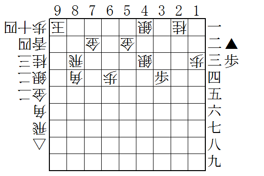
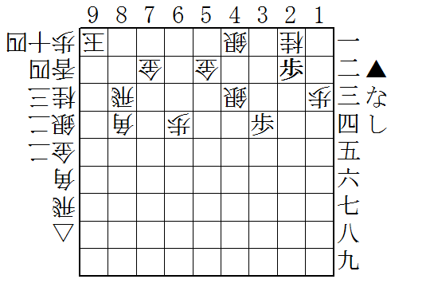
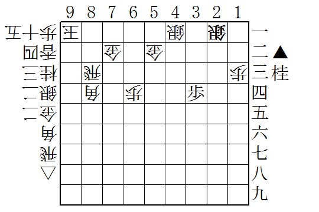
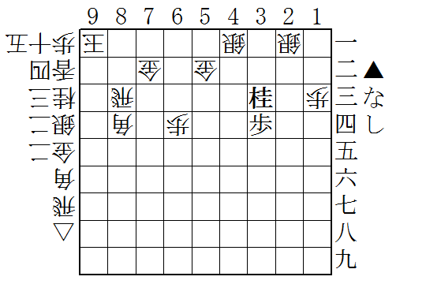
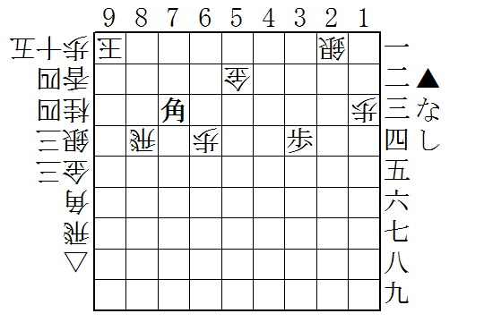

先手の持ち駒はたったの歩1枚だけだが……

まず☗2二歩と桂馬をいただく。次にと金ができるので、後手は☖3二銀と引き、☗2一歩成☖同銀と進む。

もらった桂馬を3三に打ち込んで、今度は銀の両取りがかかった。

そんな感じで、

<blockquote>

☖３二銀 
☗２一桂成 
☖同銀 
☗６一銀打 
☖６二金 
☗５二銀成 
☖同金 
☗７四金打 
☖８一飛 
☗８四金 
☖同飛 
☗７三角打

</blockquote>

と進めていくと――

ぽろぽろと価値の高い駒に変えていけて、最後はみんな大好き、目から火が出る王手飛車！

ちょっと後手の対応がお手伝いな感じだけれど、だいぶ面白かったので紹介してみたかった。

