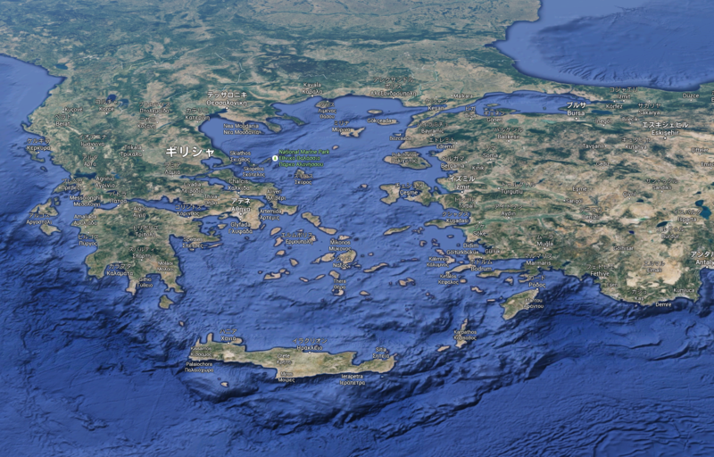
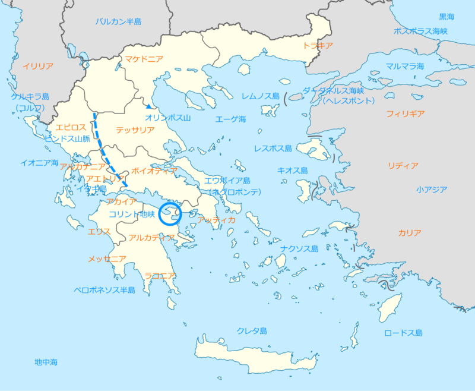
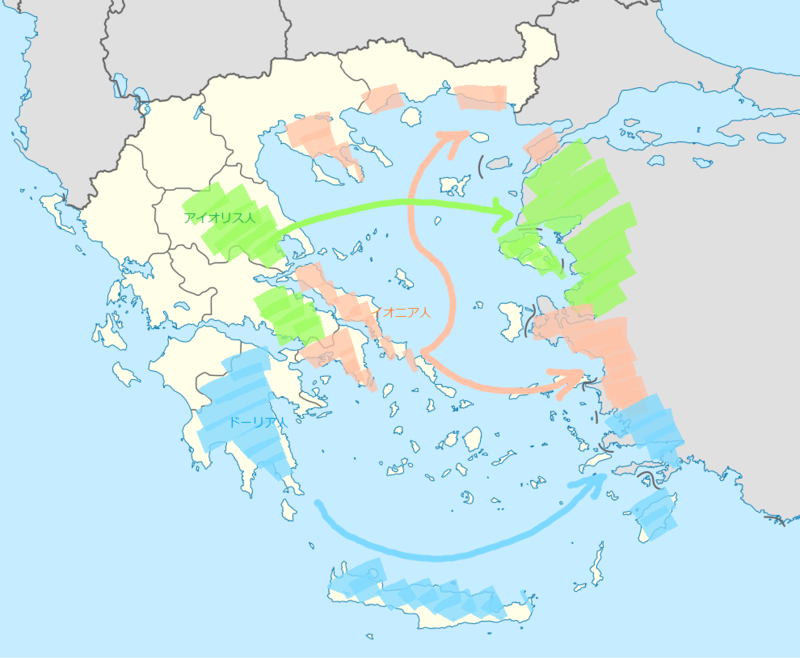

ボイオティアとかエウボイアとか言われてもさっぱりで、本を読み進めるのが苦痛になってきたので、地図を作ってみた。

ギリシアは、大きく分けて4つの部分に分かたれる。

<ul>
<li>ギリシア本土：“ギリシアの背骨”ピンダロス山脈が東西に分かつ
<ul>
<li>ギリシア西部：イオニア海に面する湿潤な地方。キュロス王を輩出したことで有名なエピロス地方などからなる</li>
<li>ギリシア東部：エーゲ海に面する乾燥した地方。テッサリア、ボイオティア（テーバイ）、アッティカ（アテナイ）、エウボイア島（エヴィア島）などに分かれる。</li>
</ul></li>
<li>ペロポネソス半島：コリント地峡を介してギリシア本土と接続。スパルタのあるラコニア地方など</li>
<li>エーゲ海を中心とした島嶼：最大の島は“地中海の空母”クレタ島</li>
</ul>
その外にはオリンポス山を挟んで北にマケドニア、その東にトラキアなどが広がる。そして、ヘレスポント（ダーダネルス海峡）、マルマラ海、ボスポラス海峡を抜けると、黒海に至る。ギリシア世界の北端はこの辺りかな。

エーゲ海の東にはアジア（小アジア半島）が広がる。沿岸部はギリシア人都市が入植しているが（後述）、内陸部はペルシア王に従うサトラップ（知事）たちの治める領域。

あと、コレは世界史で習うヤツだけど、古代ギリシアは三つの部族で構成されていた。

<ul>
<li><b>ドーリア人</b>：紀元前1100年頃ミケーネ文明が衰退するとギリシャに侵入。おもにに<b>ペロポネソス</b>半島に定住した。代表的なポリスは<b>スパルタ</b>。</li>
<li><b>アイオリス人</b>：<b>テッサリア</b>地方と<b>ボイオティア</b>地方に居住。レスボス島やアナトリア半島西部に植民し、12のポリスを建設。代表的なポリスはテーバイ。</li>
<li><b>イオニア人</b>：紀元前2000年ころにバルカン半島を南下し、<b>アッティカ</b>地方に居住。のちに小アジア北西部（イオニア地方）に進出する。代表的なポリスは<b>アテナイ</b>。</li>
</ul>
わしが学生の頃は「ドーリア人がミケーネ文明を破壊した」と習ったのだけど、濡れ衣だったみたいだな。この三つの部族のほかにも、<b>アカイア</b>系の人たちがコリントス湾からピンドス山脈西岸の辺りに住んでいたらしい。

主要なポリスもプロットしてみた。本気でやりだしたらぐちゃぐちゃになるので、だいたい有名どころかなってところだけ。

よし、これで何とかなりそうな気もする。

