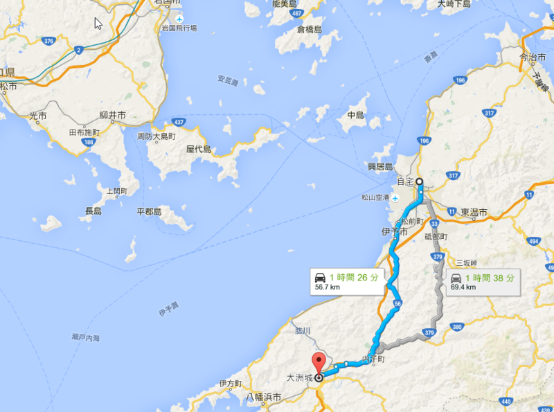
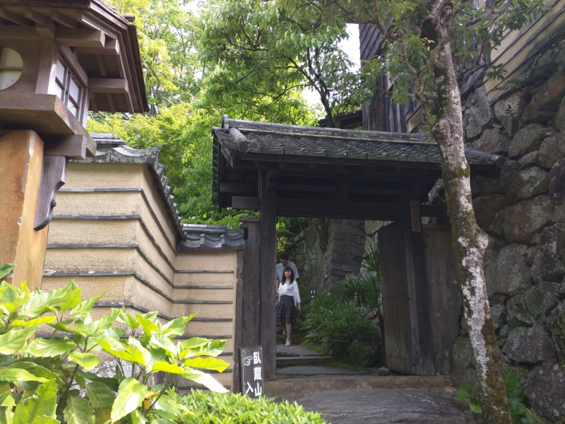
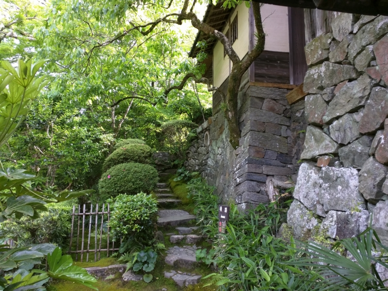
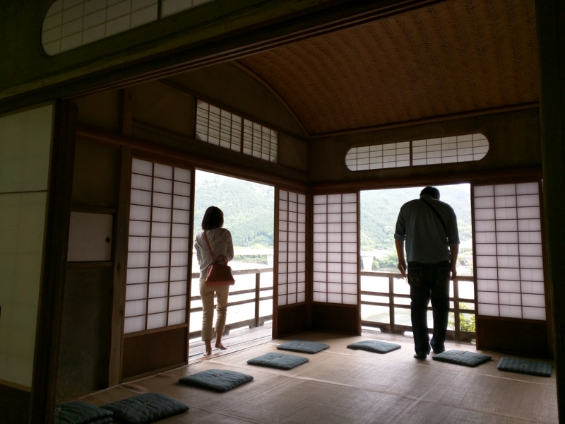
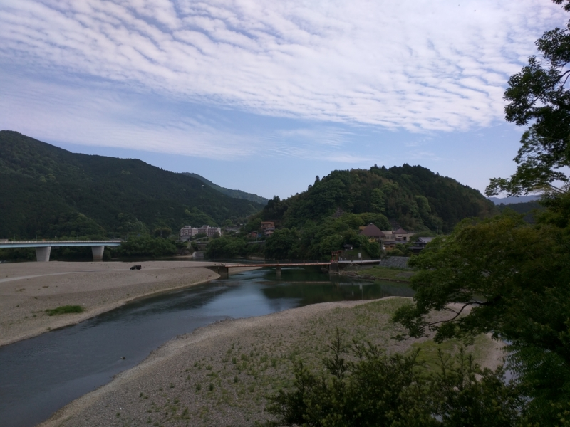
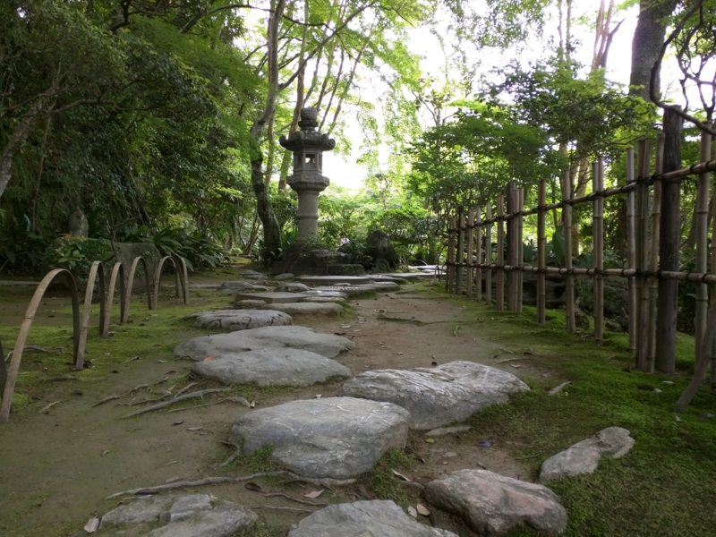
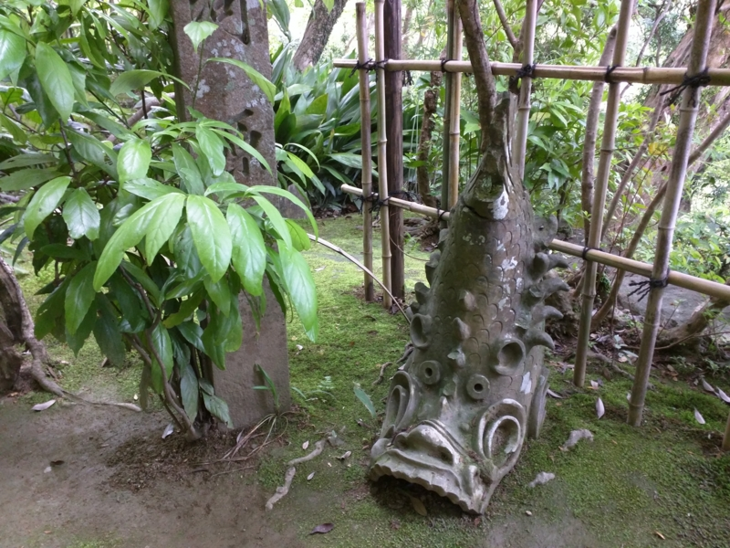
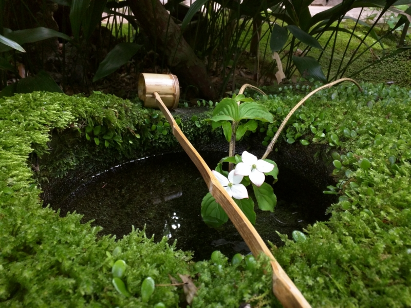

<a href="https://blog.daruyanagi.jp/entry/2015/05/11/171113">&#x30D0;&#x30A4;&#x30AF;&#xFF1A;&#x30C7;&#x30A4;&#x30C8;&#x30CA; &#x8074;&#x304F;&#x3060;&#x3051;&#x30D6;&#x30EB;&#x30FC;&#x30C8;&#x30A5;&#x30FC;&#x30B9;&#x3092;&#x30D8;&#x30EB;&#x30E1;&#x30C3;&#x30C8;&#x306B;&#x4ED8;&#x3051;&#x3066;&#x307F;&#x305F; - &#x3060;&#x308B;&#x308D;&#x3050;</a> を試してみたくてたまらなかったので、日曜日はバイクでお出かけしてみた。行先は……とくに行きたいところもなかったのだけど、行ったことない＆距離的にちょうどいいかなと思い、大洲城にしてみた。11時頃、松山を出発。

前回（<a href="https://blog.daruyanagi.jp/entry/2015/05/13/215021">&#x30D0;&#x30A4;&#x30AF;&#xFF1A;&#x5927;&#x5C71;&#x7947;&#x795E;&#x793E;&#x306B;&#x884C;&#x3063;&#x3066;&#x304D;&#x305F; - &#x3060;&#x308B;&#x308D;&#x3050;</a>）は家の前の通りを北に向かったが、今回は南に向かう。山の緑が気持ちよく、デコボコなのを気にしなければ割と走っていて楽しい道だと思う。ナビもちゃんと動いて、とてもいい感じ。複雑な交差点だとさすがに地図を確認したくなるけれど、音声の案内があるだけでもだいぶ違う。電池の持ちも半日なら問題はないようで、むしろ Android のバッテリーの方が不安だった。

2時前ごろか、大洲に到着。

ごはん屋さんを探してみるが、いい感じのところがない。いちおう観光で食ってるはずなのに、どうしようもないところだなぁ、とため息をつきながら徘徊すること半時、小洒落た茶屋を見つける。

<blockquote class="twitter-tweet" data-lang="ja">
突然おしゃれな茶屋が現れたので滑り込んだ (@ 臥龍茶屋 in 大洲市, 愛媛県) <a href="https://t.co/em2xDnZoo4">https://t.co/em2xDnZoo4</a> <a href="http://t.co/r1wZ5dWuzP">pic.twitter.com/r1wZ5dWuzP</a>
&mdash; だるやなぎ に天使が舞い降りた！ (@daruyanagi) <a href="https://twitter.com/daruyanagi/status/599808077307707392?ref_src=twsrc%5Etfw">2015年5月17日</a></blockquote>

<iframe src="https://hatenablog-parts.com/embed?url=http%3A%2F%2Ftabelog.com%2Fehime%2FA3803%2FA380301%2F38001189%2F" title="臥龍茶屋 (伊予大洲/甘味処)" class="embed-card embed-webcard" scrolling="no" frameborder="0" style="display: block; width: 100%; height: 155px; max-width: 500px; margin: 10px 0px;"></iframe>

軽食もやっているようなので、とりあえず入ってみた。アイスコーヒーをすすりながら、牛丼が出てくるのを待つ。牛丼か……カレーよりはましだけど、茶屋には似つかわしくないメニューだな。

<blockquote class="twitter-tweet" data-lang="ja">
なぜか牛丼あった <a href="http://t.co/UZh2s3xEOm">pic.twitter.com/UZh2s3xEOm</a>
&mdash; だるやなぎ に天使が舞い降りた！ (@daruyanagi) <a href="https://twitter.com/daruyanagi/status/599810112883064833?ref_src=twsrc%5Etfw">2015年5月17日</a></blockquote>

でも、美味しゅうございました。

<blockquote class="twitter-tweet" data-lang="ja">
すいぎんくつ って言うらしい。水を入れると、涼やかな音を奏でる <a href="http://t.co/7BUoszVihy">pic.twitter.com/7BUoszVihy</a>
&mdash; だるやなぎ に天使が舞い降りた！ (@daruyanagi) <a href="https://twitter.com/daruyanagi/status/599818275933925378?ref_src=twsrc%5Etfw">2015年5月17日</a></blockquote>

この臥龍茶屋には水琴窟というのが設けられていて、水をかけると、これがとてもいい音を奏でる。

<blockquote cite="http://ja.wikipedia.org/wiki/%E6%B0%B4%E7%90%B4%E7%AA%9F">

水琴窟（すいきんくつ）は、日本庭園の装飾の一つで、手水鉢の近くの地中に作りだした空洞の中に水滴を落下させ、その際に発せられる音を反響させる仕掛けで、手水鉢の排水を処理する機能をもつ

<cite><a href="http://ja.wikipedia.org/wiki/%E6%B0%B4%E7%90%B4%E7%AA%9F">&#x6C34;&#x7434;&#x7A9F; - Wikipedia</a></cite>
</blockquote>

話には聞いたことがあるが、実際に目にしたのは初めてだ。たまたま居合わせたガキンチョに教えてあげると、覚えたてのサルのように水をかけまくってて、ちょっとおかしかった。

さて、ご飯も食べて落ち着いたし、大洲城に向かうことに……する前に、この近くにある臥龍山荘というのに寄ってみることにする。入館料は大洲城とセットで800円。

 

<blockquote cite="http://www.garyusanso.jp/">

伊予の小京都と言われる大洲、その肱川随一の景勝地「臥龍淵」に臨む別荘です。明治の匠が残した数奇に飛んだ三建築、日本庭園、借景美をお楽しみ下さい。

<cite><a href="http://www.garyusanso.jp/">&#x81E5;&#x9F8D;&#x5C71;&#x8358;&#x516C;&#x5F0F;&#x30B5;&#x30A4;&#x30C8;</a></cite>
</blockquote>

大変雅な建物で、一見の価値がある。なかなか気に入って、のんびりと過ごしてしまった。さっき臥龍茶屋で一緒になったガキンチョとまたここで一緒になり、なんかため口で絡まれたりして、ちょっとやかましい雰囲気だったが気にしない。社会のルールってもんを教えてやろうかと思ったりもしたが、まぁ、そういうところもかわいらしかったので、適当にあしらってやる。ガキンチョにはこの雅はわかるまい。それよか、貴重なコケを踏んづけないかどうかの方が不安だ。

残念ながら写真は禁止されていたのだが、見る角度によって月が満ち欠けして見えるという霞月の間（かげつのま）の仕組みには、なかなか感心させられた。もし万が一お金持ちになったら、こういうお金の使い方をしてみたいものだ。

書くのめんどくさくなったので、今日はここまで。

