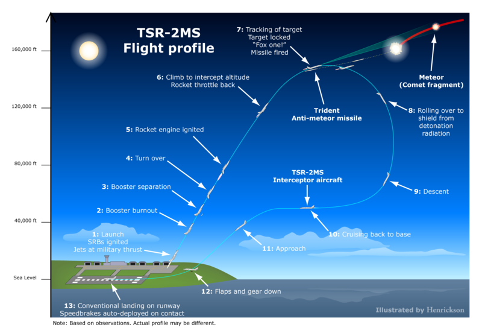
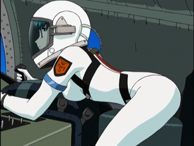
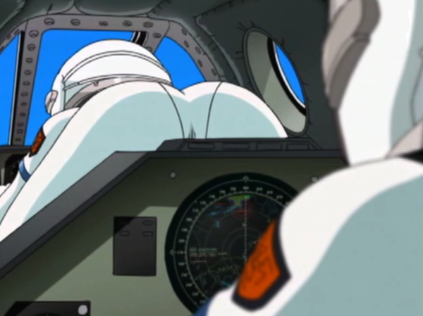

Amazon から1,000円ちょっとお小遣いをもらったので、MP3 ストアというのを徘徊していたのだけど、あんまり気に入った曲がなかった。そこで、何気なく昔好きだった曲を検索したら……

<a href="http://www.amazon.co.jp/exec/obidos/ASIN/B00Y1ZHFM6/bestylesnet-22/">メロディック・スーパー・ハード・キュア</a>
<ul><li>アーティスト: メロキュア</li><li>出版社/メーカー: 日本コロムビア</li><li>発売日: 2015/07/29</li><li>メディア: CD</li><li><a href="http://d.hatena.ne.jp/asin/B00Y1ZHFM6/bestylesnet-22" target="_blank">この商品を含むブログを見る</a></li></ul>

知らないアルバムがある。そこでググってみたところ……

<blockquote cite="http://www.hmv.co.jp/news/article/1505220014/">

「フルーツバスケット」「シスタープリンセス」など数々の楽曲を手掛けた岡崎律子、そして「カードキャプターさくら」主題歌「Catch You Catch Me」で知られる meg rockこと日向めぐみの2人によるボーカルユニット「メロキュア」。2004年5月に岡崎律子が急逝、二人の活動は惜しくも途絶えてしまいましたが、アニソンファンの間で不朽の名曲として語り継がれる「Agape」をはじめとする数々の名曲を持つユニットです。今作はメロキュアが発表したアルバム「メロディック・ハード・キュア」に加え、アルバム未収録曲「ホーム＆アウェイ」や日向めぐみ名義による楽曲などこれまでのメロキュアの全て、そして新たな世界が詰め込まれた2枚組となっております。

<cite><a href="http://www.hmv.co.jp/news/article/1505220014/">&#x300C;2015 &#x590F; &#x3069;&#x3053;&#x306B;&#x3044;&#x305F;&#x3063;&#x3066;&#x805E;&#x3053;&#x3048;&#x308B;&#x300D; &#x30E1;&#x30ED;&#x30AD;&#x30E5;&#x30A2; &quot;&#x30E1;&#x30ED;&#x30C7;&#x30A3;&#x30C3;&#x30AF;&#x30FB;&#x30CF;&#x30FC;&#x30C9;&#x30FB;&#x30AD;&#x30E5;&#x30A2;&quot;&#x30D7;&#x30EC;&#x30DF;&#x30A2;&#x30E0;&#x30FB;&#x30A8;&#x30C7;&#x30A3;&#x30B7;&#x30E7;&#x30F3;&#x767A;&#x58F2;&#x6C7A;&#x5B9A;&#xFF01;&#xFF5C;HMV ONLINE</a></cite>
</blockquote>

リリース日付は、奇しくも今日だった。これはもう予約不可避だな。しかし、もう亡くなって10年以上になるのか……。時が経つの本当に早い。もう新しいアルバムが出ることなんかあるまいって思っていたから、うれしい。

<a href="http://www.amazon.co.jp/exec/obidos/ASIN/B003E110DS/bestylesnet-22/">EMOTION the Best ストラトス・フォー TV-BOX [DVD]</a>
<ul><li>出版社/メーカー: バンダイビジュアル</li><li>発売日: 2010/08/27</li><li>メディア: DVD</li><li>購入: 1人 クリック: 17回</li><li><a href="http://d.hatena.ne.jp/asin/B003E110DS/bestylesnet-22" target="_blank">この商品を含むブログ (9件) を見る</a></li></ul>

<a href="http://www.amazon.co.jp/exec/obidos/ASIN/B003E110E2/bestylesnet-22/">EMOTION the Best ストラトス・フォー OVA-BOX [DVD]</a>
<ul><li>出版社/メーカー: バンダイビジュアル</li><li>発売日: 2010/08/27</li><li>メディア: DVD</li><li>購入: 2人 クリック: 20回</li><li><a href="http://d.hatena.ne.jp/asin/B003E110E2/bestylesnet-22" target="_blank">この商品を含むブログ (5件) を見る</a></li></ul>

自分はメロキュアを『ストラトス・フォー』で知った。これは美少女＆ミリタリーという、今となっては割とありふれた感じのアニメだったが、飛来する隕石を「コメットブラスター」が宇宙空間で破砕し、残りの大きな塊を戦闘機で地上から迎撃した「メテオスイーパー」が潰すという割と熱いアニメだった。反応も上々だったようで、TV シリーズの13話のあとに OVA が作られている。

ヒロインたちは下地島基地に所属する「メテオスイーパー」の見習いで、憧れの「コメットブラスター」になることを夢見て日々訓練と任務に明け暮れる……という設定。

「超高高度迎撃」という言葉だけでも中二心掻き立てるのに、妙に設定にこっているところがあって、乗ってる戦闘機も BAC TSR-2 や MiG-31 の改造機だったり。大気圏内は手描きで、宇宙空間はCGで描かれているというのにもコダワリが感じられる。

　

しかも、若い女の子がこんな感じで載るんですぜ？　しかも複座で。パンチラなんかよりも大変よろしい。

――というわけで、けっして A 級のアニメとは言えないかもしれないけれど、個人的には音楽も相まって、なかなか印象に残るアニメだった（最後、チューで感染するなぞの宇宙生命なんちゃらの話になるのがちょっと笑えるけどｗ）。『1st Priority』をはじめとする劇中歌は今でもたまに聞く。

残念ながらメロキュアが曲を提供していたという『円盤皇女ワるきゅーレ』という作品はまだ見たことがないのだけど、そっちから入ってきた人は『Agape』を推す声が強い。これもなかなかいい曲だと思う。

ヘッドフォンで聞くと耳が蕩けそうになるやで！

