
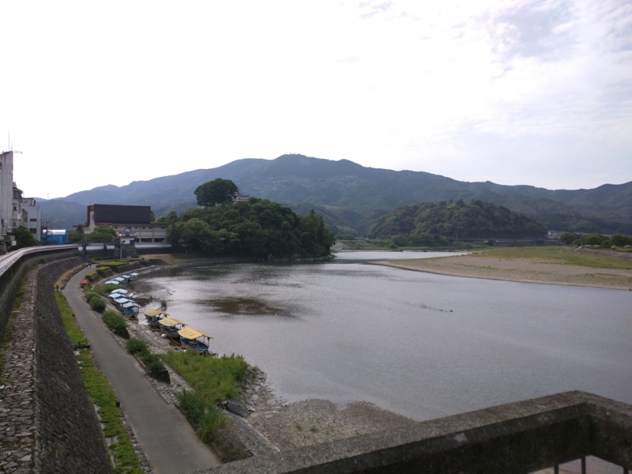

<a href="https://blog.daruyanagi.jp/entry/2015/05/21/000339">&#x30D0;&#x30A4;&#x30AF;&#xFF1A;&#x5929;&#x6C17;&#x304C;&#x3088;&#x304B;&#x3063;&#x305F;&#x306E;&#x3067;&#x5927;&#x6D32;&#x57CE;&#x306B;&#x51FA;&#x304B;&#x3051;&#x305F;&#x3089;&#x306A;&#x305C;&#x304B;&#x65D7;&#x632F;&#x308A;&#x3055;&#x305B;&#x3089;&#x308C;&#x3066;&#x305F;&#x4EF6;&#x306B;&#x3064;&#x3044;&#x3066;&#xFF08;&#x524D;&#x7BC7;&#xFF09; - &#x3060;&#x308B;&#x308D;&#x3050;</a> の続き。臥龍山荘で大洲城との共通入館券（800円）を買ったとこと、「（大須城は）4時半で札止めですが、大丈夫ですか？」と聞かれる。臥龍山荘に入ったのが3時過ぎ。以外にのんびりしすぎたので、臥龍山荘を出たのはすでに3時半をだいぶ過ぎていた。ちょっとヤバいかもしれない。ちょっと歩みを早める。

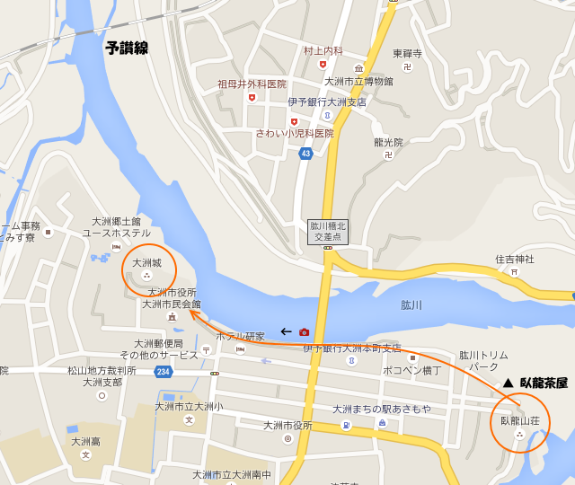

肱川沿いをテクテクと歩くこと15分ぐらいかな。川に突き出た森に隠れるようにした天守閣が見える。肱川（ひじかわ）というのは変わった名前だが、これは川に面した高石垣の工事が難航した際に“おひじ”という名前の女性を人柱にしたのが由来であるという。工事が難しいならあきらめろや、というのは現代の価値観なので言わないにしても、死に際して川に自分の名前を付けてくれと頼むというのは切ない話だ。死ぬのは仕方ないにしても、それは忘れないでほしいということなのだろう。

<blockquote class="twitter-tweet" data-lang="ja">
強そう <a href="http://t.co/bMhlIwdutK">pic.twitter.com/bMhlIwdutK</a>
&mdash; だるやなぎ に天使が舞い降りた！ (@daruyanagi) <a href="https://twitter.com/daruyanagi/status/599827432913305600?ref_src=twsrc%5Etfw">2015年5月17日</a></blockquote>

途中、「神伝流発祥の地」という碑が立っている。てっきり剣術の一派かと思ったが、どうやらあとで調べると水泳の流儀らしい。

<blockquote cite="https://www.city.ozu.ehime.jp/site/bunkazai/0203.html">

　神伝流泳法は、元和3年（1617）頃、米子藩から大洲藩の藩主となった加藤貞泰の従兄弟にあたる重臣加藤主馬光尚（1617～20在藩）によって肱川で創始された泳法と伝えられ、「神伝主馬流」と称されてきた。 
古式泳法は、武術の一つの水練術として発展してきたもので、現在、全国に12の古式泳法が伝承されている。

　大洲神伝流は、390余年の長い歴史を持ち、県内に伝承される唯一の古式泳法であり、大洲から松山へ、その後、岡山・広島・兵庫・東京等最も広く普及した泳法である。

<cite><a href="https://www.city.ozu.ehime.jp/site/bunkazai/0203.html">&#x5927;&#x6D32;&#x795E;&#x4F1D;&#x6D41; &#x6CF3;&#x6CD5; - &#x5927;&#x6D32;&#x5E02;&#x30DB;&#x30FC;&#x30E0;&#x30DA;&#x30FC;&#x30B8;</a></cite>
</blockquote>

<iframe width="480" height="270" src="https://www.youtube.com/embed/RSEdAhTc2gM?feature=oembed" frameborder="0" allow="accelerometer; autoplay; encrypted-media; gyroscope; picture-in-picture" allowfullscreen></iframe>

甲冑をつけて泳ぐことも考えられている、持久重視の泳法らしい。泳ぎは割と得意なので、今度伝授されてみるかな。

さらにいくと、「おわた櫓」が見える。二の丸東端を抑える急所で、ここが大洲城のアキレス腱って感じ。

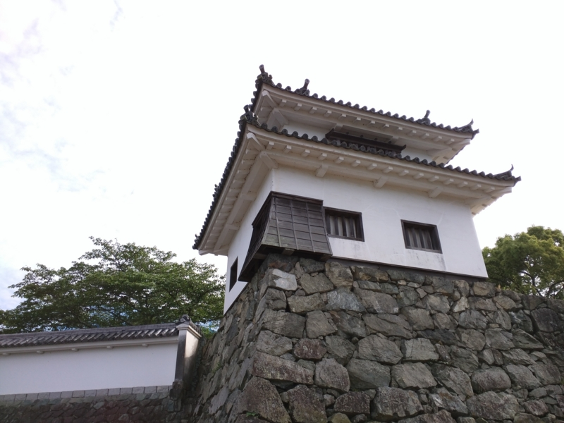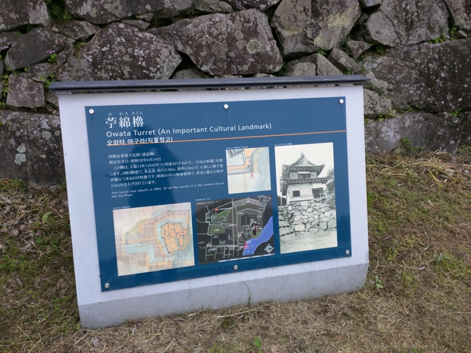

そこからテケテケと上り坂をあがる。息が切れて死にそう。膝に手をつきながらも、我慢強くのぼっていくと（単に運動不足なだけ）、開けたところにでる。これが本丸かな。

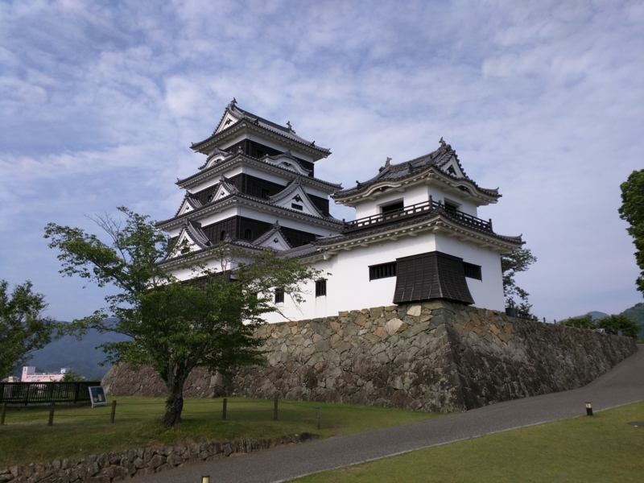

こじんまりとはしているが、近世のとれた天守閣。残念ながら平成になって再現したものだけれど、当時の技術をなるべく使って建設されている本格派。鉄筋コンクリート造りとはひと味違うんだぜー。

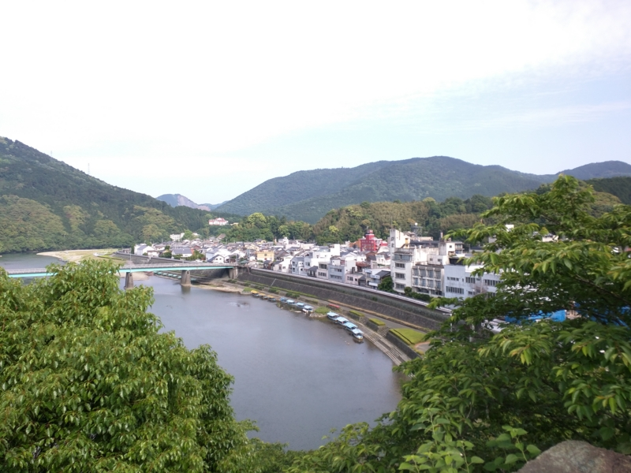

本丸広場から、歩いてきた道を眺める（船が切れたあたり、葉に隠れた広場が「神伝流発祥の地」の碑があるところ）。上ってきた甲斐があった。

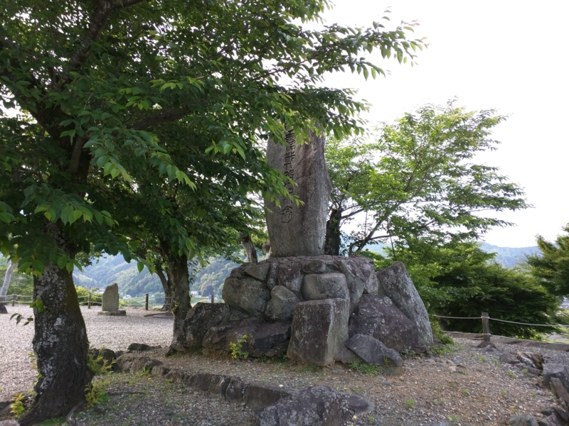

広場には日露戦争の戦没者を慰霊する碑が、木の葉に隠れるように立っている。明治42年建立とのことで、大きく「希典書」と書かれている。第3軍を率いた乃木希典のことだろうか。そのほかにも、武成隊の碑が残っている。武成隊とは、伊予大洲藩の最後（第13代）の藩主・加藤泰秋が作り上げた軍隊。大洲藩は勤王藩として有名で、泰秋は藩政改革により財政を再建するとともに、軍備の増強に努めた。小藩ながら鳥羽伏見や甲州、奥羽での戦いにも参加し、存在感を示したという。廃藩置県で免官したのちは子爵に任じられ、貴族院議員・大正天皇の侍従などを務めた。

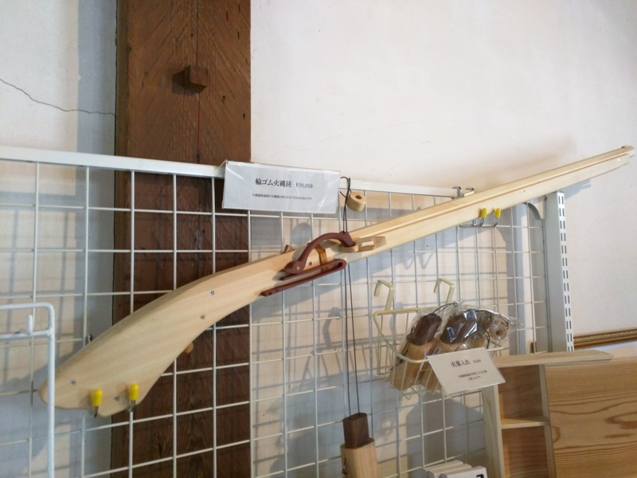

ほしい（真面目

天守閣のなかは新しく、まだ木の匂いがしそう。ただ、階段は急で、お婆さんが上り下りする姿は大変そうだった。落ちないように声をかけると、案外元気そうな声で答えていたから、運動不足ですっかり虚弱体質になっている僕よりは大丈夫かもしれんけど。

<blockquote class="twitter-tweet" data-lang="ja">
やっべ、気をつけないと <a href="http://t.co/yB42FWWORS">pic.twitter.com/yB42FWWORS</a>
&mdash; だるやなぎ に天使が舞い降りた！ (@daruyanagi) <a href="https://twitter.com/daruyanagi/status/599835130409013248?ref_src=twsrc%5Etfw">2015年5月17日</a></blockquote>

<blockquote class="twitter-tweet" data-lang="ja">
誰もこねえし、ここで寝てもいいな <a href="http://t.co/cKZOkcwEue">pic.twitter.com/cKZOkcwEue</a>
&mdash; だるやなぎ に天使が舞い降りた！ (@daruyanagi) <a href="https://twitter.com/daruyanagi/status/599834054649741312?ref_src=twsrc%5Etfw">2015年5月17日</a></blockquote>

天守からの眺めも素晴らしい。

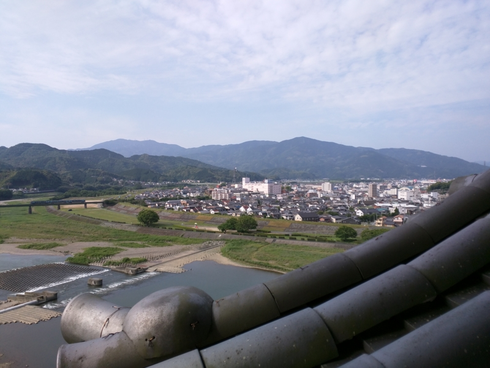

遠くに小さく、予讃線の特急が走っている。きっと宇和島に行くときに乗った「宇和海」だろう（<a href="https://blog.daruyanagi.jp/entry/2014/05/10/200224">GW: &#x3076;&#x3089;&#x308A;&#x3068;&#x5B87;&#x548C;&#x5CF6;&#x884C;&#x3063;&#x3066;&#x304D;&#x305F;&#x3063;&#x305F;&#x3002; - &#x3060;&#x308B;&#x308D;&#x3050;</a>）。新しいヒノキの香りと、柔らかく吹き込んでくる風、穏やかな天気。すっかり歩く気力をなくし、誰も高ないのをいいことに、しばらくここでグテッと寝転んでいた。

すると、そこへ“城内”アナウンスが。

4時半に JR 四国が走らせている観光列車「<a href="http://www.iyonadamonogatari.com/timetable/index.html">&#x4F0A;&#x4E88;&#x7058;&#x3082;&#x306E;&#x304C;&#x305F;&#x308A;</a>」が通るので、旗を振るのを手伝えという。仕方ないのでムクリと起き、広場へ向かう。

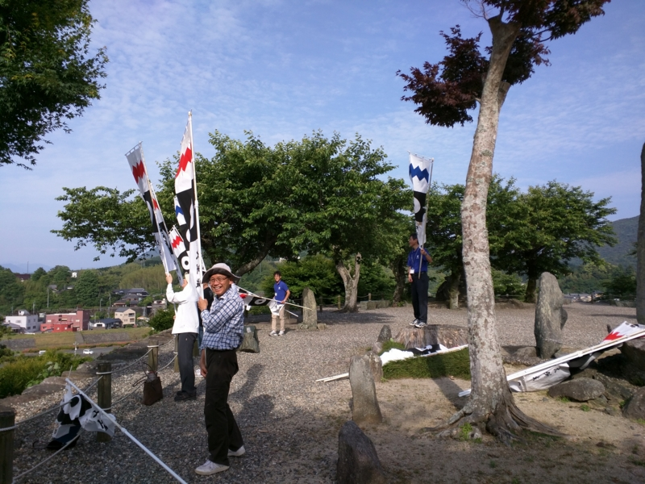

すると7、8人ほどがすでに集まっている。さっき言葉を交わしたお婆さんまでどこからともなく現れ、元気に旗を振る練習をしている。

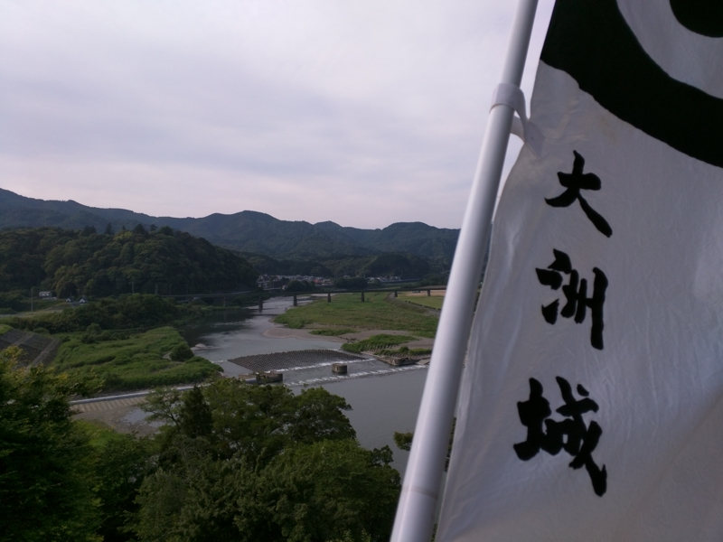

しょうがないので自分も頑張った（ツンデレ）。「伊予灘ものがたり」が橋梁に差し掛かると、「みぎ～、ひだり～」と号令がかかる。

最初はほんの10秒程度旗を振れば終わりだろうとタカをくくっていたが、なんと「伊予灘ものがたり」め、速度を落として、橋の上をちんたら走り始めやがる。20秒、30秒と時を刻むにつれ、だんだん腕がつかれてくる。あぁ、まんまと JR 四国のためにタダで労働力を提供する羽目に陥ってしまった。心のなかにじわじわと後悔の念が広がっていく。

でも、旗振りが終わると、なんか役目を果たしたみたいな、不思議な充実感がでてくる。みんなも同じようで、和気藹々な雰囲気になり、旗を構えて写真を撮ったりしていた。まぁ、これはこれで楽しかったかもしれぬと思いなおす。今度は旗を振ってもらう立場になりたいものだ。

その時の写真は、大洲城のホームページに掲載されているという。暇な人はわしを探してみてネ。

<ul>
<li><a href="http://www.ozucastle.jp/hatafuri.html">http://www.ozucastle.jp/hatafuri.html</a></li>
</ul>
この旗振りに参加してみたい人は、休みの日に「伊予灘ものがたり」が通る時間を見計らって大洲城に行ってみるといいかもしれない。

<h4>おまけ</h4>

<blockquote class="twitter-tweet" data-lang="ja">
おみやげ <a href="http://t.co/ZwATQIER3z">pic.twitter.com/ZwATQIER3z</a>
&mdash; だるやなぎ に天使が舞い降りた！ (@daruyanagi) <a href="https://twitter.com/daruyanagi/status/599842374202761216?ref_src=twsrc%5Etfw">2015年5月17日</a></blockquote>

今治タオルと本屋では売っていないという本を一冊。日本100名城を制覇するかな？

