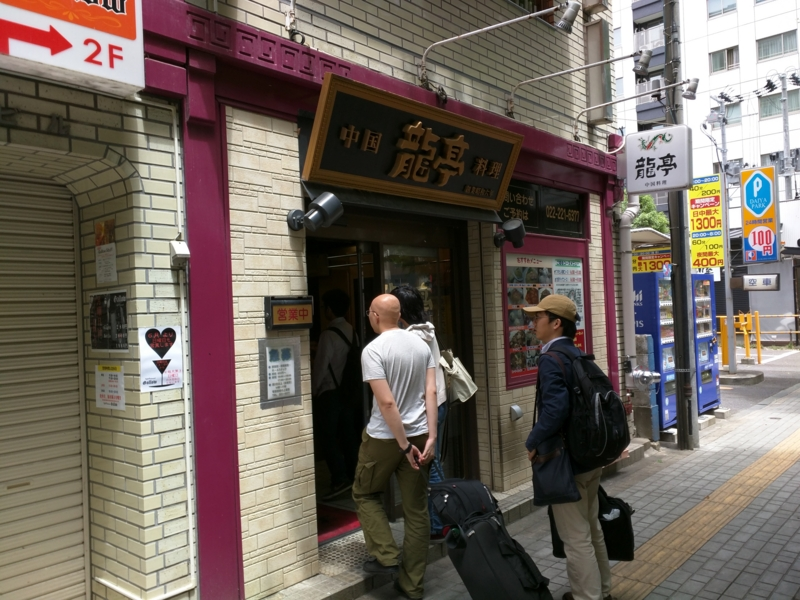
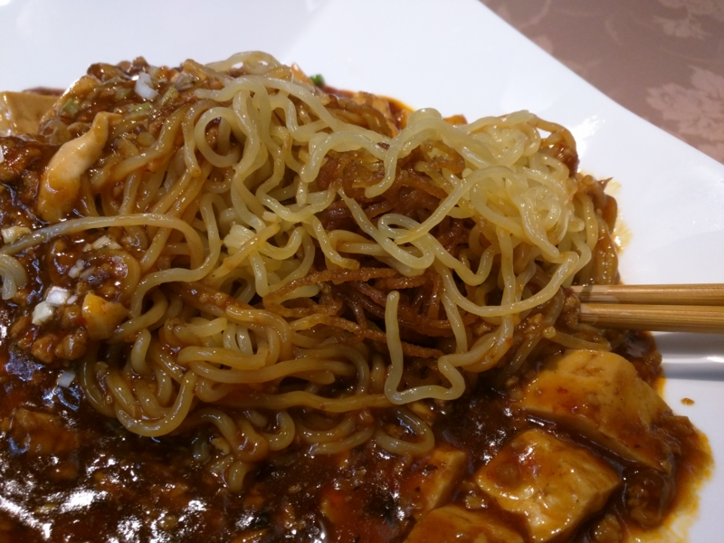
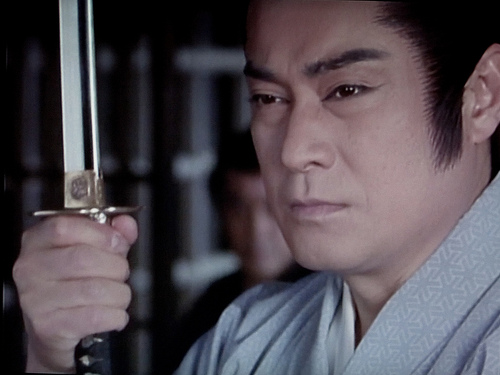

仙台プロ生の帰りに食べてきた。

<iframe src="https://hatenablog-parts.com/embed?url=https%3A%2F%2Fblog.daruyanagi.jp%2Fentry%2F2015%2F06%2F10%2F165900" title="サトヤ+プロ生勉強会＠マイクロソフト東北支店 に参加してきたった #satoya #pronama - だるろぐ" class="embed-card embed-blogcard" scrolling="no" frameborder="0" style="display: block; width: 100%; height: 190px; max-width: 500px; margin: 10px 0px;"></iframe>

こんなことをいうと ぼんぷろおじさん（@bonprosoft） が泣いちゃうので黙っていたが、実を言うとこっちがメインで、仙台プロ生はオマケだったのである（ぁ

マーボー焼きそば誕生の謎については、この記事に詳しい。

<iframe src="https://hatenablog-parts.com/embed?url=http%3A%2F%2Fnews.mynavi.jp%2Farticles%2F2014%2F06%2F28%2Fmapo%2F" title="&quot;嘘から出たまこと&quot;で誕生した宮城県の「仙台マーボー焼そば」って?" class="embed-card embed-webcard" scrolling="no" frameborder="0" style="display: block; width: 100%; height: 155px; max-width: 500px; margin: 10px 0px;"></iframe>

大雑把にまとめると、とある仙台の中華屋のおっさんが<i>「宮城県民がこよなく愛するマーボー焼そば、仙台市民はみんな食べている」</i>などとテレビでウソの供述。しかし、バカな視聴者がそれを真に受け、仙台の中華料理屋で<i>「マーボー焼そばをください（＾ｖ＾）」</i>と注文するヤツが増え、対応に苦慮した中華料理屋組合が何をとちぐるったのか<i>「いっそのことマーボー焼そばを仙台のソウルフードということにしちゃおうヽ(^o^)丿」</i>と言うことになったらしい。それでええんかって感じだけど、仙台といえばズンダと牛タン以外に食うものがなかったのも事実で（※そんなことはないです）、新しい名物の登場は、それはそれでうれしい。

本当は「竹竹」という店が有名らしいのだけど、日曜日はお休みらしいので、代わりに「龍亭」という店にお邪魔した。

このブログを書くときに知ったのだけど、実はこの店、冷やし中華発祥の店らしい。

<blockquote cite="http://ryu-tei.jp/">

　涼拌麺(リャンバンメン)、今から七十年以上も前、初めて世に出た冷やし中華はこう名付けられました。

　当店「龍亭」の創業者四倉義雄の資料によると「昭和十二年、全国の業界に先駆けて、涼拌麺を開発し…」という記録が残されております。

<cite><a href="http://ryu-tei.jp/">http://ryu-tei.jp/</a></cite>
</blockquote>

ミスったぜ。<i>マーボー焼きそばなんか食ってる場合じゃなかった／(＾o＾)＼</i>ってか、冷やし中華って仙台発祥だったんだ……？　全然知らなかったよ。

で、肝心のマーボー焼きそばのお味だが……うーん？　一言でいえば<i>「ご飯は偉大だな」</i>けっして不味くはない、というかこの店の麻婆豆腐はかなり自分の好みに近い。ちょっと辛いけど、近所にあれば1カ月に1回は食いたいぐらいに美味しい。しかし、だ。なんで焼きそばにのせた！　微妙に食べづらいし、ごはんにのせた方がウマいだろ。目を覚ませ、仙台民！！

――とはいえ、別にゲテモノってわけじゃない。仙台を訪れたら、一度ぐらいは食ってみてもいいと思う。

次行くときは、ぜひ冷やし中華の方を食べてみたい――そう思う吉宗であった。

