

<a href="http://www.amazon.co.jp/exec/obidos/ASIN/4063879135/bestylesnet-22/">ヒストリエ(9) (アフタヌーンKC)</a>
<ul><li>作者: 岩明均</li><li>出版社/メーカー: 講談社</li><li>発売日: 2015/05/22</li><li>メディア: コミック</li><li><a href="http://d.hatena.ne.jp/asin/4063879135/bestylesnet-22" target="_blank">この商品を含むブログ (16件) を見る</a></li></ul>

<blockquote cite="https://ja.wikipedia.org/wiki/%E3%82%A2%E3%83%83%E3%82%BF%E3%83%AD%E3%82%B9_(%E5%B0%86%E8%BB%8D)">

アッタロス（ギリシャ語 Άτταλος、英語 Attalus、紀元前390年 - 紀元前336年）は、古代マケドニア王ピリッポス2世に仕えたマケドニアの貴族・将軍で、ピリッポス2世の7番目の妻クレオパトラ・エウリュディケの叔父である。

<cite><a href="https://ja.wikipedia.org/wiki/%E3%82%A2%E3%83%83%E3%82%BF%E3%83%AD%E3%82%B9_(%E5%B0%86%E8%BB%8D)">&#x30A2;&#x30C3;&#x30BF;&#x30ED;&#x30B9; (&#x5C06;&#x8ECD;) - Wikipedia</a></cite>
</blockquote>

アッタロスさんって、登場したときはどうしようもないおっさんって感じのイメージだったじゃないですか。

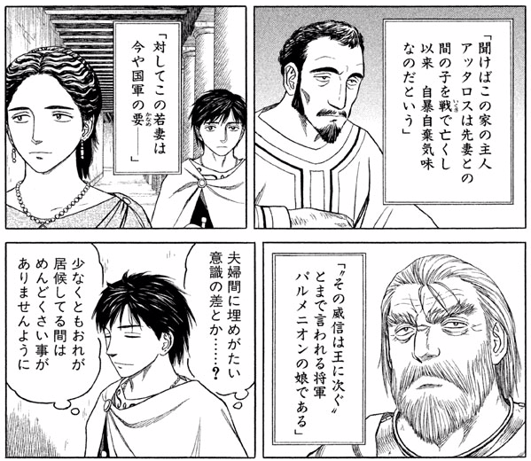

本作ではパルメニオンの妻をめとっているという設定（史実でどうだかは知らない）のマケドニア貴族だが――

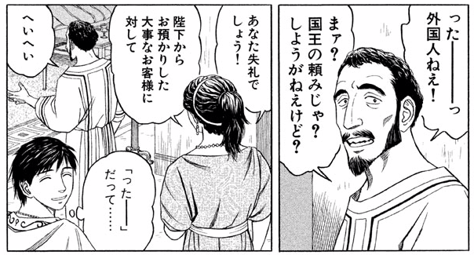

礼儀があんまりなってなくて――

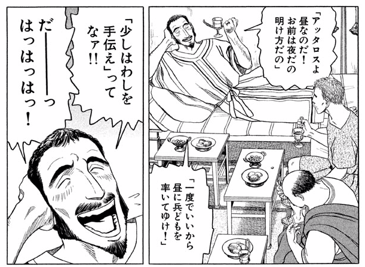

わりと自己中心的なおっさんとして描かれている。

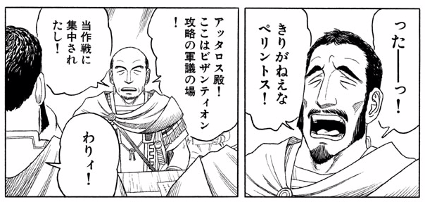

態度が悪すぎて、軍議でも怒られちゃったりする（それにしても「わりィ！」には笑える）。パルメニオン将軍の一族なのに……。

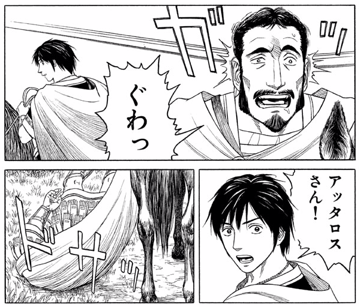

一方、肝心の戦でもイマイチで、頭に投石の直撃を食らって馬から垂直落下をかましたり。まぁ、気絶したら受け身なんかとれないのだと思うけど、それにしてもカッコワルい。石でぶつけて、地面にぶつけて、頭大丈夫なんだろうか。

でも、この巻では<s>頭を打ったせいか</s>メキメキとカッコよくなってきてる。

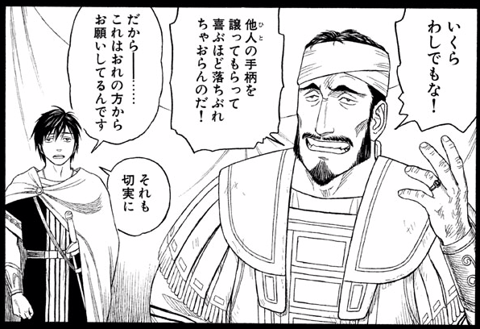

まず、エウメネスに功績を譲られても、決して受け取ろうとしないアッタロスさん。贈り物を絶対受け取らないフォーキオンみたいでカッコイイ。

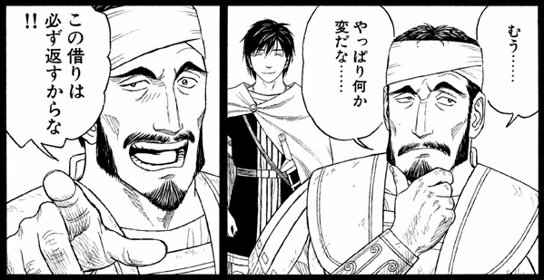

そして、「借りは必ず返す」という案外律儀な面もみせる（アッタロスさんに変な奴扱いされたエウメネス涙目）。エウメネスが開発した“将棋”では王から王子への“譲位”に躊躇する様子を見せるなど、保守的な面も覗かせていたが、礼儀がなっていないように見えてちゃんと守るべき義理は心得ているようだ。

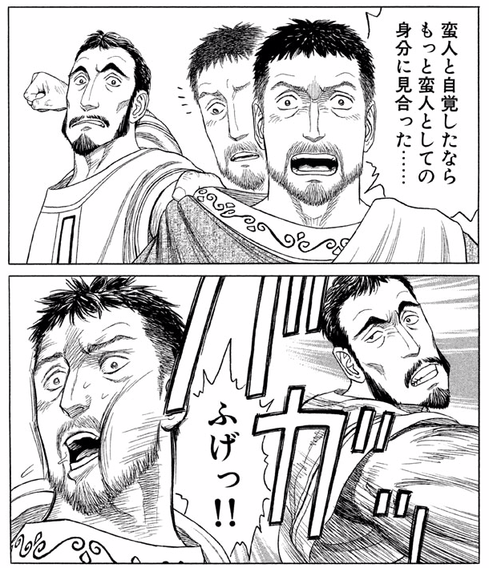

そして、エウメネスを蛮族扱いするヘカタイオスには正義の鉄槌！

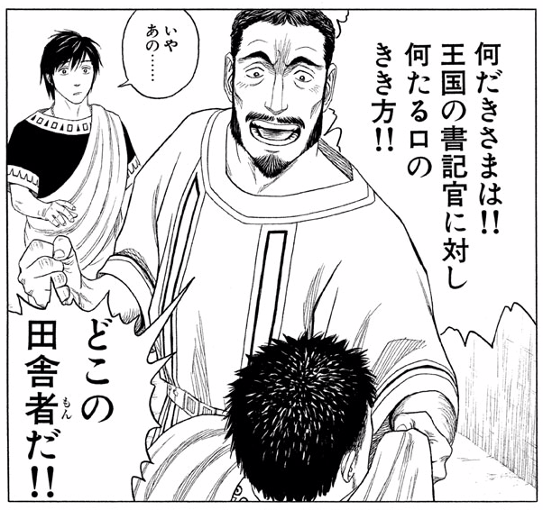

めっちゃカッコイイ。マケドニアだって割と田舎なのに、それをナチュラルに棚にあげちゃうところが、腐っても貴族な感じでカッコイイ。

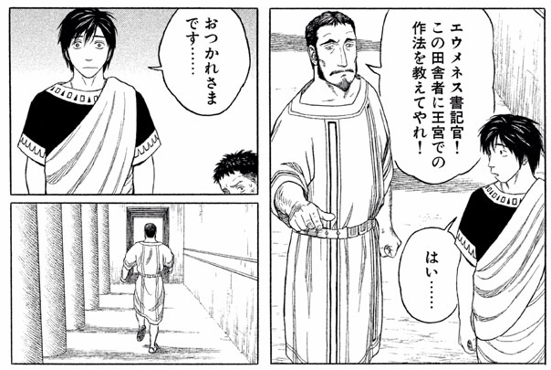

捨て台詞もカッコイイ。エウメネスがキョトンとしてしまうぐらいカッコイイ。どうもこのおっさん、身内はとことん大事にするタイプのようだ。どう考えても“ミエザの学園”組の若い貴族より使えるようには見えないが、古きよきマケドニア貴族って感じ（？）がよい。

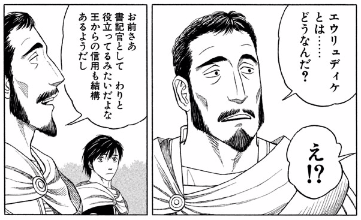

そんなアッタロスさんだが、最近はお気に入りの姪っ子・エウリュディケをエウメネスとくっ付けようと画策しているらしい。まぁ、本人たちもチューとかしてるし、そのうち勝手に引っ付きそうなんだけど……ひとつ気になることがある。

<blockquote cite="https://ja.wikipedia.org/wiki/%E3%82%AF%E3%83%AC%E3%82%AA%E3%83%91%E3%83%88%E3%83%A9%E3%83%BB%E3%82%A8%E3%82%A6%E3%83%AA%E3%83%A5%E3%83%87%E3%82%A3%E3%82%B1">

クレオパトラ・エウリュディケ（ギリシャ語：Κλεοπάτρα Ευρυδίκη、ラテン文字表記：Cleopatra Eurydice）は、紀元前4世紀の古代マケドニア王ピリッポス2世の妃の一人で、マケドニア貴族アッタロスの姪。ピリッポス2世が最後に娶った7番目の妻

<cite><a href="https://ja.wikipedia.org/wiki/%E3%82%AF%E3%83%AC%E3%82%AA%E3%83%91%E3%83%88%E3%83%A9%E3%83%BB%E3%82%A8%E3%82%A6%E3%83%AA%E3%83%A5%E3%83%87%E3%82%A3%E3%82%B1">&#x30AF;&#x30EC;&#x30AA;&#x30D1;&#x30C8;&#x30E9;&#x30FB;&#x30A8;&#x30A6;&#x30EA;&#x30E5;&#x30C7;&#x30A3;&#x30B1; - Wikipedia</a></cite>
</blockquote>

このエウリュディケっていう子、もしかしてフィリッポスの嫁さんになる人なんじゃぁ……。どうやって話を付けていくんだろう？　アッタロスさんの成長といい、ますます目が離せないですね！（カイロネイアの戦いよりもそっちかよ！！）

