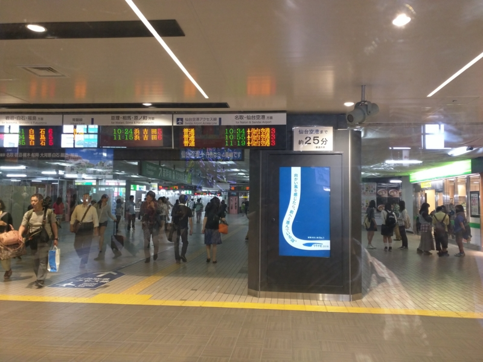
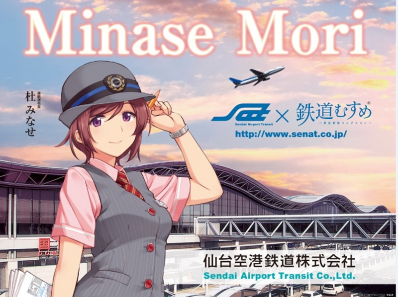
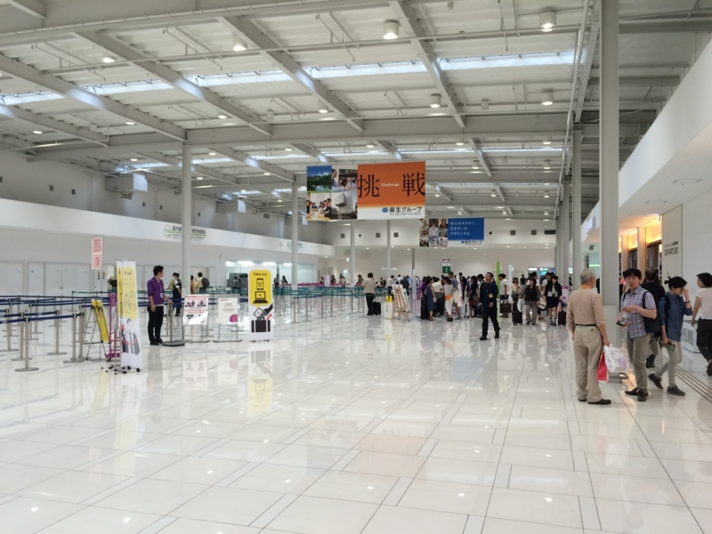
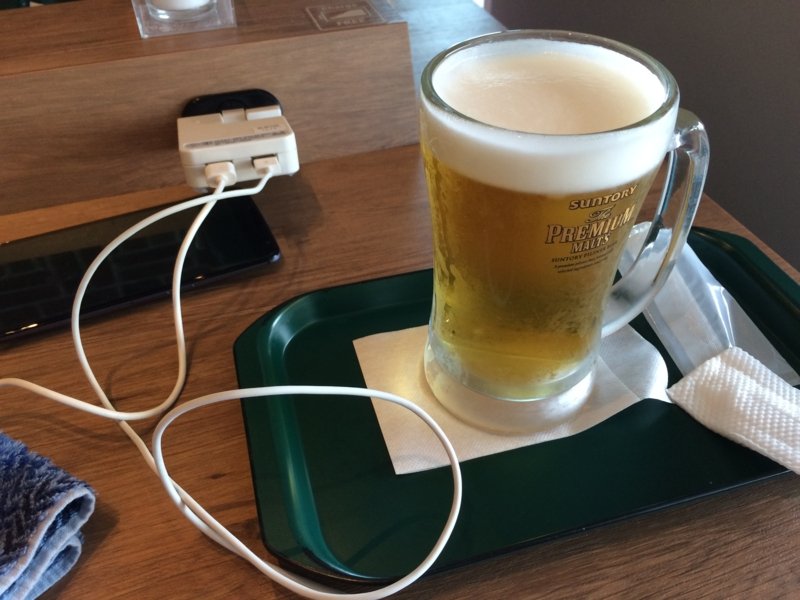
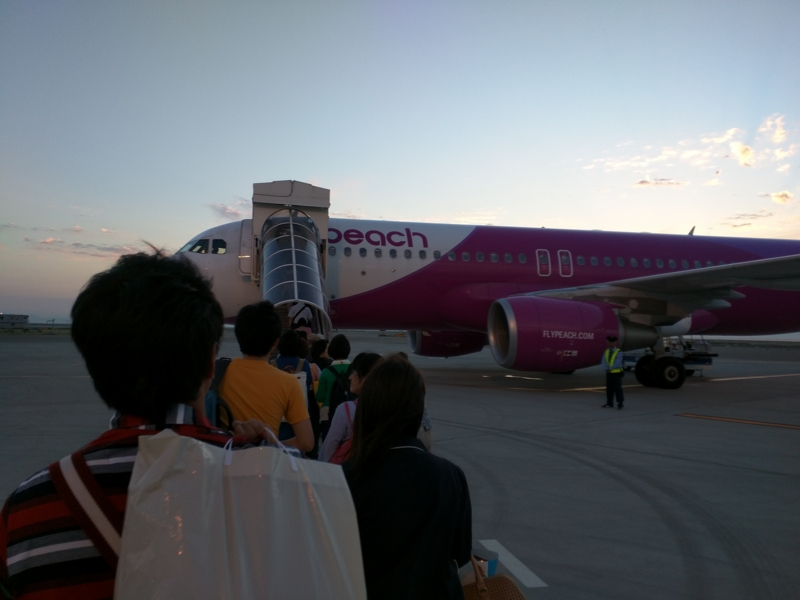

仙台から松山までの帰路は、依然に画策していた通り、ピーチの関空乗り継ぎを利用した。

<iframe src="https://hatenablog-parts.com/embed?url=https%3A%2F%2Fblog.daruyanagi.jp%2Fentry%2F2015%2F06%2F10%2F165900" title="サトヤ+プロ生勉強会＠マイクロソフト東北支店 に参加してきたった #satoya #pronama - だるろぐ" class="embed-card embed-blogcard" scrolling="no" frameborder="0" style="display: block; width: 100%; height: 190px; max-width: 500px; margin: 10px 0px;"></iframe>

<iframe src="https://hatenablog-parts.com/embed?url=https%3A%2F%2Fblog.daruyanagi.jp%2Fentry%2F2015%2F06%2F02%2F000335" title="松山から仙台へ行くために、まず東京へでる。 - だるろぐ" class="embed-card embed-blogcard" scrolling="no" frameborder="0" style="display: block; width: 100%; height: 190px; max-width: 500px; margin: 10px 0px;"></iframe>

震災のときは津波がここまで来ていたのがショッキングだったけれど、今ではその面影もなく。キレイで使いやすい空港だなぁ、と思った。今のところ LCC はピーチの関空便だけみたいだけど、拠点化するらしいので便数も増えそう。

一番うれしいのは、仙台駅からのアクセスがとてもいいこと。

空港アクセス線というのが通っていて、だいたい昼間は20分おきぐらいに出ている。

しかもよくわからん萌えキャラ付き！　この子は仙台空港駅にもいた。ぜひ伊予鉄にも（ｹﾞﾌﾝｹﾞﾌﾝ

まぁ、それはともかく、おもな空港と主要駅までの距離・運賃ってどんなものなのだろうか<a href="#f-7100c2ca" name="fn-7100c2ca" title="実は松山に引っ越すときにサラッと調べたのだけど。どうせなら空港が便利な街に住むのがいい">*1</a>。<a href="http://www.mlit.go.jp/koku/15_bf_000310.html">&#x822A;&#x7A7A;&#xFF1A;&#x7A7A;&#x6E2F;&#x4E00;&#x89A7; - &#x56FD;&#x571F;&#x4EA4;&#x901A;&#x7701;</a> から拠点空港の会社管理空港・国管理空港（ただし、北海道・沖縄を除く）の空港を抜粋し、バスでの所要時間・運賃を「空港名　リムジンバス　所要時間」でググって適当にゲットしてまとめてみた。

<table>
<tr>
<th> 空港名	</th>
<th> 行先	</th>
<th> 運賃	</th>
<th> 所要時間</th>
</tr>
<tr>
<td>成田※	</td>
<td>東京シティエアターミナル	</td>
<td>3,000円	</td>
<td>約60～90分</td>
</tr>
<tr>
<td>中部※	</td>
<td>名鉄バスターミナル	</td>
<td>1,000円	</td>
<td>46分～85分</td>
</tr>
<tr>
<td>関西※	</td>
<td>大阪駅前（梅田）	</td>
<td>1,550円	</td>
<td>90分</td>
</tr>
<tr>
<td><b>大阪</b>※	</td>
<td>大阪駅前（梅田）	</td>
<td>640円	</td>
<td>30分</td>
</tr>
<tr>
<td><b>東京</b>※	</td>
<td>東京シティ・エアターミナル	</td>
<td>820円	</td>
<td>約20～50分</td>
</tr>
<tr>
<td>新千歳※	</td>
<td>札幌駅前	</td>
<td>1,030円	</td>
<td>約80分</td>
</tr>
<tr>
<td>仙台※※	</td>
<td>仙台駅	</td>
<td>910円	</td>
<td>40分</td>
</tr>
<tr>
<td><b>新潟</b>	</td>
<td>新潟駅南口	</td>
<td>410円	</td>
<td>約25分</td>
</tr>
<tr>
<td>広島	</td>
<td>広島駅新幹線口	</td>
<td>1,340円	</td>
<td>45分</td>
</tr>
<tr>
<td>高松	</td>
<td>JR高松駅	</td>
<td>760円	</td>
<td>約40分</td>
</tr>
<tr>
<td><b>松山</b>	</td>
<td>松山市駅	</td>
<td>410円	</td>
<td>約20分</td>
</tr>
<tr>
<td>高知	</td>
<td>高知駅バスターミナル	</td>
<td>720円	</td>
<td>35分～45分</td>
</tr>
<tr>
<td><b>福岡</b>※	</td>
<td>博多駅バスターミナル	</td>
<td>260円	</td>
<td>15分</td>
</tr>
<tr>
<td>北九州	</td>
<td>小倉駅	</td>
<td>620円	</td>
<td>33分</td>
</tr>
<tr>
<td>長崎	</td>
<td>長崎駅前	</td>
<td>800円	</td>
<td>43分～58分</td>
</tr>
<tr>
<td>熊本	</td>
<td>熊本駅前	</td>
<td>800円	</td>
<td>55分</td>
</tr>
<tr>
<td>大分	</td>
<td>JR大分駅前	</td>
<td>1,550円	</td>
<td>65分</td>
</tr>
<tr>
<td><b>宮崎</b>	</td>
<td>宮崎駅	</td>
<td>440円	</td>
<td>25～30分</td>
</tr>
<tr>
<td>鹿児島	</td>
<td>鹿児島中央駅	</td>
<td>1,250円	</td>
<td>38分～41分</td>
</tr>
</table>
（※印は鉄道が通っており、実際には最大半分ぐらいの所要時間でたどりつける。また、仙台空港は電車の乗り入れとともにリムジンバスが廃止されているとの由）

最強のアクセスを誇る福岡空港（※ただし、赤字をドバドバ垂れ流している模様）は別格にして、まぁ、所要時間30分以内・運賃500円以下ならわりと利便性の高い空港と言える気がする（リストには入れてないけど、富山空港あたりも割と近かったはず）。

でも、やっぱり鉄道のある空港には勝てないわな。バスと違って鉄道ならば時間が計算できるので、ギリギリまで駅でショッピング……なんてことも可能。松山空港もぜったい伊予鉄の乗り入れをするべきだと思った。

3:00 過ぎに仙台空港を出て、関空で乗り継ぎ待ち。第二ターミナルを探検してみようかとも思ったけど、探検するほどの大きさがなかった（

ビールを飲みながら本を読んで、2時間ほど潰した。売店での会計時に、もっていたプルタルコス『英雄伝 4』をレジに置き忘れるというハプニングがあったけど、搭乗前に気が付いてとりに行くとちゃんと確保してくれてあった。ありがたし。

それ以外は別にトラブルもなく、松山空港まで飛んで帰れましたとさ。めでたしめでたし。

<a href="#fn-7100c2ca" name="f-7100c2ca" class="footnote-number">*1</a>:実は松山に引っ越すときにサラッと調べたのだけど。どうせなら空港が便利な街に住むのがいい

