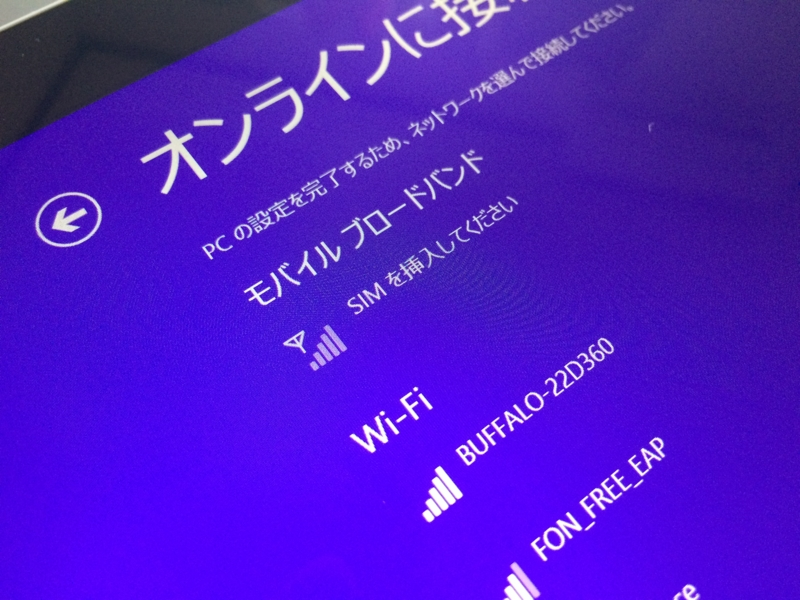

二日連続、宅急便。開けてびっくり、Surface 3。あとのことなぞ、知るものか。最悪、卵かけご飯で生きればいい――でも、なんか最近、卵の値段あがってるような。昔は88円の特売で当り前な感覚だったけど、今は100円台で買えたらラッキーみたいな感じになってる。

――まぁ、卵の話は置いておいて。

<iframe src="https://hatenablog-parts.com/embed?url=https%3A%2F%2Fblog.daruyanagi.jp%2Fentry%2F2015%2F06%2F18%2F175723" title="懺悔：MADOSMA 買いました。 - だるろぐ" class="embed-card embed-blogcard" scrolling="no" frameborder="0" style="display: block; width: 100%; height: 190px; max-width: 500px; margin: 10px 0px;"></iframe>

Microsoft ストアで一括購入か、Y! モバイルで分割購入か少し悩んだけれど、Y! モバイルだと Surface Pen（6,000円相当）がもらえる上、最初の三カ月は月額基本料無料（Lプランで 3,696円×3）だったので、いざとなればキャンペーン終了とともに違約金（9,500円）払って解約してもそれほど損にはなるまい、と思って分割にしておいた。Y! モバイルの SIM でなければ通信のパフォーマンスが出ないという話もあったし、まぁ、そこらへんも見極めたかった。

なにはともあれ、開封開封。

スペック的には今使っている Surface Pro 3 よりも一回り小さいけど、パッと見、そうは感じなかった。比べるとやっぱり小さいが。ほんとは iPad ぐらいの大きさだと個人的にうれしいのだけど（もう Surface Pro 3 があるので、それとの差別化を考えると）、Surface mini とか出してくれないのかなぁ。

フィルムにはボタンやポートのアイコンが印字してある。なにがどこにあるのか分かりやすくて、気が利いていると思う。Surface Pro 3  にはなかった気がするのだけど、箱を引っ張り出して確認するのメンドクサイ。

本体をとりだすと、その下に「Microsoft Office」のカードと、SIM スロットを開けるためのピンが顔を出す。Surface 3 に付属の「Microsoft Office」は、<i>（たぶん）永久ライセンスの<b>「Microsoft Office Home & Business Premium」</b>＋<b>一年間有効な「Office 365 サービス」</b>（1TB の OneDrive とか 60分/月 の Skype 電話とか）</i>になっている（のだと思う、正直ややこしくてわからん）。「Office 365 サービス」の部分は ¥6,264 で延長が可能だ。

あと、充電器とケーブルが付属。Surface 3 の給電は Micro USB で行うように変更されているが、個人的には Pro 3 みたいな感じの方が接続がシッカリしてて好きだ。

なんというか、Micro USB はもともと給電用に設計されていないせいか、謎の頼りなさがある。カッチリはまらないのが気になってしゃあない。

とはいえ、Micro USB ならば万が一忘れてもどこかですぐに調達できるから、その点では安心かもしれない。Nexus 6 や MADOSMA とケーブルの共有もできるしね。あと、USB ってなぜか表裏まちがって挿しちゃうけど、Surface 3 の電源ケーブル二はその心配があまりない。インジケーターが上になるように挿せばいい。暗がりだと間違える可能性がないとは言えんけどネ。

ちなみに、Y! モバイルの特典でもらった Surface Pen は赤色だった。TypeCover もこれに合わせて赤色を購入しようかと思う。それにしても、Surface は毎回 TypeCover を買い直しになるのが金銭的にキツい。

本体のフィルムをはがしてそのまま電源ボタンを押すと、電源ケーブルをつながなくても Windows が立ち上がった。ちょこっと充電されてたみたい。

セットアップ画面にモバイルブロードバンドの項目が出てきて、思わずニヤニヤする。これで無線 LAN が確保できない環境でも艦これができる。セットアップが始まっちゃったけど、SIM を挿してみることにする。

本体左下にある SIM スロットの穴にピンを挿すと、トレイがカシュッとでてきた。このトレイに SIM を載せて（切り欠きがあるから方向は間違わないと思う）、元のスロットにブスッと挿し、セットアップ画面を戻ったり進んだりしているうちにちゃんと認識してくれた。

自分ちだと若干電波が弱いけど、まぁ、気にしない。こういうのは、とりあえず繋がれば十分だ。

とりあえず半日ほど使ってみたけれど、軽さ・小ささもさることながら、発熱が少なくなったもがとてもうれしい。Surface Pro 3 だとストアアプリのゲームを立ち上げるとファンがうるさかったが、Surface 3 ならばそんなことはない。そもそもファンレスらしく、吸気口・排気口が見当たらない。これだったら図書館にももって行けそうだ。

（初期のスタート画面。Surface<s> Hub</s>アプリと変な PDF アプリ、MetaMoji 以外には追加のアプリはなさげ。シンプルでいい）

弱点はといえば、キックスタンドの自由度が下がったことか。Surface Pro 3 のキックスタンド（無段階）は、前回にするとペン入力にちょうどいい角度になったのだけど、Surface 3 はそこまで開かない（2段階のみ）ので、これがどこまで影響するかちょっと使ってみないとわからない。パフォーマンスに関しても、もう少し使ってみないと何とも言えない。少なくとも、めちゃくちゃ遅いってことはない。Visual Studio をガシガシ使うとかっていうんじゃなけりゃ、とくに不満はないかも。

あと、弱点というほどではないんだが、Surface Pro 3 と音量ボタンの位置が変わっている。そのため、スクリーンショット（［Windows］＋音量下げキー）を撮ろうとしてつい電源ボタンを押してしまう。まぁ、これは慣れの問題かな。

まだまだじっくり試せていないけれど、Surface Pro、Surface、Surface 2、Surface Pro 3 と買ってきた身からすると、この Surface 3 は、<i>無印シリーズのフットワークの軽さ＋Pro シリーズの自由さ</i>のバランスがとれていて、歴代最高レベルの Surface になるんじゃないかと感じた。ただ、iPad の代わりにはならんと思うから、「これさえあれば、なにもいらない」ってのはちょっと吹きすぎかと（笑

ともかく、MADOSMA とちがって Surface は Microsoft 純正のリファレンス的な端末だし、ほしければ Windows 10 の発売を待たずにさっさと買っちゃえばいいと思うよ。

