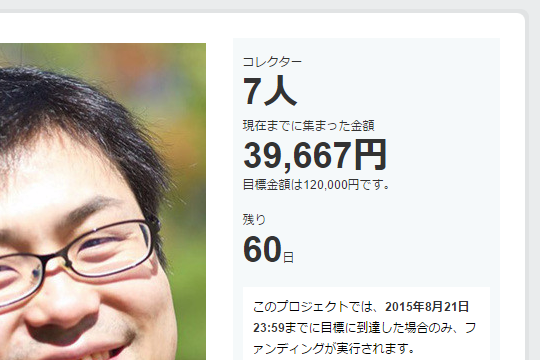

週末、高松で歩きまくって疲れたせいか、昨晩は20時ぐらいに寝てしまったのだけど、起きたらこんなことになってた／(＾o＾)＼

<iframe src="//hatenablog-parts.com/embed?url=https%3A%2F%2Fmotion-gallery.net%2Fprojects%2Fdaruyanagi" title="柳 英俊（だるやなぎ）LINE スタンプ プロジェクト" class="embed-card embed-webcard" scrolling="no" frameborder="0" style="display: block; width: 100%; height: 155px; max-width: 500px; margin: 10px 0px;"><a href="https://motion-gallery.net/projects/daruyanagi">柳 英俊（だるやなぎ）LINE スタンプ プロジェクト</a></iframe>

<blockquote>

柳 英俊をご存知ですか？　「だるやなぎ」というニックネームの方が有名かもしれません。彼は、2014年2月に東京を離れ、現在 愛媛県 松山市に住むフリーライターの男性 35歳 独身。

一般人と少し違うところは、Creative Commons Zero (CC0) ライセンスであること。いわゆるフリー素材です。

ただ、残念なことに、まだ認知度が低く、良質なコンテンツも世に出せていません。そこで今回、LINE クリエイターズスタンプとして公開すること、また当プロジェクト自体により、認知を広め、価値を高め、盛り上げていきたいと考えています。

これまでご存知なかった方も、気軽に参加いただき、“柳 英俊 アーリーアダプター” となって応援をお願いします。柳 英俊にしてほしいスタンプメッセージのご提案もお待ちしています。

</blockquote>

“<a href="http://pronama.azurewebsites.net/pronama/">&#x30D7;&#x30ED;&#x751F;&#x3061;&#x3083;&#x3093;</a>”を世に送り出した敏腕プロデューサー @jz5 が裏でなにか画策しているのは知っていたけれど（“だるやなぎからのメッセージ”なんかは事前に打ち合わせしたし）、意外に本格的な感じですな（震え声

しかも、もう4万円ほど集まっているし。お金はもっと大事に使うべきやと思うで！

クラウドファンディングってよくわかっていないんだけど、目標額に到達したらお金って戻るのかな？（フリーソフトにお金出したことあるけど、何か見返りがあるわけじゃない＆目標額達成でちゃんとモノが開発されたから、そういうケースに遭遇したことがない）　まぁ、そういうことも含めて、自分も一口乗ることにしようかなと思う――来月のお小遣いが入金されたら。

<blockquote>

追記：　ちょうど Google Adsense でお小遣いをもらったので投入してみましたが、プロジェクトがゴールした場合にのみ決済が走るようですね（クレジットカードだと引き落とされますが、まぁ、あとで返ってくるんちゃうかな）。あと、参加するとだれが支援してくれたのかが分かるのですが……意外なメンツもいて思わずお茶吹きましたｗ

</blockquote>

あと、もしこのプロジェクトが無事にゴールしたら、設定されているお礼とは別に、スペシャルコース貢献者にはなにかしたいかなー。なにしよう？

