
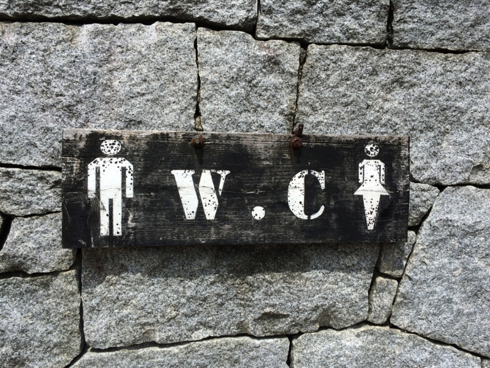

地方で勉強会をやったとき、もう一つ大事にしたいのが、よそからきてくれた人へのおもてなしです。

<iframe src="https://hatenablog-parts.com/embed?url=https%3A%2F%2Fblog.daruyanagi.jp%2Fentry%2F2015%2F06%2F19%2F023709" title="プログラミング生放送勉強会 第34回＠サイボウズ株式会社 松山オフィス、無事終わりました！ #pronama - だるろぐ" class="embed-card embed-blogcard" scrolling="no" frameborder="0" style="display: block; width: 100%; height: 190px; max-width: 500px; margin: 10px 0px;"></iframe>

せっかくきてくれたのだから、松山を堪能して帰ってほしいですよね。とはいえ、独りで観光したい人もいるだろうし、こっちも10人も20人も来られても対応できない（大人数なるとどこ入るのも難しくなる……）のが難しいところなのですけど。今回は懇親会で興味ありそうな人にちょろっと<i>「みんなでお城行きたい人は 10:00 東雲口ね！」</i>と伝えるだけにしました。「やることねえし、きてやるか」みたいなヒトが来てくれたらそれでいいかなと。今回は僕も含めて4人ほど集まりました。

<h3>松山城</h3>

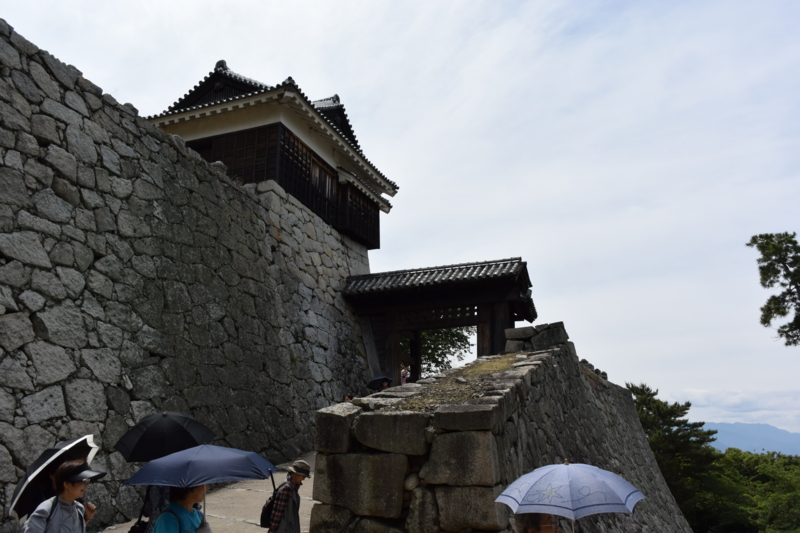

松山に来たら、まず松山城ですね。県外から来た人にはとりあえず松山城を見せて、じゃこカツを口につっこんでおけば大丈夫なので割とチョロいです。とんかつパフェは初心者にはやめておいた方がいいでしょう。

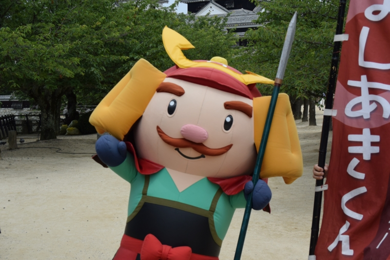

今回は動く“よしあきくん”がいました。“よしあきくん”は松山城を築いた加藤嘉明（よしあき、よしあきらとも）にちなんだ松山城のマスコットキャラクターです。名前がストレート過ぎですよね。元ネタの加藤嘉明が比較的マイナーなのもしんどいです（賤ヶ岳の七本槍の一人ではあるのですが）。でも僕は、目の焦点のあってない猟奇的な感じが割と好きです。

ほかにも『ぼっちゃん』のマドンナに扮した可愛らしいお姉さんもいて、一緒に写真を撮ることができました。@shibayan がすごくうれしそうに写真を撮ってもらっていたのが印象的です。“よしあきくん”は別にいなくてもよかった。

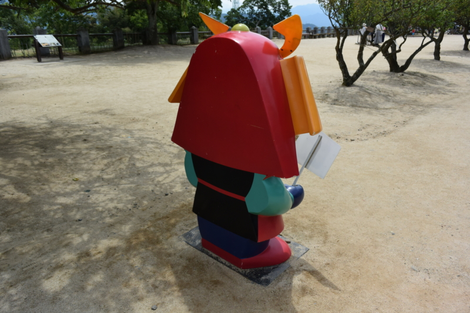

ちなみに、“よしあきくん”には動かないバージョンもあります。前は天守閣への入り口にある料金所付近にいたような気がするのですが、今回みるとちょっと前進していました。邪魔者扱いされて追い出されたのか、写真を撮るのによいポジションへ進出したのか、とても気になります。あと、後ろ半分がないのがかわいそうなので、totoBIG の一等を当てたら補完してあげたいですね。

ぶっちゃけ松山城には何回も来ているので、見飽きたところもあるのですが、それでも毎回ちょっとした発見があります。今回はこの“石落とし”。ここから石とか落として敵を撃退するんですねー。あと、壁の穴は飛び道具を放つためのモノですが、正方形のと長方形（縦長）のものがあると思います。たぶん、正方形のが鉄砲用で、長方形のが弓用でしょうね。知らんけど。

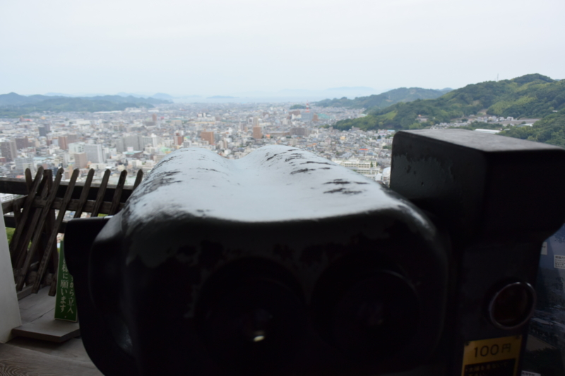

あとは天守閣の望遠鏡で自分ちのベランダを見て遊んだりしていました。前に見える海は、たぶん松山観光港のあたりでしょうね。ここから広島や小倉なんかにフェリーで行けるはずです。近いうちに行ってみたいと思ってるんですけど、なかなか……。

<h3>鍋焼きうどん</h3>

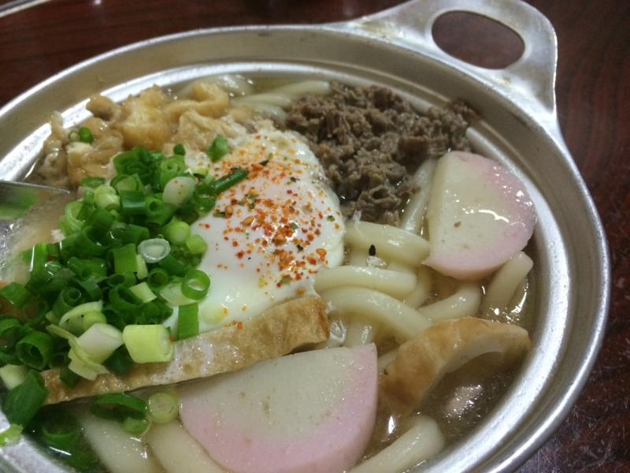

お昼ご飯は松山のソウルフード・鍋焼きうどんにしました。松山城からはロープウェイ街・大街道商店街を抜けて30分弱歩くことになるのですが、まぁ、歩けば歩くほどごはんがおいしくなるからね。ここで @daisuke_nomura と @kirin_nico が合流。

さて、松山の鍋焼きうどん界は「ことり」と「アサヒ」に二分されているのですが、今回は「アサヒ」をチョイスしました。単に僕の好みです。あと、奥に座敷があって、6人だとそこに通してもらえるかなーと期待したのもあります（この策はドンピシャでした）。

<iframe src="https://hatenablog-parts.com/embed?url=http%3A%2F%2Ftabelog.com%2Fehime%2FA3801%2FA380101%2F38000348%2F" title="アサヒ (松山市/うどん)" class="embed-card embed-webcard" scrolling="no" frameborder="0" style="display: block; width: 100%; height: 155px; max-width: 500px; margin: 10px 0px;"></iframe>

お稲荷さんと、鍋焼きうどん。今回は卵入りを食べました！　甘いお出汁が相変わらずで、ほっこりとした気分になれます。

あ、このお店、前払い制なので注意してくださいね。おうどんが運ばれてきたときにお会計をします。待ってる間に小銭を用意しておくといい感じです。

<h3>道後温泉＆道後麦酒館</h3>

そのあとは大街道のゲームセンターで @daisuke_nomura とエアホッケーを戦いました。最初は一戦だけするつもりだったのですが、なかなか敗北を受け入れられない @daisuke_nomura が食い下がってきて、結局三戦しました。結果は全勝でしたが代償は大きく、2日間ほど全身筋肉痛で苦しみました。なんかクレーがいっぱい出てくるモードがあって、それがオッサンにはしんどかった……。@kirin_nico に<i>「そんなに行き来らしてエアホッケーしてるひと、初めて見た」</i>と言われたのが屈辱です。

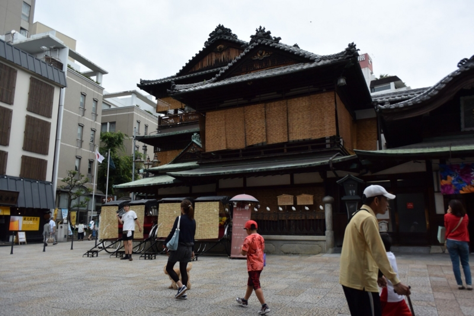

スポーツで汗を流した後は、いよいよ温泉ですね。この時期の道後温泉は簾を垂らしていて涼しげです。前回きたときはミストも出ていてすごく涼しかったのですが、あれ、またやってほしいな。

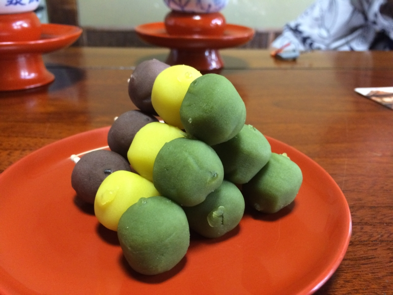

大人数で行ったときだけ見られるお団子タワー（最上階の個室のみ）。このぼっちゃん団子は、割とどこでも売ってます。地元の人は“うつぼ屋”のモノが一番いいといいますが、どうなんでしょうか。

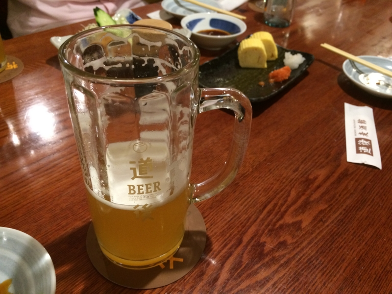

温泉のあとは、隣にある道後麦酒館でぐだぐだと地ビールを呑みます。みんなじゃこカツを食いまくっていたのですが、そんなに気に行ったのか？　まぁ、美味しいと思いますけど。

<iframe src="https://hatenablog-parts.com/embed?url=http%3A%2F%2Fwww.dogobeer.co.jp%2Fbakusyukan.html" title="道後麦酒館" class="embed-card embed-webcard" scrolling="no" frameborder="0" style="display: block; width: 100%; height: 155px; max-width: 500px; margin: 10px 0px;"></iframe>

ここで福田さんとお別れ。サンライズ瀬戸で帰るみたいで、電車の時間がありました。みんなと一緒じゃなければ映画の話とか聞いてみたかったんですけど、まぁ、またの機会にでも。

<h3>観覧車</h3>

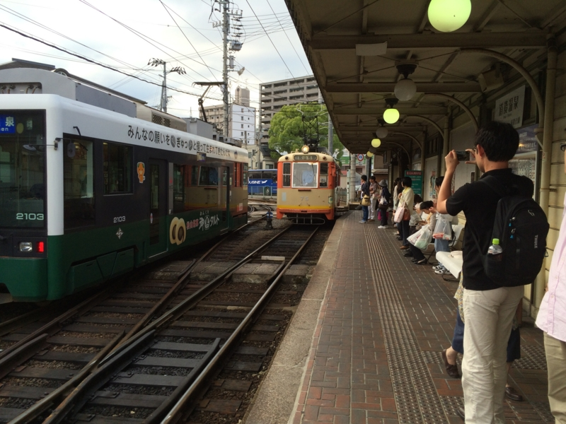

さて、僕らもいい加減移動。道後温泉駅から電車で松山市駅に行くことにしました（なぜかみんな、松山市駅が見たいらしい）。バスで帰る @jz5 ともここらあたりでお別れしたような？　ビール飲みすぎたせいか、ここらあたりの記憶があいまいです。

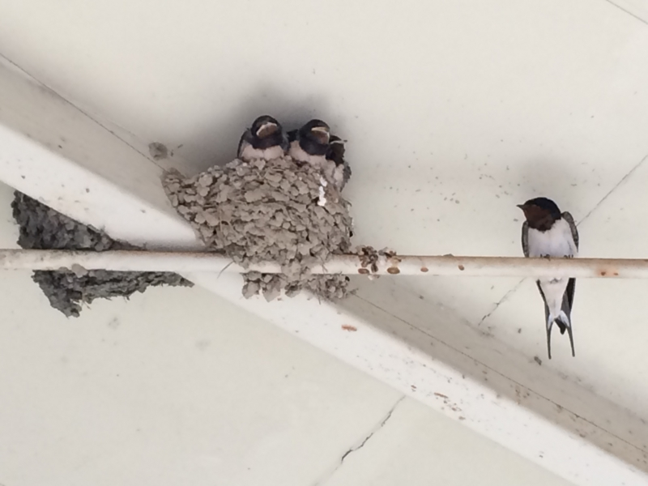

ただ、道後温泉駅にたくさんツバメの巣があったのは割と覚えているかも。落ちて死んじゃってる雛もいて可哀想でしたが、おおかた元気で、盛んに餌をねだっていました。かわいいですね。

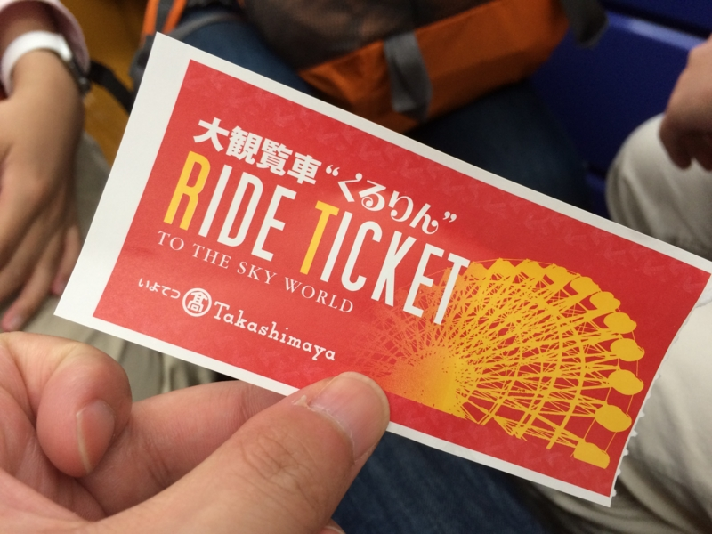

さて、松山市駅にきたはいいけれど、何もすることがない。ここは松山で一番栄えているところの一つですが、東京から来たヒトにとっては別にどうってことないでしょう。というわけで、進退窮まって、あろうことか観覧車に乗ることになりました――おっさん四人で。

<iframe src="https://hatenablog-parts.com/embed?url=http%3A%2F%2Fwww.iyotetsu-takashimaya.co.jp%2Fkururin%2F" title="いよてつ髙島屋｜大観覧車くるりん" class="embed-card embed-webcard" scrolling="no" frameborder="0" style="display: block; width: 100%; height: 155px; max-width: 500px; margin: 10px 0px;"></iframe>

一つのカゴに平均年齢30歳のおっさんが四人。これが半分女の子だったらまだ楽しいでしょうに。ある種のお魚は、狭いところに♂ばかりいれておくと一部が♀になるそうですが、人間も早くそうなればいいと思います。

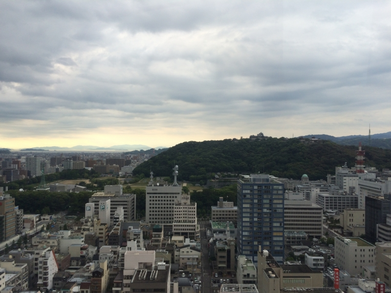

でも、景色はとてもよかったです。松山城の天守閣がよく見える。その真下にある和風の建物群は二の丸ですね。専ら“恋人の聖地”という売り出し方をしているので、僕は足を踏み入れたことがないのですが。

――というわけで、6時ごろ、飛行機で帰る残りの三人のおっさんもリムジンバスで送り出して任務完了。

観覧車は僕も乗ったことがなかったので、割と楽しかったです。もうそろそろこっちにきて1年半になるのに、まだまだ松山の知らないところ多いですね。もっといろいろブラブラしてみたいです。

